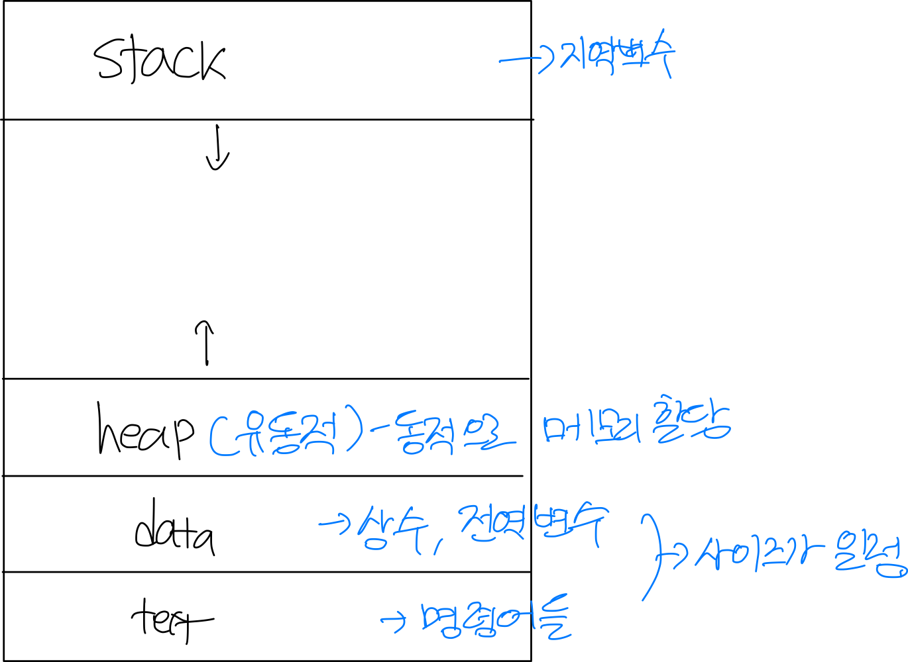

# 운영체제 3장 정리(Process)

-----

◻︎Process
- 실행중인 프로그램
- 프로세스는 순차적인 방식안에서 진행되어야 한다.

◻︎Program Vs Process

-Process
- 프로세스는 메모리 안에서 활동하는 개체이다.
- 프로세스는 상태를 가지고있다.

-Program
- 프로그램 디스크에 저장되는 수동적인 개체이다(실행가능한 파일)
- 프로그램은 실행되어지는 파일이 메모리 안으로 로드되어질때 프로세스가 된다.
- 하나의 프로그램은 여러개의 프로세스가 될수있다
- Like Class vs Instance

◻︎Job vs Task vs Process
- jobs는 배치 시스템에서 실행되어진다.
- Tasks는 시간 분할 시스템에서 실행된다.
- 프로세스는 현대 컴퓨터 시스템에서 실행되어지는 단위이다.
- 우리는 모두 프로세스라고 부를수있다.

◻︎ MultiProcessing vs MultiTasking
-멀티 프로세싱은 두개이상의 CPU에서 작동하는 거싱고 Multitasking은 CPU가 그들사이에서 바뀌면서 여러개의 프로세스를 실행시키는 것이다.
-Time Sharing

◻︎Memory Layout
- 프로그램 코드는 text sction 에서 불러와진다.
- 스택은 일시적인 데이터를 포함하고있다(Function Parameters,return addresses,local variables)
- Data Section은 전역변수를 포함하고 있다.
- Heap은 실행되는 동안 동적으로 할당되어진다.

(Memory Layout)

◻︎Process State

-프로세스의 실행으로써 상태가 변한다.

-New
- 프로세스가 생성 되어지는중 

-Running

- 명령어가 실행 되는 중

-Waiting
- 프로세스가 이벤트가 발생한 동안 기다리는것 중

-Ready
- 프로세스가 하나의 프로세서에 등록되어지는 것을 기다리는 중

-Terminated
- 프로세스의 실행이 종료되어 진 것 

◻︎ Process Control Block(PCB)

-Process Control Block(or task control block)
- 정보는 프로세스 간에 연관되어있다.

-Contents of PCB

1.Process State
- Running,Waitiing,-etc

2.Program Counter
- Location of intruction to next execute

3.CPU registers
- Contents of all process-centric registers

4.CPU scheduling information
- Priorites,scheduling queue pointers

5.Memory-management information
- Memory allocated to the proces
 
6.Accounting information
- CPU used,clock time elapsed since start,time,limits

7.I/O status information
- I/O Devices allocated to process list of open files

◻︎Threads
- 거의 프로세스는 실행된 싱글 스레드를 가진다.
- Multiple Program은 프로세스 당 대응한다.

◻Process Scheduling
- 시분할의 목적은 각 프로그램들이 실행되는 동안 사용자가 상호 작용할 수 있도록 프로세스들 사이에서 
CPU 코어를 빈번하게 교체하는 것이다.
- Process scheduler는 실행가능한 여러 프로세스 중에서 하나의 프로세스를 선택한다.

◻Characteristics of processes
-I/O-bound process
- Spends more of its time doing I/O
-CPU-bound process
- Generates I/O requests infrequncy

◻Scheduling Queues
-Ready Queue
- 프로세스가 시스템에 들어가게 되면 준비큐에 들어가서 준비 상태가 되어 CPU코어에서 실행되기를 기다린다.
- 일반적으로 연결 리스트(linked list)에 저장된다.

-Wait Queue
- I/O 완료와 같은 특정 이벤트가 발생하기를 기다리는 프로세스는 대기 큐(wait Queue)에 삽입된다.

◻Process lifeCycle

-새로운 프로세스는 ready queue에 처음에 놓여진다.
-프로세스는 실행이 되기 위해 선택 되거나 혹은 dispatch될때까지 기다린다.
-CPU코어가 할당되고 실행 상태가 되면 ,여러 이벤트 중 하나가 발생 될 수 있다.

-During exection
- 프로세스가 I/O요청을 공표한 다음 I/O대기 큐에 놓일 수 있다.
- 프로세느는 새 자식 프로세스를 만든 다음 자식의 종료를 기다리는 동안 대기큐에 놓일 수 있다.
- 인터럽트 또는 타임 슬라이스가 만료되어 프로세스가 코어에서 강제로 제거되어 준비큐로 돌아갈수있다.

-