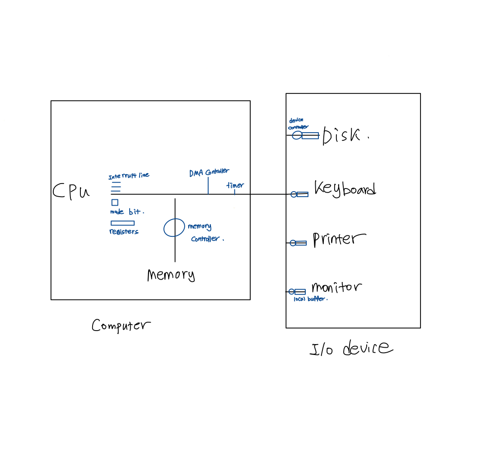
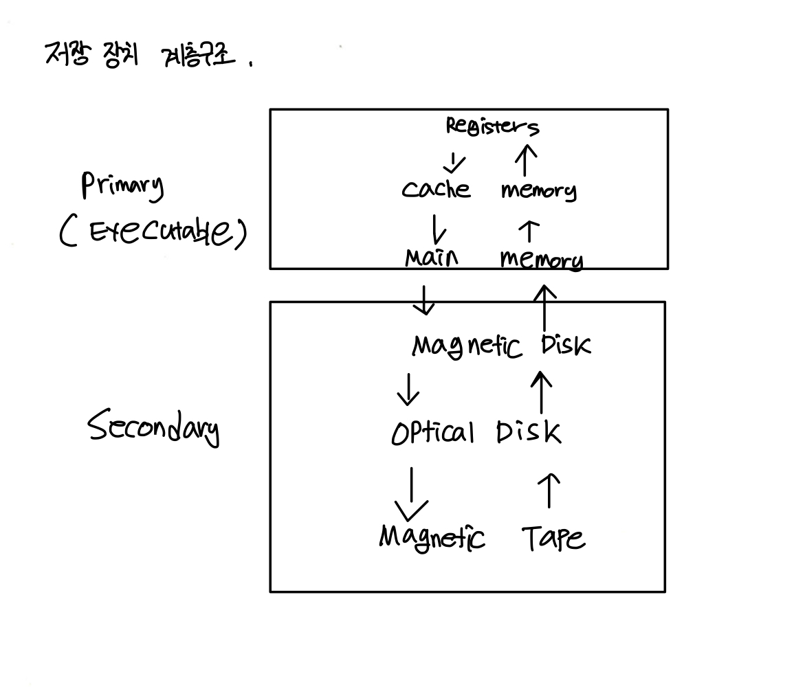
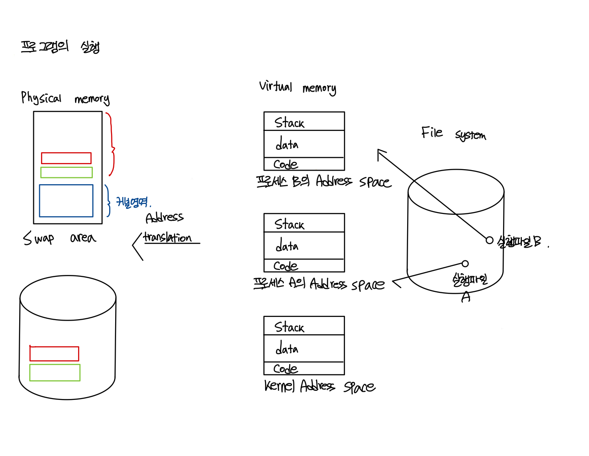
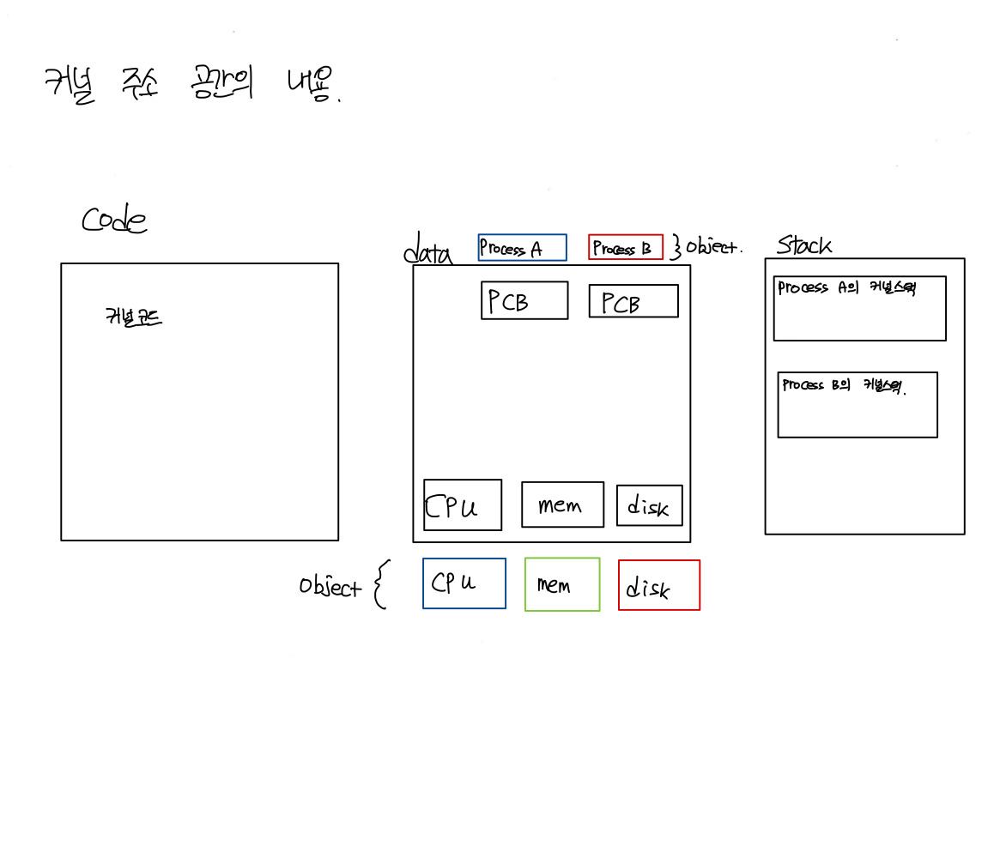

- 운영체제란
  - 컴퓨터 하드웨어 바로 위에 설치되어 사용자 및 다른 모든 소프트웨어와 하드웨어를 연결하는 소프트웨어 계층
  - 좁은 의미의 운영체제, 커널 : 운영체제의 핵심 부분으로 메모리에 상주하는 부분
  - 광의의 운영체제 : 커널 뿐 아니라 각종 주변 시스템 유틸리티를 포함한 개념
- 운영체제의 목적
  - 컴퓨터 시스템을 편리하게 사용할 수 있는 환경을 제공 
  - 하드웨어(컴퓨터 시스템의 자원)를 효율적으로 관리 해 주는 것이 운영체제의 가장 큰 목적
  - 하드웨어는 이미 주어진 것이기 때문에 최대한의 성능을 내도록 해줘야 함 
  - 프로세스,파일,메세지 등도 운영체제에선 자원임
- 운영체제의 분류
  1. 동시작업 가능 여부
     - 단일 작업 (sigle tasking) : 한 번에 하나의 작업만 처리
     - 다중 작업 (multi tasking) : 동시에 두 개 이상의 작업 처리
  2. 사용자의 수
     - 단일 사용자 (single user)
     - 다중 사용자 (multi user)
  3. 처리방식
     - 시분할 (time sharing) : 현대의 대부분의 컴퓨터의 처리방식,짧은 응답시간을 가진다 (interactive)
     - 일괄처리 (batch processing) : 현대에서는 거의 사용하지 않음 (interactive 하지 않음)
     - 실시간 (Realtime OS) : 정해진 시간안에 어떠한 일이 반드시 종료됨이 보장되어야 하는 실시간 시스템을 위한 OS(EX: 원자로/ 공장 제어, 미사일 제어, 반도체 장비,로보트 제어)
- 몇가지 용어
  - Multitasking :  하나의 프로그램이 끝나기 전에 다른 프로그램이 실행될 수 있는 것
  - Multiprogramming : 여러 프로그램이 메모리에 동시에 올라갈 수 있음을 강조
  - Time sharing :  CPU의 시간을 분할하여 나누어 쓴다는 의미를 강조
  - Multiprocess : 여러 프로그램이 동시에 실행된다.
  - 위에 용어들은 동시에 여러작업을 수행한다는 의미를 뜻한다.
  - Multiprocessor : 하나의 컴퓨터에 CPU (processor)가 여러 개 붙어 있음을 의미
- 운영체제의 예
  - UNIX(유닉스)
    - 대부분을 C언어로 작성
    - 높은 이식성
    - 최소한의 커널 구조
    - 복잡한 시스템에 맞게 확장 용이
    - 소스 코드 공개
    - 프로그램 개발에 용이
    - 다양한 버전
      - System V, FreeBSD, SunOS, Solaris, Linux    
  - DOS(Disk Operating System) : 단일 사용자용 운영체제, 메모리 관리 능력의 한계
  - MS Windows
    - MS사의 다중 작업용 GUI 기반 운영 체제
    - Plug and Play, 네트워크 환경 강화
    - 불안정성
    - 풍부한 지원 소프트웨어
- 운영체제의 구조
  - CPU < = > memory < = > Disk , I/O device 
  - 프로세스 관리
  - 보호 시스템
  - 네트워킹
  - 명령어 해석기 (command line interpreter)

- 컴퓨터 시스템 구조
     
    - mode bit 
      - 사용자 프로그램의 잘못된 수행으로 다른 프로그램 및 운영체제에 피해가 가지 않도록 하기 위한 보호 장치 필요
      - Mode bit을 통해 하드웨어 적으로 두가지 모드의 operation 지원
        - 1 : 사용자 모드 , 사용자 프로그램 수행
        - 2 : 모니터 모드(커널모드, 시스템 모드) : OS 코드 수행
      - 보안을 해칠수 있는 중요한 명령어는 모니터 모드에서만 수행 가능한 특권 명령으로 규정
      - Interrup나 Exception 발생시 하드웨어가 mode bit을 0으로 바꿈
      - 사용자 프로그램에게 CPU를 넘기기 전에 mode bit을 1로 셋팅
    - 타이머
      - CPU를 특정 프로그램이 독점하는 것으로부터 보호
      - 타이머는 time sharing을 구현하기 위해 널리 사용됨
      - 타이머는 현재 시간을 계산하기 위해서도 사용
    - I/O divice controller
        - 해당 I/O 장치 유형을 관리하는 일종의 작은 CPU
        - 제어 정보를 위해 control, register, status register를 가짐
        - local buffer를 가짐
    - DMA (Direct Memory Access)
      - 빠른 입출력 장치를 메모리에 가까운 속도로 처리하기 위해 사용
      - CPU의 중재없이 device controller가 device의 buffer storage의 내용을 메모리에 block단위로 직접 전송
      - 바이트 단위가 아니라 block 단위로 인터럽트를 발생시킴

    - 사용자 프로그램은 I/O 요청시 운영체제에게 요청을 하고 이를 시스템 콜(system call)이라고함
  
- 인터럽트(Interrupt) : 인터럽트 당한 시점의 레지스터와 program couter를 save 한 후 CPU의 제어를 인터럽트 처리 루틴에 넘김
  - Interrupt(하드웨어 인터럽트) : 하드웨어가 발생시긴 인터럽트
  - Trap (소프트웨어 인터럽트)
    - Exception : 프로그램이 오류를 범한 경우
    - System call : 프로그램이 커널 함수를 호출하는 경우

- 입출력
  - 동기식 입출력 (synchronous I/O)
    - I/O 요청 후 입출력 작업이 완료된 후에야 제어가 사용자 프로그램에 넘어감
  - 비동기식 입출력 (asynchronous I/O)
    - I/O가 시작된 후 입출력 작업이 끝나기를 기다리지 않고 제어가 사용자 프로그램에게 즉시 넘어감
  - 두 경우 모두 I/O의 완료는 인터럽트로 알려줌

- 저장장치 계층 구조
  
  - 상위 계층의 저장장치로 올라갈수록 속도가 빠르나 크기당 비용이 비싸 용량이 하위 계층에 비해서 적음

- 프로그램의 실행(메모리 Load)
  
  - 커널영역은 항상 메모리에 상주함
  - 유저모드에서는 커널모드에 접근 하지 못함, 따라서 커널 모드에 접근을 하기 위해서는 시스템 콜(system call)을 사용해서 커널모드에 접근하게 됨
  - 저장공간에 존재하는 실행파일이 메모리 공간에 올라감으로 써 프로그램이 실행이 되지만, Virtual Memory를 거쳐 실행하게 됨
  - Virtual Memory의 경우 프로그램이 실행 되었을때 가상메모리 공간에 올라가게 되고 종료되었을 때 사라짐
  - Virtual Memory의 주소는 각각 개별의 주소를 가지게 되고 물리 메모리에 접근 시에 변환되어서 들어감
  - 메인메모리의 용량의 한계로 메인메모리의 연장공간으로 써 Swap area(디스크에 존재)를 사용하게 됨
  - 파일 시스템의 경우 전원이 종료되어도 데이터가 남으나 Swap area의 경우 데이터가 삭제됨 

- 커널 주소 공간의 내용
  
  - 커널코드
    - 시스템콜, 인터럽트 처리 코드
    - 자원 관리를 위한 코드
    - 편리한 서비스 제공을 위한 코드
    - 사용자 프로그램마다 커널코드를 따로 사용함
  - 사용자 프로그램이 사용하는 함수(function)
    - 사용자 정의 함수
      - 자신의 프로그램에서 정의한 함수

    - 라이브러리 함수
      - 자신의 프로그램에서 정의하지 않고 갖다 쓴 함수
      - 자신의 프로그램의 실행 파일에 포함되어 있다.

    - 커널함수
      - 운영체제 프로그램의 함수
      - 커널 함수의 호출 = 시스템 콜
   