- File System
- File and FileSystem
  - File 
    - A named collection of related information
    - 일반ㄱ으로 비 휘발성의 보조기억장치에 저ㅇ
    - 운영체제는 다양한 저장장치를 file이라는 동일한 논리적 단위로 볼수 있게 해줌
    - Operation
      - create,read,write,reposition(Iseek),delete,open,close 등
    - File attribute(혹은 파일의 metadata)
      - 파일 자체의 내용이 아니라 파일을 관리하기 위한 각종 정보들
        - 파일이름, 유형, 저장된 위치, 파일사이즈
        - 접근권한(읽기/쓰기/실행), 시간(생성/변경/사용), 소유자 등
    - File system
      - 운영체제에서 파일을 관리하는 부분
      - 파일 및 파일의 메타데이터, 디렉토리 정보등을 관리
      - 파일의 저장 방법 결정
      - 파일 보호등
    - open()
      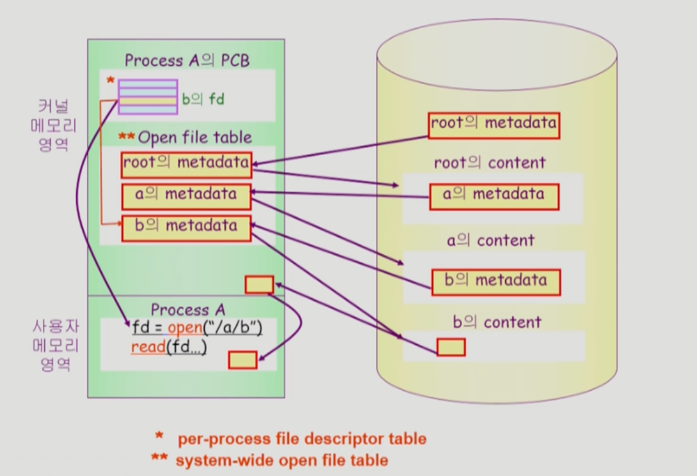
      - 디스크로 부터 파일 c의 메타데이터를 메모리로 가지고옴
      - 이를 위하여 directory path를 search
        - 루트 디렉토리 "/"를 open하고 그 안에서 파일 "a"의 위치 획득
        - 파일 "a"를 open한 후 read하여 그 안에서 파일 "b"의 위치 획득
        - 파일 "b"를 open한 후 read하여 그 안에서 파일 "c"의 위치 획득
        - 파일 "c"를 open한다
      - Directory path의 search에서 너무 많은 시간 소요
        - Open을 read/write와 별도로 두는 이유임
        - 한번 Open한 파일은 read/write시 directory search 불 필요
      - Open file table
        - 현재 open된 파일들의 메타데이터 보관소(In memory)
        - 디스크의 메타데이터보다 몇 가지 정보가 추가
          - Open한 프로세스의 수
          - File offset: 파일 어느 위치 접근 중인지 표시(별도 테이블 필요)
        - File descriptior(file handle, file control block)
          - Open file table에 대한 위치 정보(프로세스 별)
- Directory and Logical Disk
  - Directory 
    - 파일의 메타데이터 중 일부를 보관하고 있는 일종의 특별한 파일
    - 그 디렉토리에 속한 파일 이름 및 attribute들 
    - operation
      - search for a file, create a file, delete file
      - list a directory, rename a file, traverse the file system
    - Partition(=Logical Disk)
      - 하나의 (물리적) 디스트 안에 여러 파티션을 두는게 일반적
      - 여러 개의 물리적인 디스크를 하나의 파티션으로 구성하기도 함
      - (물리적)디스크를 파티션으로 구성한 뒤 각각의 파티션에 file system을 깔거나 swapping등 다른 용도로 사용할 수 있음
- File Protection
  - 각 파일에 대해 누구에게 어떤 유형의 접근(read/write/execution)을 허락할 것인가?
  - Access Control 방법
    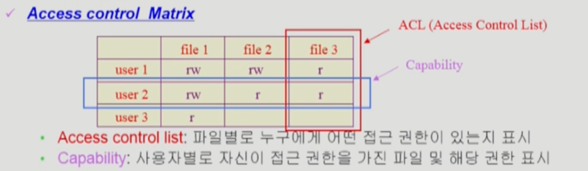
  - Grouping
    - 전체 user를 owner,group,public의 세 그룹으로 구분
    - 각 파일에 대해 세 그룹의 접근 권한(rwx)을 3비트씩으로 표시
    - 예) UNIX
  - Password
    - 파일마다 password를 두는 방법(디렉토리 파일에 두는 방법도 가능)
    - 모든 접근 권한에 대해 하나의 password: all or nothing
    - 접근 권한별 password: 암기문제,관리문제 
    - File System의 Mounting
    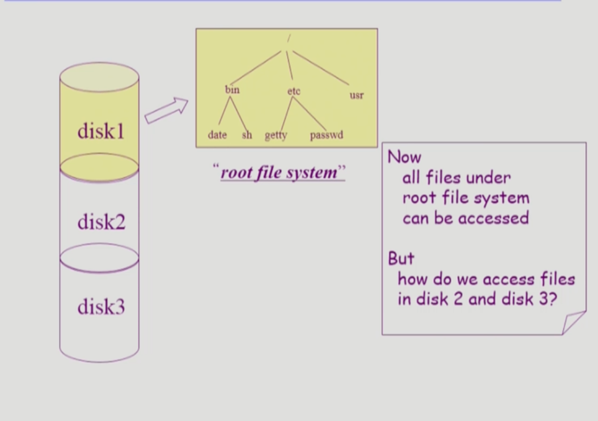
- Access Methods
  - 시슽템이 제공하는 파일 정보의 접근방식
    - 순차 접근(sequential)
      - 카세트 테이프를 사용하는 방식처럼 접근
      - 읽거나 쓰면 offset은 자동적으로 증가
    - 직접 접근(direct access, random access)
      - LP 레코드 판과 같이 접근하도록 함
      - 파일을 구성하는 레코드를 임의의 순서로 접근할 수 있음

- Allocation of File Data in Disk
  - Contiguous Allocation
    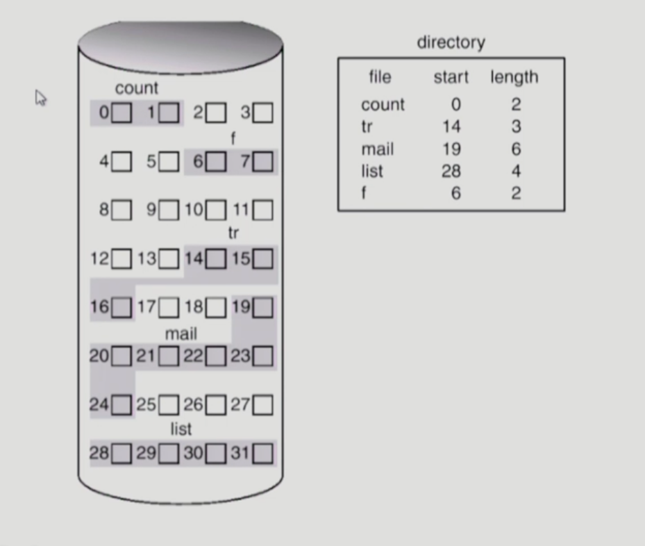
    - 단점
      - external frgamentation
      - File grow가 어려움
        - file 생성시 얼마나 큰 hole을 배당할 것인가?
        - grow가능 vs 낭비(internal fragmentation)
    - 장점
      - Fast I/O
        - 한번의 seek/rotation으로 많은 바이트 transfer
        - Realtime file용으로, 또는 이미 run 중이던 process의 swapping용
      - Direct access(=random access) 가능
  - Linked Allocation
    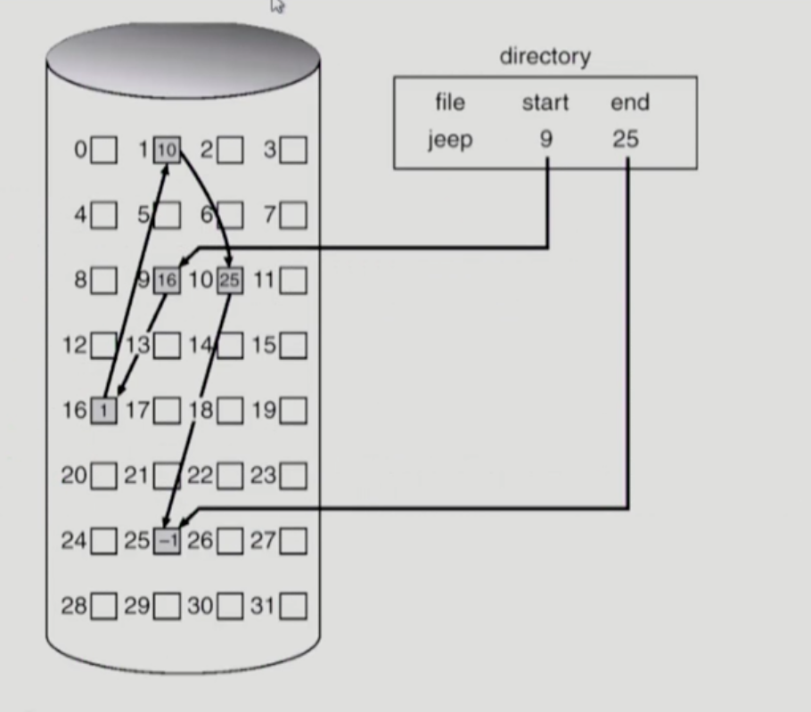
    - 장점
      - External framentation 발생 않마
    - 단점
      - No random access
      - Reliablity문제 
        - 한 sector가 고장나 Pointer가 유실되면 많은 부분을 잃음
      - Pointer를 위한 공간이 block의 일부가 되어 공간 효율성을 떨어뜨림
        - 512bytes/sector, 4bytes/pointer
    - 변형
      - File-allocation table(FAT)파일 시스템
        - 포인터를 별도의 위치에 보관하여 reliablity와 공간효율성 문제 해결
  - Indexed Allocation
    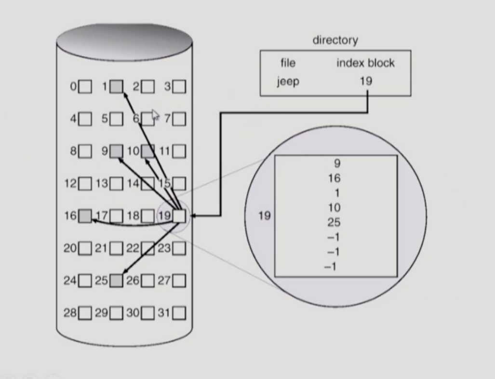
    - 장점
      - External fragmentation이 발생하지 않음
      - Direct access가능
    - 단점
      - Small file의 경우 공간 낭비(실제로 많은 file들이 small)
      - Too Large file의 경우 하나의 block으로 index를 저장하기에 부족
        - 해결방안
          1. Linked scheme
          2. multi-level index
- Unix 파일 시스템의 구조
  
  - 유닉스 파일 시스템의 중요 개념
    - Book block
      - 부팅에 필요한 정보(bootstrap loader)
    - Superblock
      - 파일 시스템에 관한 총체적인 정보를 담고있다.
    - Inode
      - 파일 이름을 제외한 파일의 모든 메타 데이터를 저장
    - Data block
      - 파일의 실제 내용을 보관
- Fat File System
  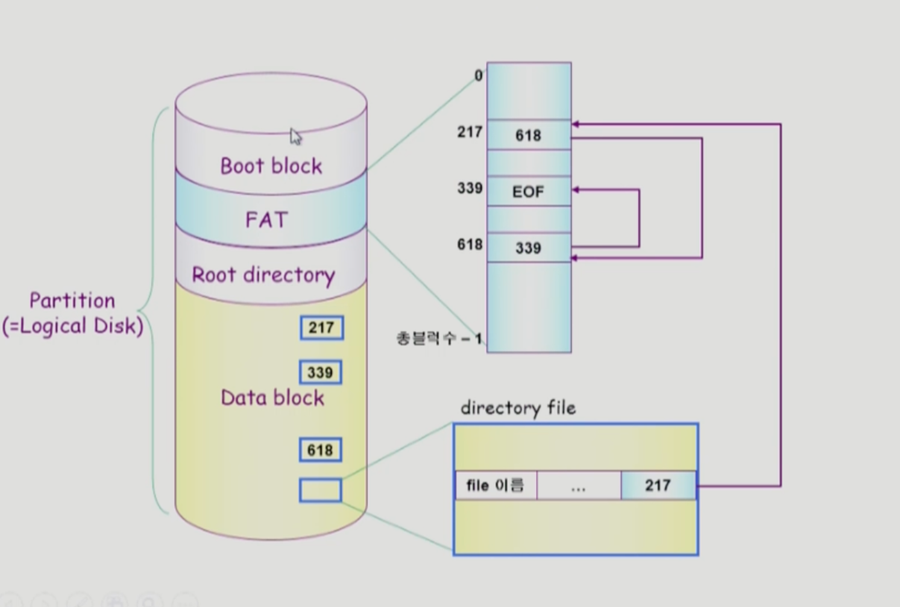

- Free-Space Management
  - Bit map or bit vector
  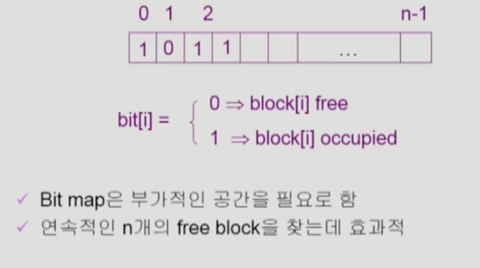
  - Linked list
    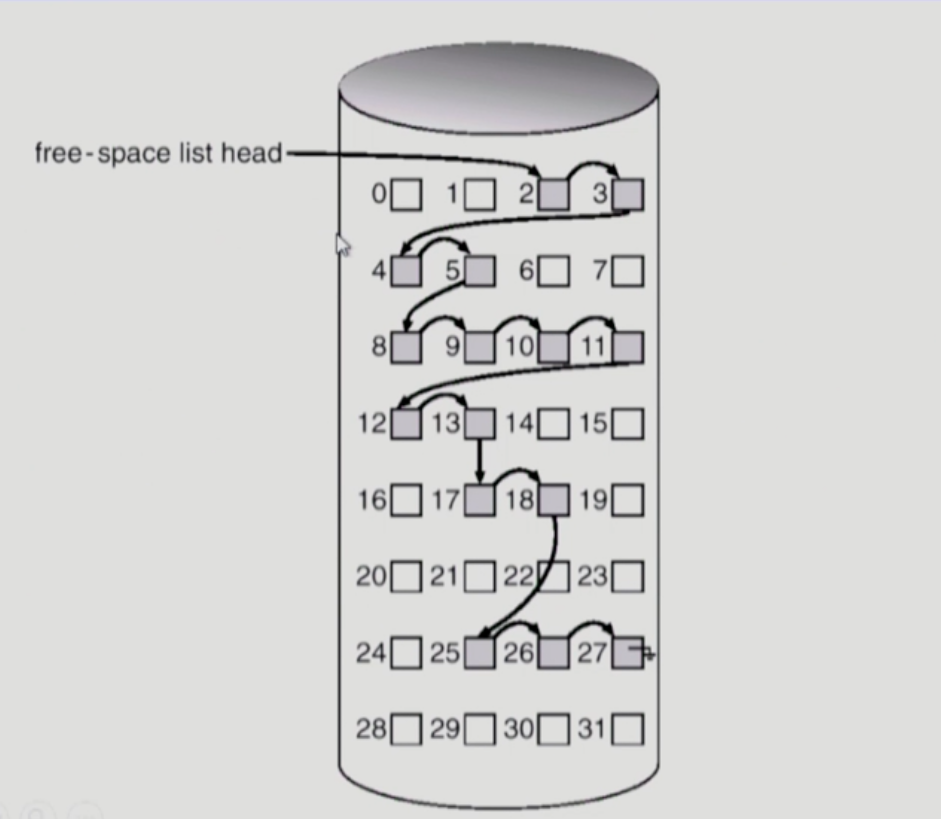
    - 모든 free block들을 링크로 연결(free list)
    - 연속적인 가용공간을 찾는 것은 쉽지 않다
    - 공간의 낭비가 없다
  - Grouping
    - linked list방법의 변형
    - 첫번째 free block이 n개의 pointer를 가짐
      - n-1 pointer는 free data block을 가리킴
      - 마지막 Pointer가 가리키는 block은 또 다시 n pointer를 가짐
  - Counting
    - 프로그램들이 종종 여러개의 연속적인 block을 할당하고 반납한다는 성질에 착안
    - first free block, # of contiguous free blocks을 유지

- Directory Implementation
  - Linear list
    - <file name,file의 metadata>의 list
    - 구현이 간단
    - 디렉토리 내에 파일이 있는지 찾기 위해서는 Linear search 필요(time-consuming)
  - Hash Table
    - linear list + hashing
    - Hash table은 file name을 이 파일의 linear list의 위치로 바꾸어줌
    - search time을 없앰
    - Collision 발생 가능
    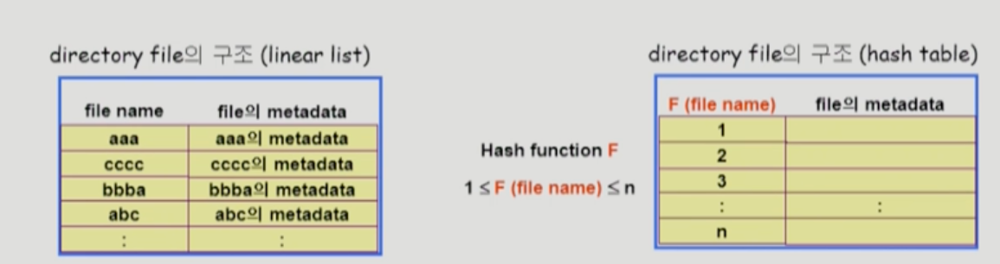
  - File의 metatdata의 보관 위치
    - 디렉토리 내에 직접 보관
    - 디렉토리에는 포인터를 두고 다른곳에 보관
      - inode,FAT등
  - Long file name의 지원
    - <file name, file의 metadata>의 list에서 각 entry는 일반적으로 고정 크기
    - file name이 고정 크기의 entry길이보다 길어지는 경우 entry의 마지막 부분에 이름의 뒷부분이 위치한 곳의 포인터를 두는 방법
    - 이름의 나머지 부분은 동일한 directory file의 일부에 존재
    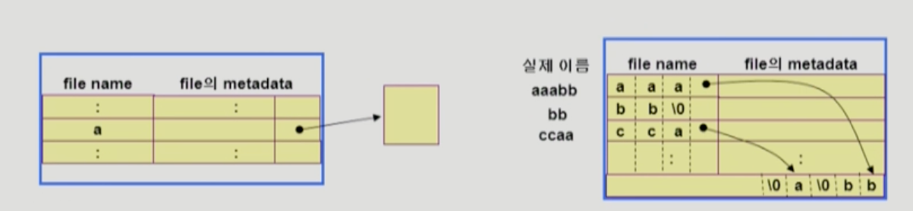

- VFS and NFS
  - Virtual File System(VFS)
    - 서로 다른 다양한 file system에 대해 동일한 시스템 콜 인터페이스(API)를 통해 접근할 수 있게 해주는 OS의 layer
  - Network File System
    - 분산 시스템에서는 네트워크를 통해 파일이 공유될 수 있음
    - NFS는 분산 환경에서의 대표적인 파일 공유 방법임
  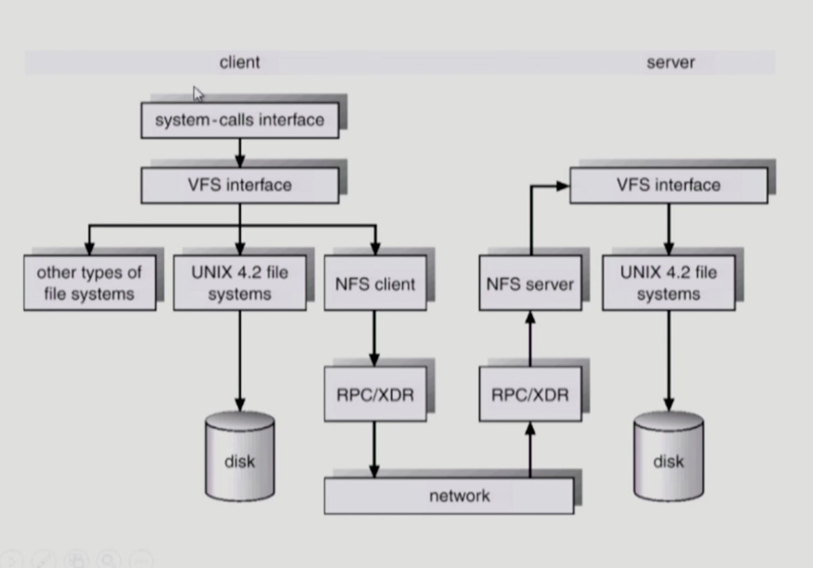

- Page Cache and Buffer Cache
  - Page Cache
    - Virtual memory의 Paging system에서 사용하는 page frame을 caching의 관점에서 설명하는 용어
    - Memory-Mapped I/O를 쓰는 경우 file의 I/O에서도 page cachetkdyd
  - Memory-Mapped I/O
    - File의 일부를 virtual memory에 mapping시킴
    - 매핑 시킨 영역에 대한 메모리 접근 연산은 파일의 입출력을 수행하게 함
  - Buffer Cache
    - 파일 시스템을 통한 I/O연산은 메모리의 특정 영역인 Buffer cache사용
    - File 사용의 locality 활용
      - 한번 읽어온 block에 대한 후속 요청시 buffer cache에서 즉시 전달
    - 모든 프로세스가 공용으로 사용
    - Replacememt algorithm 사용
  - Unified Buffer Cache
    - 최근의 OS에서는 기존의 buffer cache가 page cache에 통합됨
  
  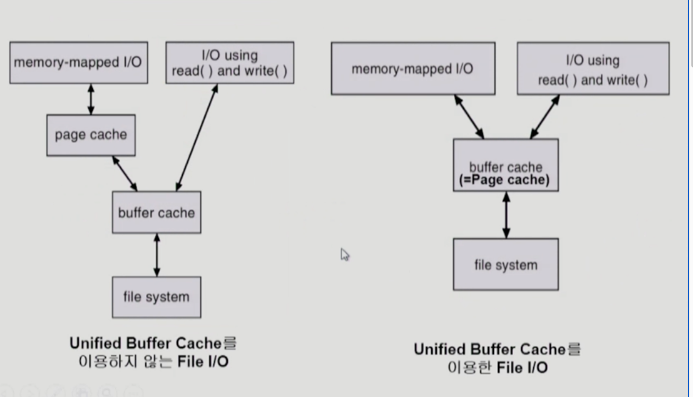
  