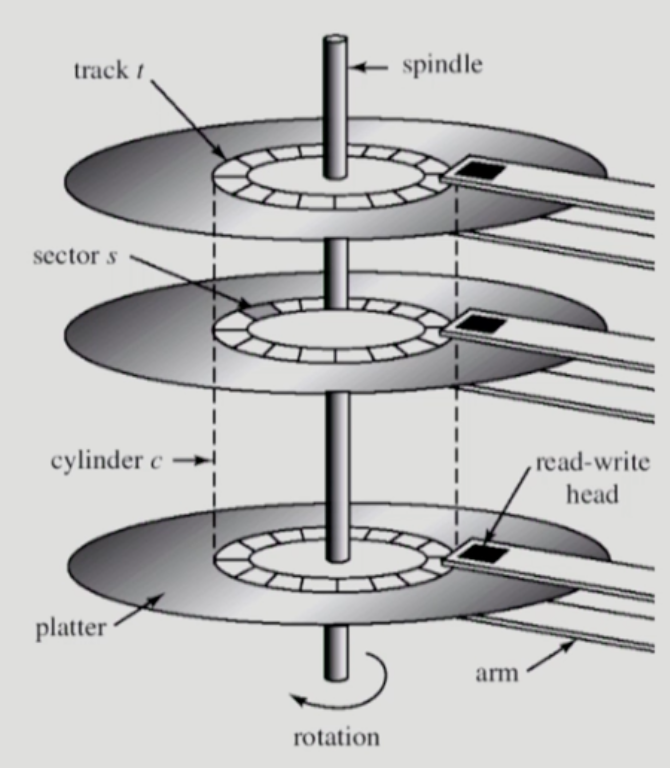
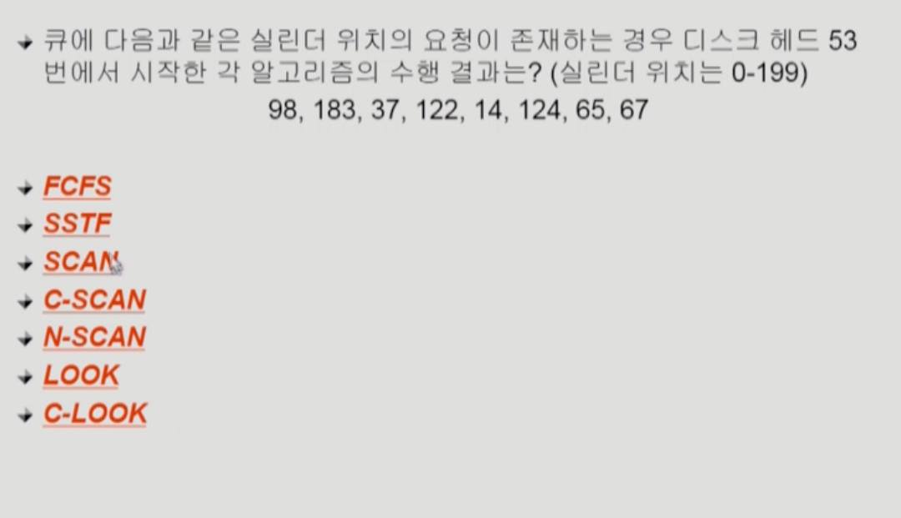
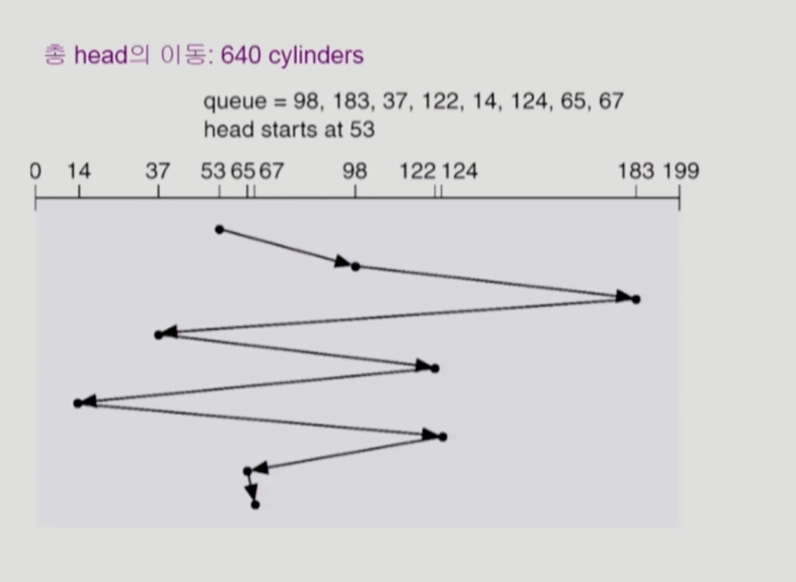
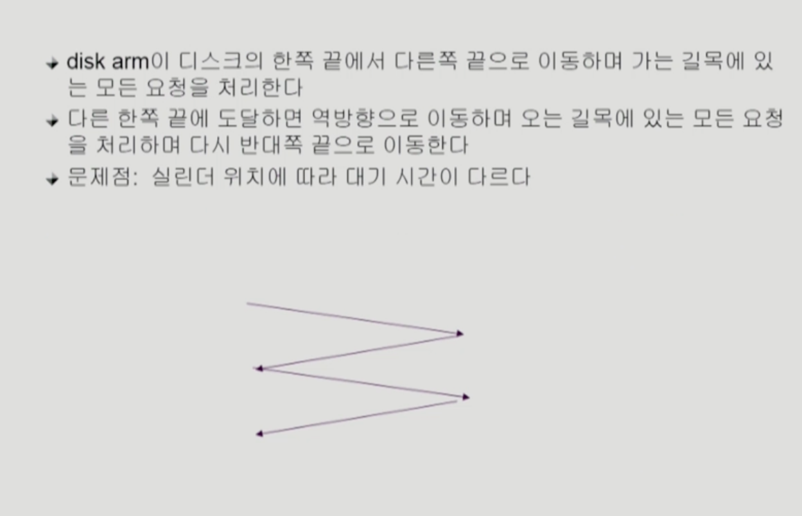
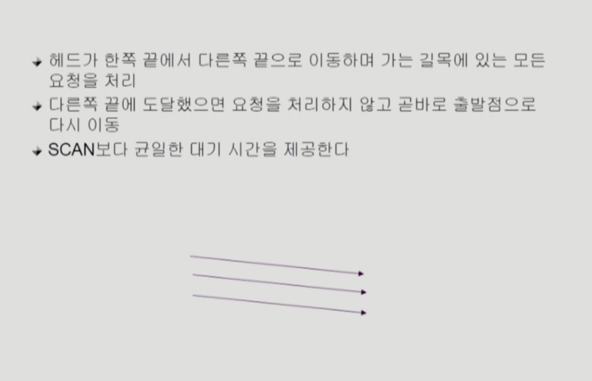
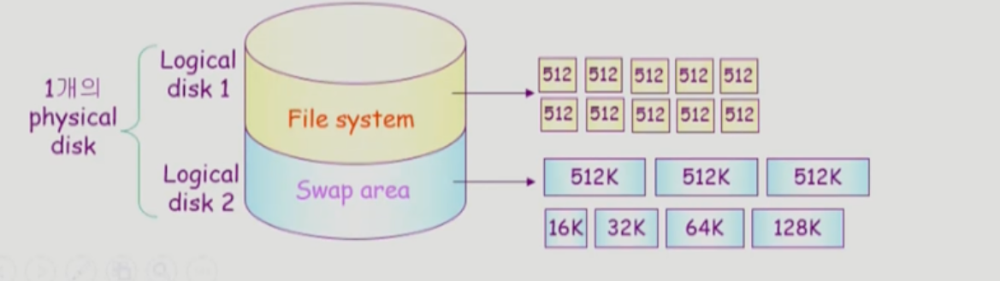

- Disk Structure
  - logical block   
    - 디스크의 외부에서 보는 디스크의 단위 정보 저장 공간들
    - 주소를 가진 1차원 배열처럼 취급
    - 정보를 전송하는 최소단위
  - Sector  
    - Logical black이 물리적인 디스크에 매핑된 위치
    - Sector 0은 최외곽 실린더의 첫 트랙에 있는 첫번째 섹터이다.
- Disk Management
  - physical formatting(Low-lelvel formatting)
    - 디스크를 컨트롤러가 읽고 쓸 수 있도록 섹터들로 나누는 과정
    - 각 섹터는 header+실제 data(보통 512bytes) + trailer로 구성
    - header와 trailer는 sector number,ECC(Error-Correcting COde)등의 정보가 저장되며 controller가 직접 접근 및 운영
  - Partitioning
    - 디스크를 하나 이상의 실린더 그룹으로 나누는 과정
    - OS는 이것을 독립적 disk로 취급(Logical disk)
  - Logical formatting
    - 파일 시스템을 만드는 것
    - FAT, inode, free space 등의 구조 포함
  - Booting
    - ROM에 있는 small bootstrap loader의 실행
    - sector 0 (boot block)을 load 하여 실행
    - sector 0은 full Bootstrap loader program
    - OS를 디스크에서 load하여 실행

- Disk Scheduling
  - Access time의 구성
    - Seek time
      - 헤드를 해당 실린더로 움직이는데 걸리는 시간
    - Rotational latency
      - 헤드가 원하는 섹터에 도달하기 까지 걸리는 회전 지연 시간
    - Transfer time
      - 실제 데이터의 전송 시간
  - Disk bandwidth
    - 단위 시간 당 전송된 바이트의 수
  - Disk scheduling
    - seek time을 최소화하는 것이 목표
    - Seek time = seek distance
   
- Disk Scheduling Algorithm
    
  - FCFS(First Come First Service)
    
  - SSTF(Shortest seek Time First) 
  - SCAN
    
  - C-SCAN
    
  - Other Algorithms
    - N-SCAN
      - SCAN의 변형 알고리즘
      - 일단 arm이 한 반향으로 움직이기 시작하면 그 시점 이후에 도착한 Job은 되돌아올때 service
    - LOOK and C-LOOK
      - SCAN이나 C-SCAN은 헤드가 디스크끝에서 끝으로 이동
      - LOOK과 C-LOOK은 헤드가 진행 중이다가 그 방향에 더 이상 기다리는 요청이 없으면 헤드의 이동방향을 즉시 반대로 이동한다.
- Disk-Scheduling Algorithm의 결정
  - SCAN,C-SCAN및 그 응용 알고리즘은 LOOK, C-LOOK등이 일반적으로 디스크 입출력이 많은 시스템에서 효율적인 것으로 알려져 있음
  - File 할당 방법에 따라 디스크 요청이 영향을 받음
  - 디스크 스케줄링 알고리즘은 필요할 경우 다른 알고리즘으로 쉽게 교체할 수 있도록 OS와 별도의 모듈로 작성되는 것이 바람직하다.
- Swap-Spcae Management
  - Disk를 사용하는 두가지 이유
    - memory의 volatile한 특성 ->file system
    - 프로그램 실행을 위한 Memory 공간 부족->swap space(swap area)
  - Swap-space
    - Virtual memory system에서는 디스크를 memory의 연장 공간으로 사용
    - 파일 시스템 내부에 둘수도 있으나 별도 partition 사용이 일반적
      - 공간 효율성 보다 속도 효율성이 우선
      - 일반 파일보다 훨씬 짧은 시간만 존재하고 자주 참조됨
      - 따라서 block의 그키 및 저장 방식이 일반 파일 시스템하고 다름
  

- RAID
  - RAID(Redundant Array of Indenpendent Disks)
    - 여러개의 디스크를 묶어서 사용
  - Raid의 사용 목적
    - 디스크 처리 속도 향상
      - 여러 디스크에 block의 내용을 분산 저장
      - 병렬적으로 읽어옴(interleaving, striping)
    - 신뢰성(reliablity)향상
      - 동일 정보를 여러 디스크에 중복 저장
      - 하나의 디스크가 고장(failure)시 다른 디스크에서 읽어옴(Mirroring, shadowing)
      - 단순한 중복 저장이 아니라 일부 디스크에 parity를 저장하여 공간의 효율성을 높일 수 있다.