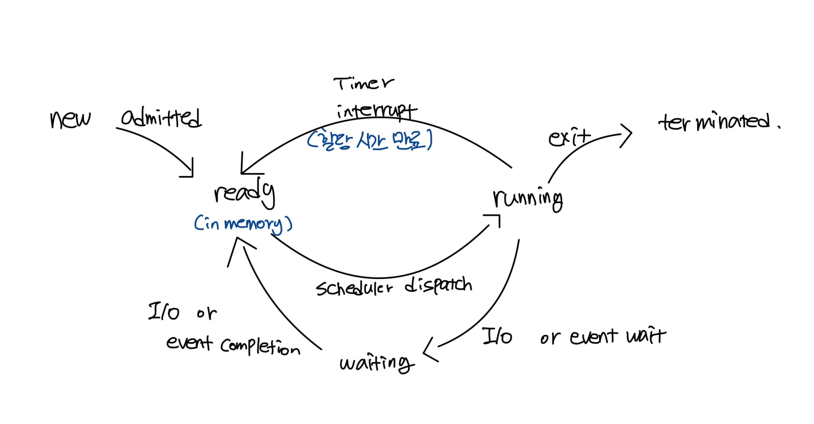
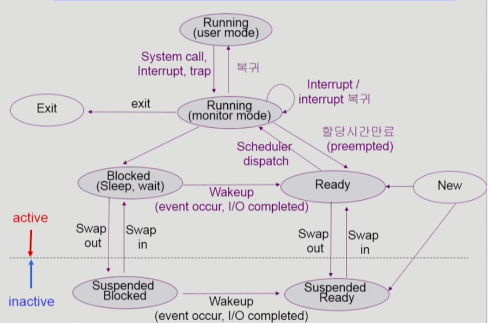
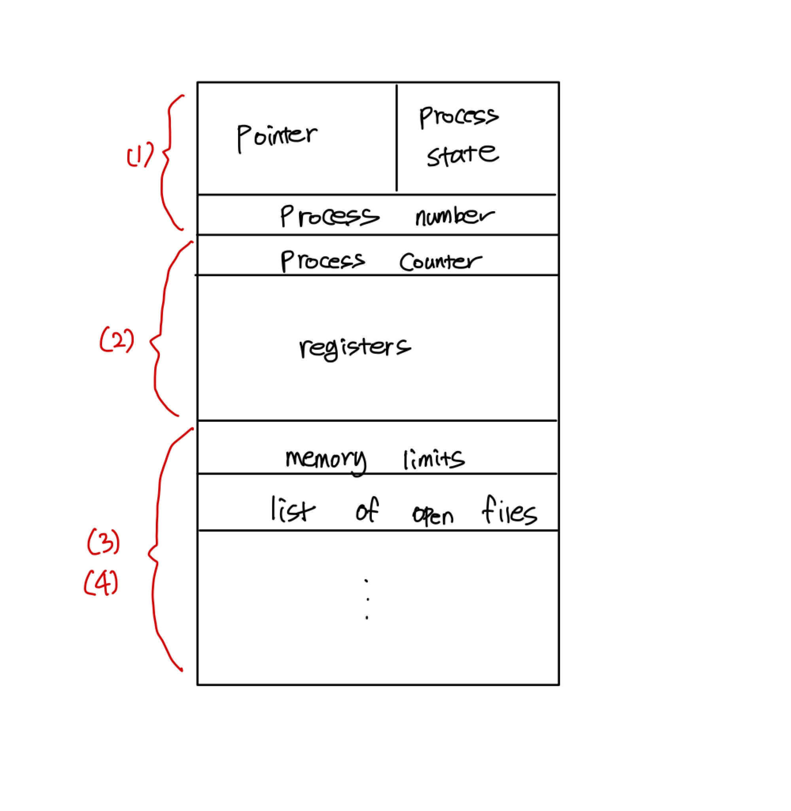
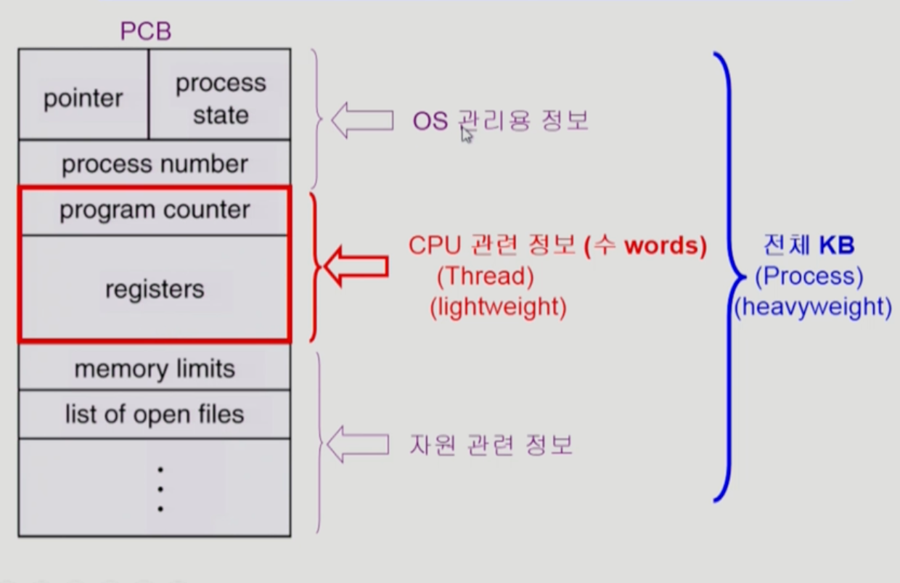

- 프로세스
  - 프로세스는 실행중인 프로그램이다.
  
- 프로세스의 문맥(context) : 프로그램이 어떠한 상태에 놓여져있는지에 대해서 확인하기 위해 존재함
  - CPU 상태를 나타내는 하드웨어의 문맥
    - Program Counter, 각종 register
  - 프로세스의 주소 공간
    - code, data, stack
  - 프로세스 관련 커널 자료 구조
    - PCB(Process Control Block)
    - Kernal stack
  
- 프로세스의 상태(Process state)
  - 프로세스는 상태(state)가 변경되며 수행된다.
   
    

    - Running : CPU를 잡고 instruction을 수행중인 상태
    - Ready : CPU를 기다리는 상태(메모리 등 다른 조건을 모두 만족하고)
    - Blocked(wait, sleep) 
      - CPU를 주어도 당장 instruction을 수행할 수 없는 상태
      - Process 자신이 요청한 event(예: I/O)
      - I/O등의 event를 스스로 기다리는 상태(디스크에서 file을 읽어와야 하는 경우)
    - new : 프로세스가 생성중인 상태
    - Terminated : 수행(execution)이 끝난 상태

    Suspended가 추가된 프로세스 상태
    

    - Suspended(stopped)
      - 외부적인 이유는 프로세스의 수행이 정지된 상태
      - 프로세스는 통째로 디스크에 swap out된다.
      - 예) 사용자가 프로그램을 일시 정지 시킨경우 시스템이 여러 이유로 프로세스를 잠시 중단시킴(메모리에 너무 많은 프로세스가 올라와 있을때)

    - Blocked: 자신이 요청한 event가 만족되면 Ready
    - Suspended: 외부에서 resume 해 주어야 Active

- PCB(Process Control Block)
  -  운영체제가 각 프로세스를 관리하기 위해 프로세스당 유지하는 정보
    
  -  다음의 구성요소를 가진다(구조체를 유지)
    1. OS가 관리상 사용하는 정보
         - Process state, Process ID
         - scheduling information, priority
    2. CPU 수행 관련 하드웨어 값
       - Program counter, registers
    3. 메모리 관련
       - Code, data, stack 의 위치 정보
    4. 파일 관련
       - Open file descriptions 

- 문맥 교환 Context Switch
  - CPU를 한 프로세스에서 다른 프로세스로 넘겨주는 과정
  - CPU가 다른 프로세스에게 넘어갈 때 운영체제는 다음을 수행
    - CPU를 내어주는 프로세스의 상태를 그 프로세스의 PCB에 저장
    - CPU를 새롭게 얻는 프로세스의 상태를 PCB에서 읽어옴

  - System call이나 Interrupt 발생시 반드시 context switch가 일어나는 것은 아님
  

  - (1)의 경우에도 CPU 수행 정보 등 context의 일부를 PCB에 save해야 하지만 문맥교환을 하는 (2)의 경우 그 부담이 훨씬 큼(eg. cache memory flush)

- 스케줄러(Scheduler)
  - Long-term scheduler(장기 스케줄러 or job scheduler)
    - 시작 프로세스 중 어떤 것들을 ready queue로 보낼지 결정
    - 프로세스에 memory(및 각종 자원)을 주는 문제
    - degree of Multiprogramming을 제어
    - time sharing system에는 보통 장기 스케줄러가 없음 (무조건 ready)

  - Short-term scheduler(단기 스케줄러 or CPU scheduler)
    - 어떤 프로세스를 다음번에 runnig 시킬지 결정
    - 프로세스에 CPU를 주는 문제
    - 충분히 빨라야함 (millisecond 단위)

  - Medium-Term-Scheduler(중기 스케줄러 or Swapper)
    - 여유 공간 마련을 위해 프로세스를 통째로 메모리에서 디스크로 쫓아냄
    - 프로세스에게 memory를 뺏는 문제
    - degree of Multiprogramming을 제어
    - 중기 스케줄러로 인해 Suspended(stopped) 상태가 생김

- 쓰레드(Thread,lightweight process)
  - 프로세스 하나에 CPU의 수행단위를 여러개 두는 것을 쓰레드라고 함
  - 구성 
    - program counter
    - register set
    - stack space
  - 동료 thread와 공유 하는 부분
    - code section
    - data section
    - os resources
  - 전통적인 개념의 heavyweight process는 하나의 thread를 가지고 있는 task로 볼 수 있다.

  

  - 프로세스내에서는 쓰레드 생성시 CPU관련 정보만 여러개 생성되고 나머지 OS관리용 정보와 자원 관련 정보는 공유하게 된다.

  
- 장점
  - 다중 스레드로 구성된 태스크 구조에서는 하나의 서버 스레드가 blocked(waiting) 상태인 동안에도 동일한 태스크 내의 다른 스레드가 실행(runnig)되어 빠른 처리를 할 수 있다.
  - 동일한 일을 수행하는 당중 스레드가 협력하여 높은 처리율(throughput)과 성능 향상을 얻을 수 있다.
  - 스레드를 사용하면 병렬성을 높일 수 있다.(이례적인 경우, CPU가 여러 개 있는 경우)

  - 응답성(Responsivness) : 하나의 쓰레드가 네트워크과 같은 작업을 할때 디스플레이 작업을 하면서 빠르게 보여줄 수 있다.
  - 자원 공유(Resource Sharing) : 여러개의 쓰레드가 프로세스내의 자원을 공유하면서 사용하기 때문에 좀 더 효율적으로 자원을 활용할 수 있음
  - Economy : 프로세스를 생성하는 것 보다 프로세스 안에 쓰레드를 추가하는 것이 오버헤드가 훨씬 적고, 프로세스 내에서 Context switch가 될 때 오버헤드가 상당히 큰데 쓰레드 내에서는 오버헤드가 적다. Solaris의 경우 두 가지 overhead가 각각 30배, 5배이다.
  - Utilization of MP(Multi processor) Architectures : 각각의 쓰레드가 서로 다른 CPU에서 병렬적으로 실행 될 수 있음

- 쓰레드의 구현 방법
    - Kernel Threads
    - 쓰레드가 여러개 있다는 것을 운영체제 커널이 알고있다.
    - 어떤 쓰레드는 커널의 지원을 받는다 
      - 예)Windows 95/98/NT, Solaris, Digital Unix, Mach

  - User Threads
    - 라이브러리의 지원을 받는 쓰레드 이다. 
    - 운영체제 커널이 유저 쓰레드가 있다는 것을 모르고 유저 프로그램이 스스로 관리한다.
    - 구현상에 제약점이 존재한다.
    - POSIX Pthreads
    - Mach C-threads
    - Solaris threads

  - real-time threads
  

  