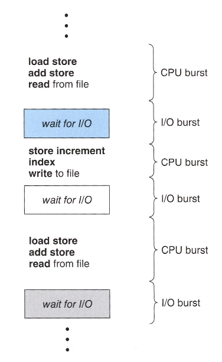
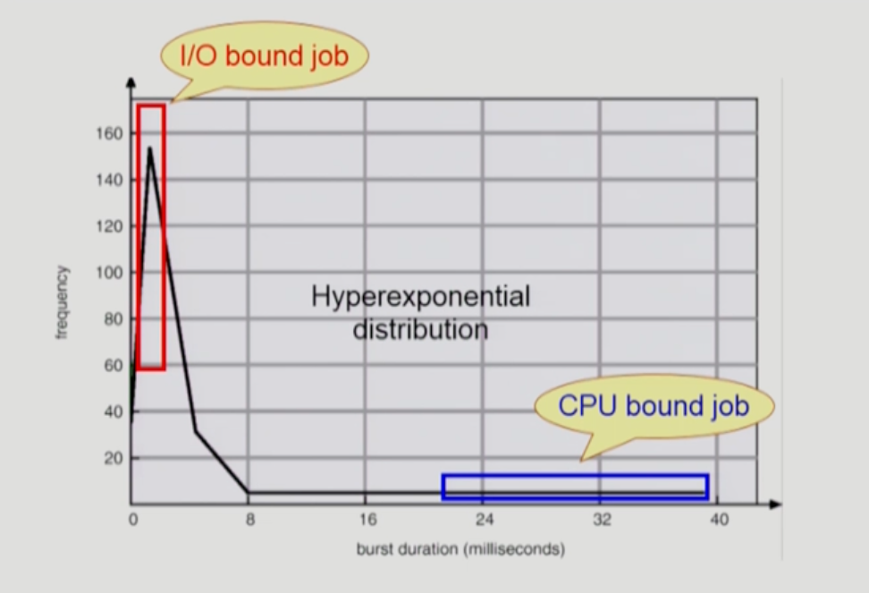

- Cpu Scheduling
  - CPU and I/O bursts in Program Execution
    
  
  - CPU burst Time의 분포
    

    - 여러 종류의 job(=process)이 섞여 있기 때문에 CPU 스케줄링이 필요하다
      - interactive job에게 적절한 response 제공 요망
      - CPU의 I/O 장치 등 시스템 자원을 골고루 효율적으로 사용
- 프로세스의 특성 분류
  - 프로세스는 그 특성에 따라 다음 두 가지로 나눔
    - I/O-bound process
      - CPU를 잡고 계산하는 시간 보다 I/O에 많은 시간이 필요한 job
      - (many short CPU bursts)

    - CPU-bound process
      - 계산 위주의 job
      - (few very long CPU bursts)

- CPU Scheduler % Dispathcer
  - CPU Scheduler
    - Ready 상태의 프로세스 중에서 이번에 CPU를 줄 프로세스를 고른다.
  - Dipatcher
    - CPU의 제어권을 CPU scheduler에 의해 선택된 프로세스에게 넘긴다.
    - 이 과정을 context switch(문맥 교환)라고 한다.

  - CPU 스케줄링이 필요한 경우는 프로세스에게 다음과 같은 상태 변화가 있는 경우이다.
    1. Running - Blocked 예) I/O 요청을 하는 시스템 콜
    2. RUnning - Ready 예) 할당시간 만료로 timer interrupt
    3. Blocked - Ready 예) I/O 완료후 인터럽트
    4. Terminate

  - 1,4에서의 스케줄링은 nonepreemtive(강제로 뺏지 않고 자진반납)
  - 다른 스케줄링은 preemptive(=강제로 빼앗음)

