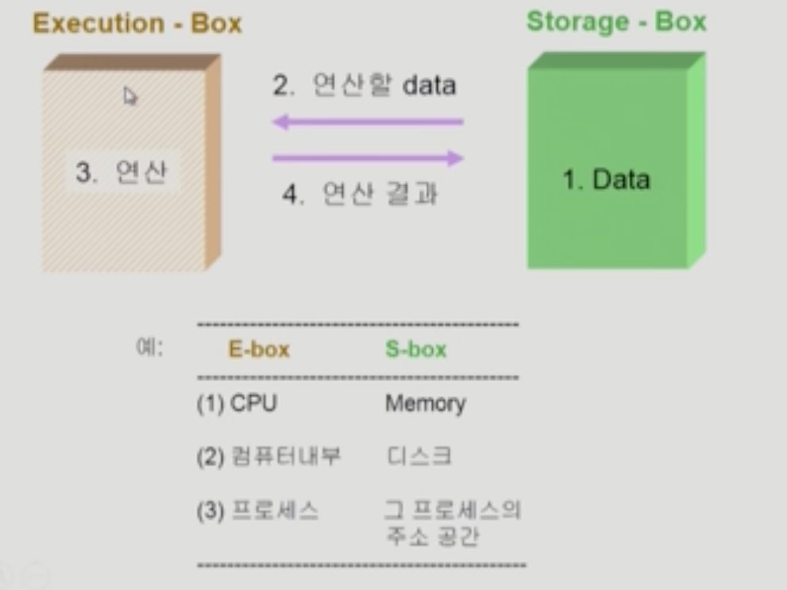
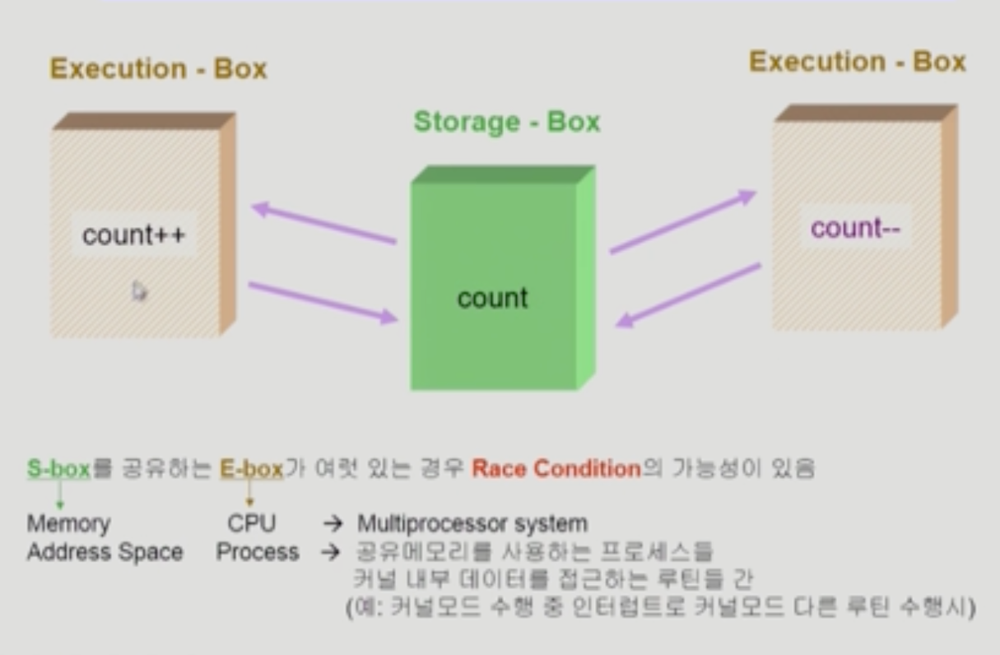
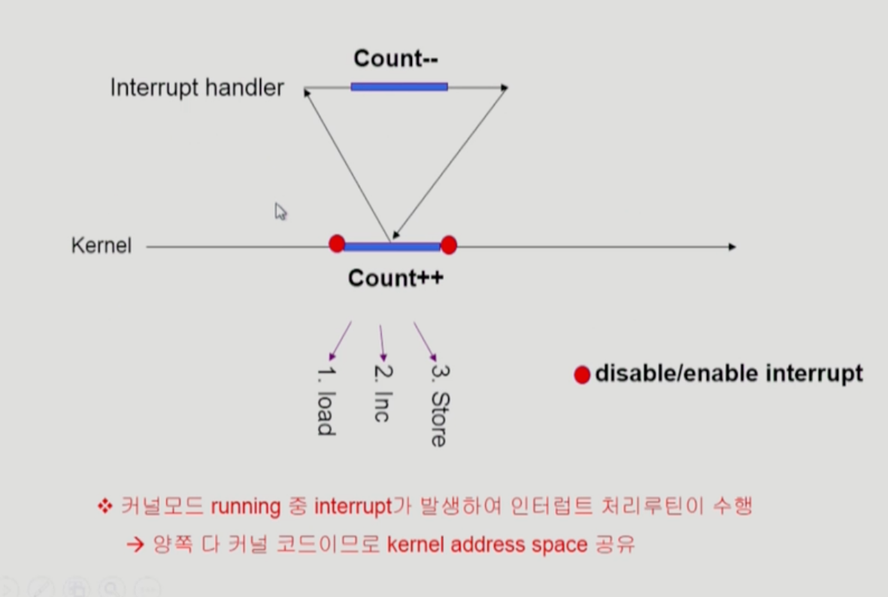
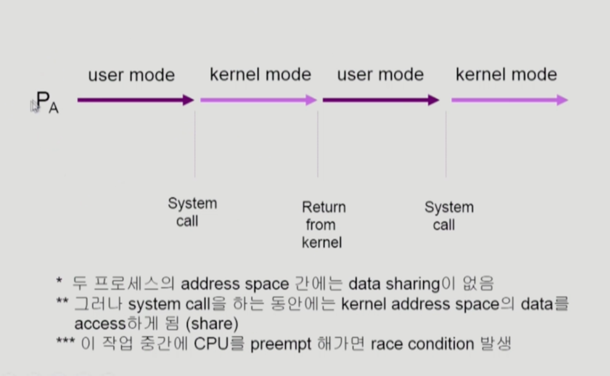
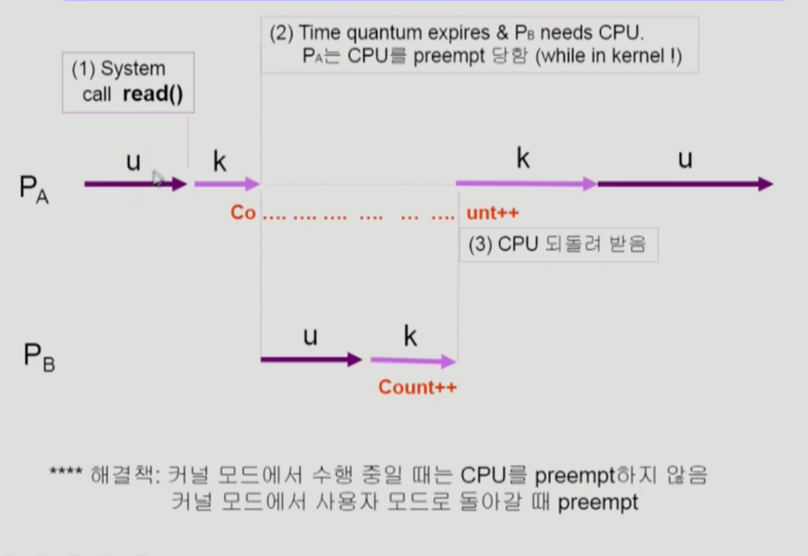
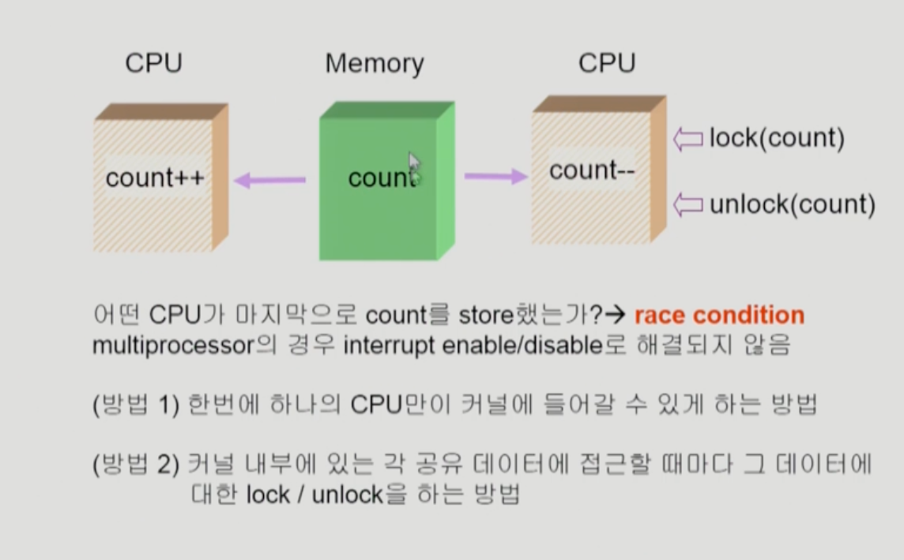

- 데이터 접근
  
- Race Condition
  

    - 여러 프로세스들이 동시에 공유 데이터를 접근 하는 상황
    - 데이터의 최종 연산 결과는 마지막에 그 데이터를 다룬 프로세스에 따라 달라짐

- os에서 race condition은 언제 발생하는가?
  - kernel 수행 중 인터럽트 발생 시
  - Process가 시스템 call을 하여 Kernel mode로 수행 중인데 context switch가 일어나는 경우
  - Multiprocessor에서 shared memory 내의 kernal data

- os에서의 race condition
  1. interrupt handler vs kernel
    
  2. preempt a process running in kernel
    
    
  3. multiprocessor
    

- Process Synchronization 문제
  - 공유 데이터(shared data)의 동시 접근(concurrent access)은 데이터의 불일치 문제(inconsistency)를 발생 시킬 수 있다.
  - 일관성(consistency)유지를 위해서는 협력 프로세스(cooperating process)간의 실행 순서(orderly execution)를 정해주는 케머니즘 필요

- The Critical-Section(공유데이터에 접근하는 코드) Problem(임계 구역)
  - n개의 프로세스가 공유 데이터를 동시에 사용하기를 원하는 경우
  - 각 프로세스의 code segment에는 공유 데이터를 접근하는 critical section이 존재
  - Problem
    - 하나의 프로세스가 ciritcal section에 있을 때 다른 모든 프로세스는 criticla section에 들어갈 수 없어야 한다.
  
