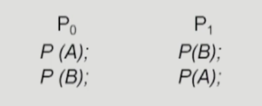
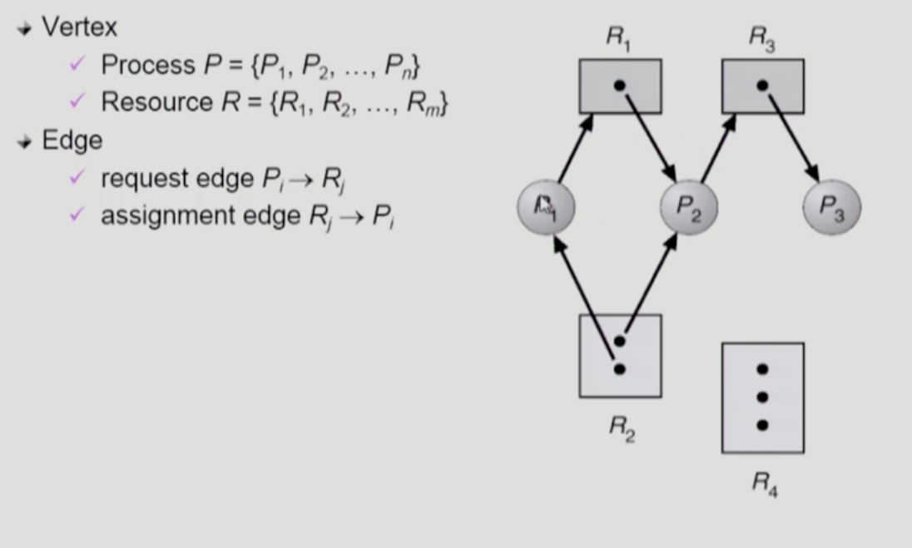
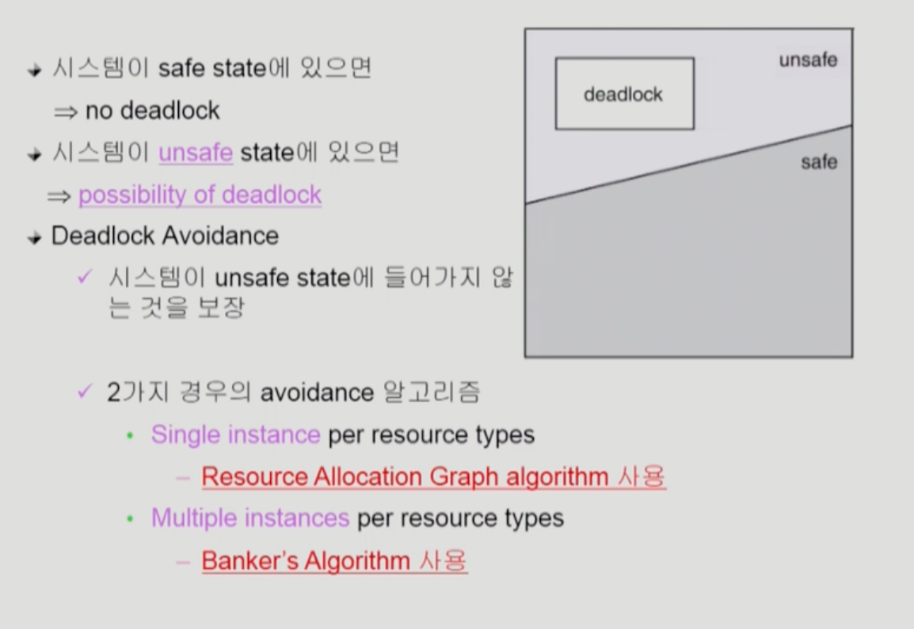
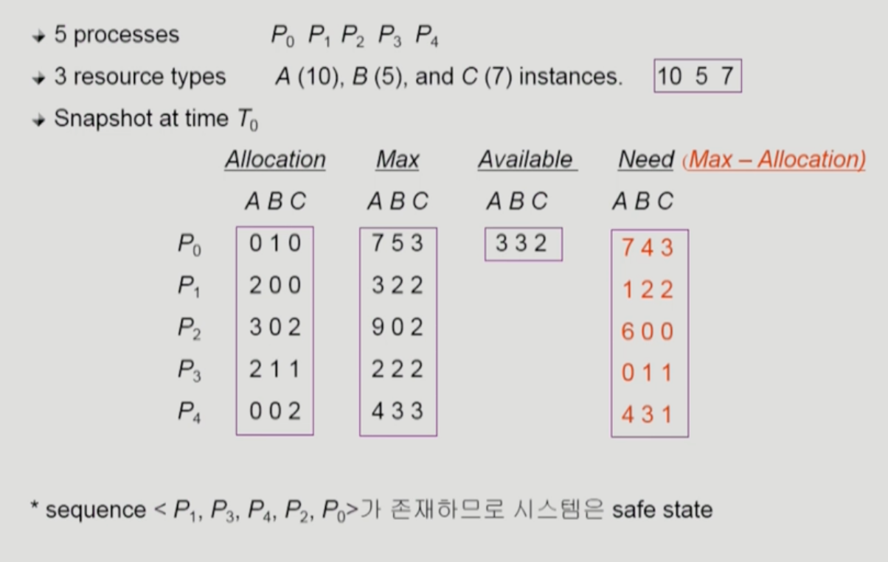
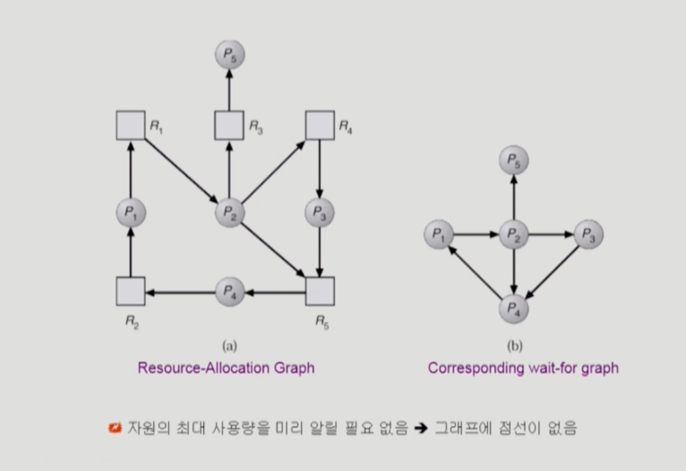
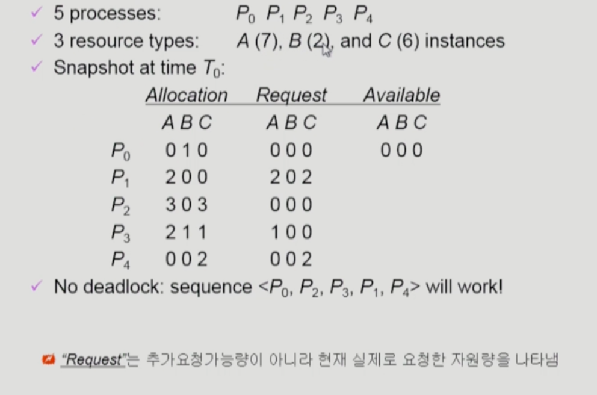

- deadlock(교착 상태)
  - 일련의 프로세스들이 서로가 가진 자원을 기다리며 block된 상태
- Resource(자원)
  - 하드웨어,소프트웨어 등을 포함하는 개념
  - 예) I/O device, CPU cycle, memory space, semaphoreemd
  - 프로세스가 자원을 사용하는 절차
    - Request, Allocate,Use,Realease
  - Deadlock Example1
    - 시스템에 2개의 tape drive가 있다.
    - 프로세스 P1과 P2 각각이 하나의 tape drive를 보유한 채 다른 하나를 기다리고 있다.
  - Deadlock Example2
    - Binary semaphores A and B
    
  - 데드락 발생의 4가지 조건
    - Mutual exclusion(상호 배제)
      - 매 순간 하나의 프로세스만이 자원을 사용할 수 있음
    - No preemption(비 선점)
      - 프로세스는 자원을 스스로 내어놓을 뿐 강제로 빼앗기지 않음
    - Hold and wait(보유대기)
      - 자원을 가진 프로세스가 다른 자원을 기다릴 때 보유 자원을 좋지 않고 계속 가지고 있음
    - circular wait(순환 대기)
      - 자원을 기다리는 프로세스 간에 사이클이 형성되어야 함
      - 프로세스는 P0,P1,.... Pn이 있을 때
        1. P0은 P1이 가진 자원을 기다림
        2. P1은 P2가 가진 자원을 기다림
        3. Pn-1은 Pn이 가진 자원을 기다림
        4. Pn은 P0이 가진 자원을 기다림

- Resource-Allocation-Graph(자원 할당 그래프)
    

    - 그래프에 cycle이 없음녀 deadlock이 아니다.
    - 그래프에 cycle이 있으면
      - if only one instance per resource type then deadlock
      - if several instances per resource type, possiblity of deadlock

- Deadlock의 처리방법(위로 강할수록 강한 방법)
  - Deadlock Prevention
    - 자원 할당 시 Deadlock의 4가지 필요 조건 중 어느 하나가 만족되지 않도록 하는 것
  - Deadlock Avoidance
    - 자원 요청에 대한 부가적인 정보를 이용해서 deadlock의 가능성이 없는 경우에만 자원을 할당
    - 시스템 state가 원래 state로 돌아올 수 있는 경우에만 자원 할당
  - Deadlock Detection and recovery(시스템이 느려졌을때 deadlock확인 및 recovery)
    - Deadlock 발생은 허용하되 그에 대한 detection 루틴을 두어 deadlock발견시 recover
  - Deadlock Ignorance(deadlock을 하지않음)
    - Deadlock을 시스템이 책임지지 않음
    - Unix를 포함한 대부분의 OS가 채택

- Deadlock Prevention
  - Mutual Exclusion
    - 공유해서는 안되는 자원의 경우 반드시 성립해야 함
  - Hold and Wait
    - 프로세스가 자원을 요청할 때 다른 어떤 자원도 가지고 있지 않아야 한다.
    - 방법1. 프로세스 시작 시 모든 필요한 자원을 할당받게 하는 방법
    - 방법2. 자원이 필요한 경우 보유 자원을 모두 놓고 다시 요청
  - No preemtion
    - process가 어떤 자원을 기다려야 하는 경우 이미 보유한 자원이 선점됨
    - 모든 필요한 자원을 얻을 수 있을 때 그 프로세스는 다시 시작된다.
    - State를 쉽게 save하고 restore할 수 있는 자원에서 주로 사용(CPU, memory)
  - Circular Wait
    - 모든 자원 유형에 할당 순서를 정하여 정해진 순서대로만 자원 할당
    - 예를 들어 순서가 3인 자원 Ri를 보유 중인 프로세스가 순서가 1인 자우너 Rj을 할당 받기 위해서는 우선 Rj를 release해야 한다.
    - > Utilization저하 throughput 감소, starvation 문제

- Deadlock Avoidance
  - 자원 요청에 대한 부가정보를 이용해서 자원 할당이 deadlock으로부터 안전(safe)한지를 동적으로조사해서 안전한 경우에만 할당
  - 가장 단순하고 일반적인 모델은 프로세스들이 필요로 하는 각 자원별 최대 사용량을 미리 선언하도록 하는 방법임
  - safe state
    - 시스템 내의 프로세스들에 대한 safe sequence가 존재하는 상태
  - safe sequence
    - 프로세스의 sequence<P1,P2,P3....Pn>이 safe하려면 Pi(1<= i < n)의 자원 요청이 "가용자원 + 모든 Pj(j<i)의 보유자원" 에 의해서 충족 되어야 함
    - 조건을 만족하면 다음 방법으로 모든 프로세스의 수행을 보장
      - pi의 자원 요청이 즉시 충족될 수 없으면 모든 Pj(j<i)가 종료될 때 까지 기다린다.
      - Pi-1이 종료되면 Pi의 자원요청을 만족시켜 수행된다.
    

- Resource Allocation Graph algorithm
    

- Bankers Algorithm
  - 가정
    - 모든 프로세스는 자원의 최대 사용량을 미리 명시
    - 프로세스가 요청 자원을 모두 할당 받은 경우 유한 시간 안에 이들 자원을 다시 반납ㅏㄴ다.
  - 방법
    - 기본 개념: 자원 요청시 safe 상태를 유지할 경우에만 할당
    - 총 요청 자원의 수가 가용 자원의 수보다 적은 프로세스를 선택(그런 프로세스가 없음 unsafe상태)
    - 그런 프로세스가 있으면 그 프로세스에게 자원을 할당
    - 할당받은 프로세스가 종료되면 모든 자원을 반납
    - 모든 프로세스가 종료될 때까지 이러한 과정 반복
  - Example
    

- Deadlock Detection and Recovery
  - Deadlock Detection
    - Resource type당 single instance인 경우
      - 자원 할당 그래프에서의 cycle이 곧 deadlock을 의미
    - Resource type당 multiple instance인 경우
      - Banker's algorithm과 유사한 방법 활용
  - Wait-for graph알고리즘
    - Resource type당 single instance인 경우
    - Wait-for graph
      - 자원 할당 그래프의 변형
      - 프로세스만으로 node구성
      - Pj가 가지고 있는 자원을 Pk가 기다리는 경우 Pk->Pj
    - Algorithm
      - Wait-for graph에 사이클이 존재하는지를 주기적으로 조사
      - O(n^2)
  

  
  - Recovery
    - Process termination
      - Abort all deadlocked processes
      - Abort one process at a time until the deadlock cycle is eliminated
    - Resource Preemption
      - 비용을 최소화할 victim의 선정
      - safe state로 rollback하여 process를 restart
      - Starvation 문제
        - 동일한 프로세스가 계속해서 victim으로 선정되는 경우
        - cost factor에 rollback 횟수도 같이 고려

- Deadlock Ignorance
  - Deadlock이 일어나지 않는다고 생각하고 아무런 조치도 취하지 않음
    - Deadlock이 매우 드물게 발생하므로 deadlock에 대한 조치 자체가 더 큰 overhead일 수 있음
    - 만약 시스템에 deadlock이 발생한 경우 시스템이 비 정상적으로 작동하는 것을 사람이 느낀후 직접 process를 죽이는 방법으로 대처
    - Unix,windows등의 대부분의 OS가 채택