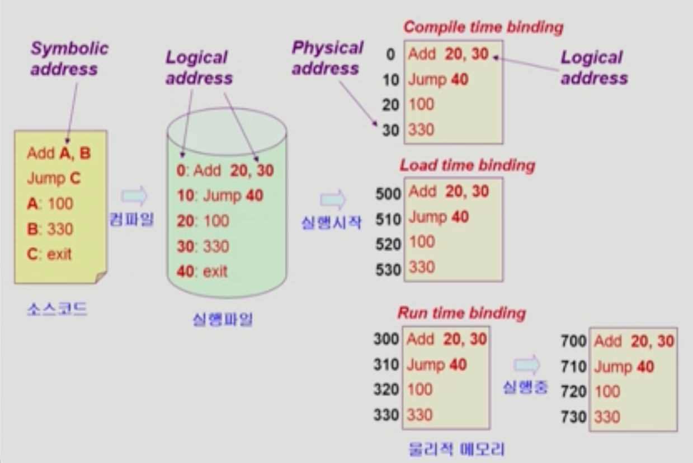
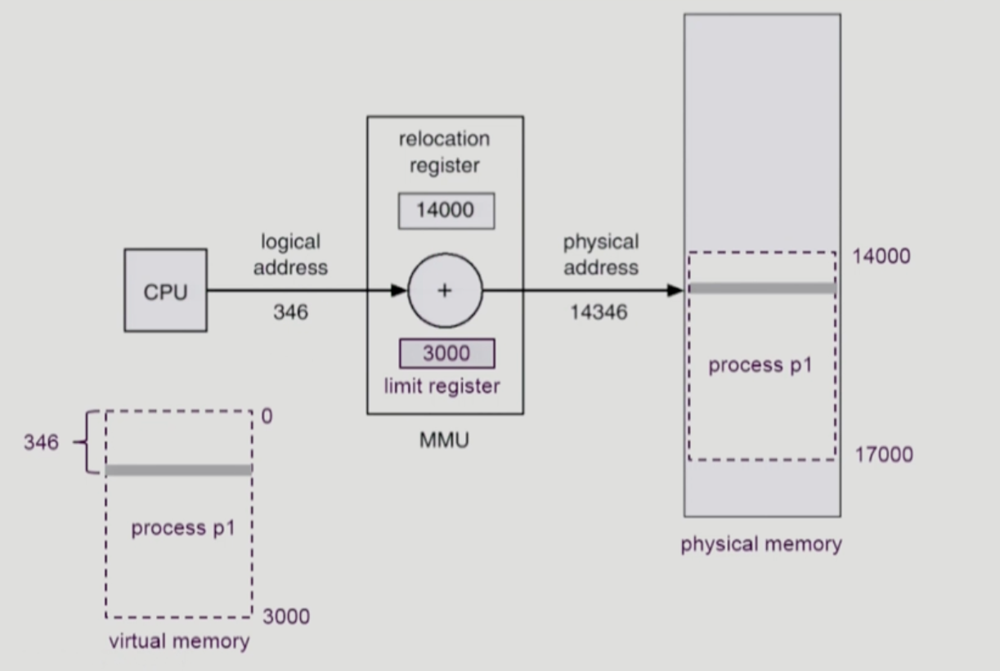
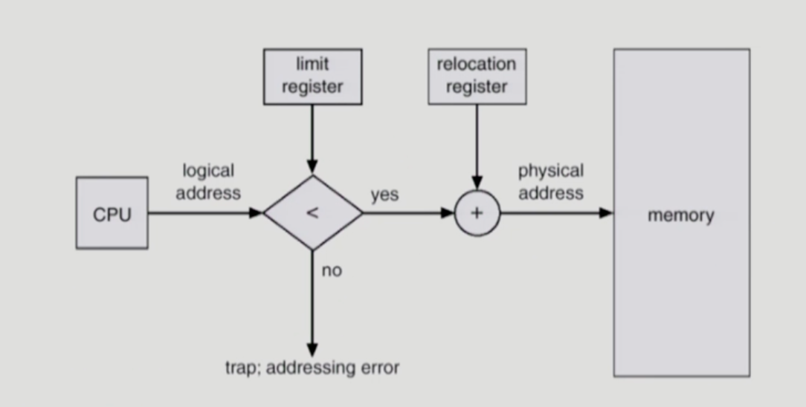
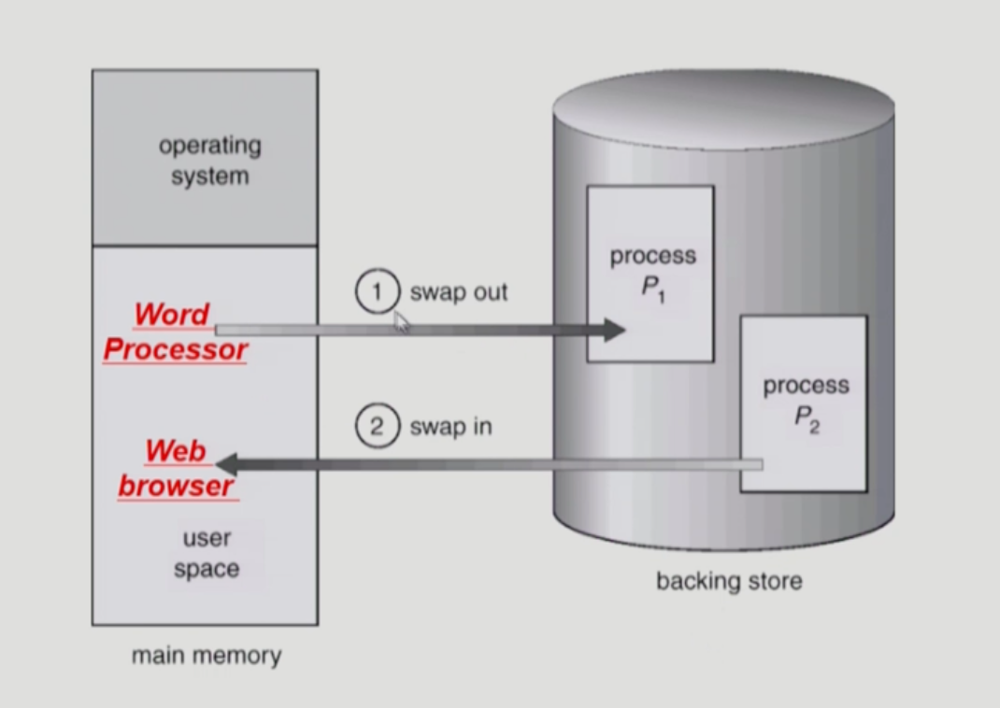
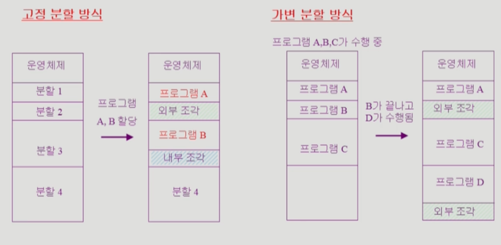
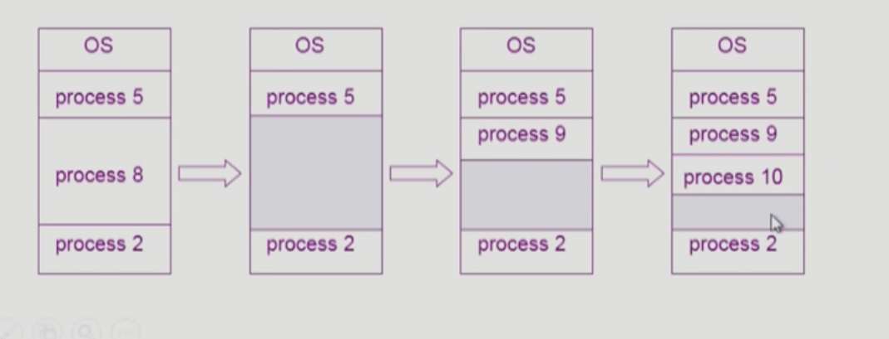
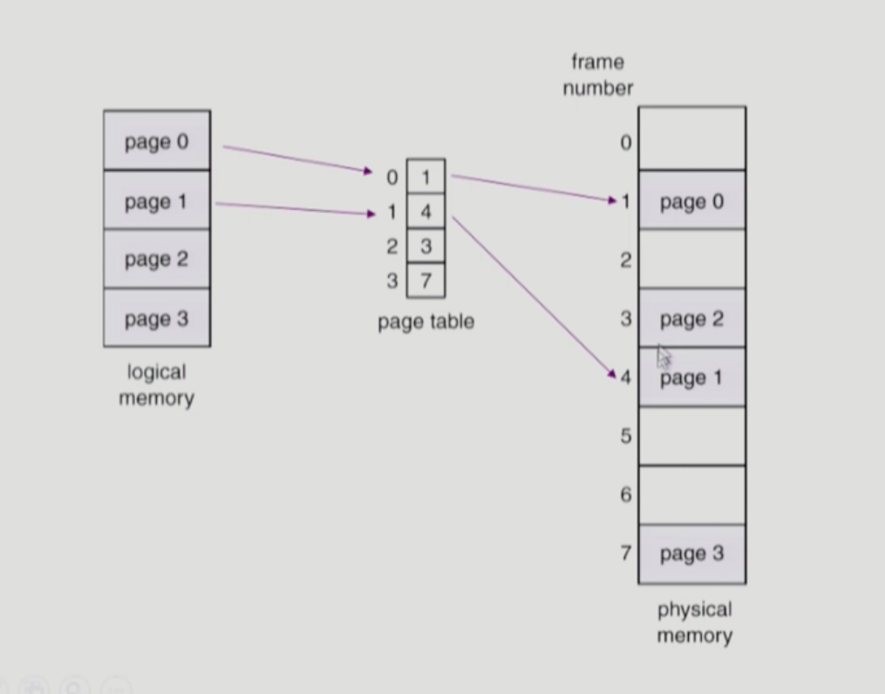
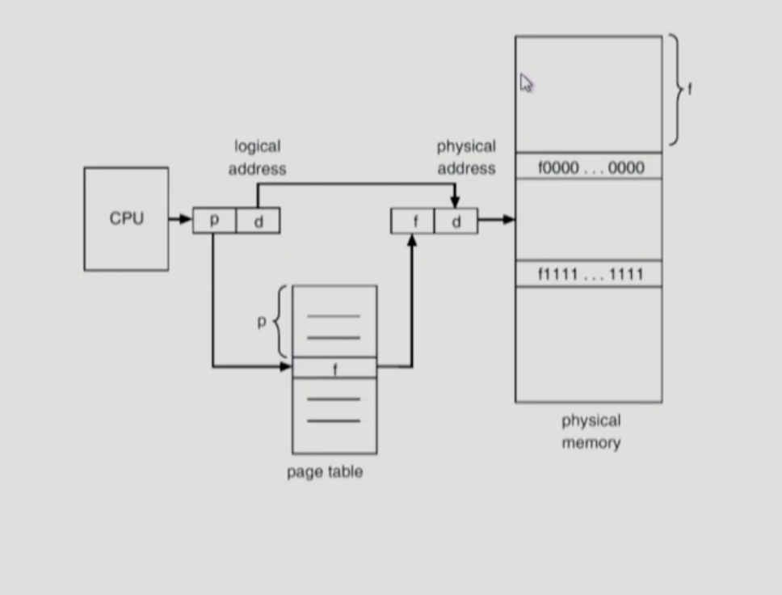
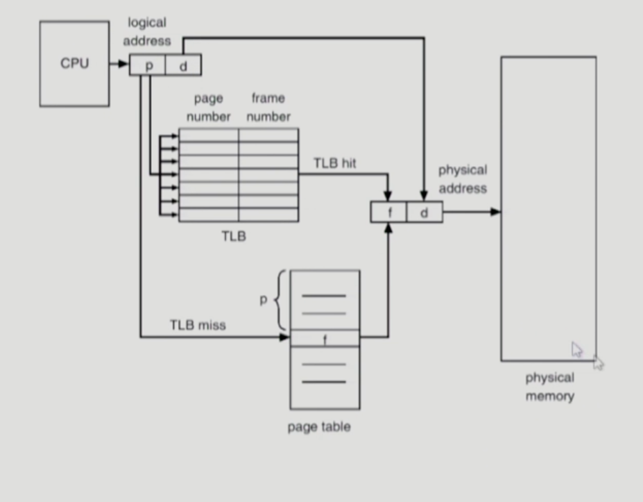

** Memory Management **

- Logical vs physicalAddress
  - Logical address(=virtual address)
    - 프로세스마다 독립적으로 가지는 주소공간
    - 각 프로세스마다 0번지부터 식작
    - CPU가 보는 주소는 Logical address임
  - Physical address
    - 메모리에 실제 올라가는 위치
  - 주소 바인딩: 주소를 결정하는 것
    - Symbolic Address -> Logical Address -> Physical Address (Logical Address -> Physical address : 이시점이 언제인가?)
    - compile time binding
      - 물리적 메로리 주(physical address)가 컴파일 시 알려짐
      - 시작 위치 변경시 재 컴파일
      - 컴파일러는 절대 코드(absolute code) 생성
    - Load time binding
      - Loader의 책임하에 물리적 메모리 주소 부여
      - 컴파일러가 재 배치가능코드(relocatable code)를 생성한 경우 가능
    - Excution time binding(=Run time binding)
      - 수행이 시작된 이후에도 프로세스의 메모리 상 위치를 옮길 수 있음
      - CPU가 주소를 참조할 때마다 binding을 점검(address mapping table)
      - 하드웨어 적인 지원이 필요(e.g.. base and limit registers, MMU)
       
- MMU(Memory-Management Unit)
  - logical address를 physical address로 매핑해주는 Hardware device
  - MMU scheme
    - 사용자 프로세스가 CPU에서 수행되며 생성해내는 모든 주소값에 대해 base register(=relocation register)의 값을 더 한다.
  - user program
    - logical address만을 다룬다
    - 실제 physical address를 볼 수 없으며 알 필요가 없다.
- Dynamic Relocation
  
- Hardware Support for Address Translation
  
  - 운영체제 및 사용자 프로세스 간의 메모리 보호를 위해 사용하는 레지스터
    - Relocation register(=base register) : 접근할 수 있는 물리적 메모리 주소의 최소값
    - Limit register: 논리적 주소의 범위
- Dynamic Loading
  - 프로세스 전체를 메모리에 미리 다 올리는 것이 아니라 해당 루틴이 불려질 때 메모리에 Load하는 것
  - memory utilization 향상
  - 가끔식 사용되는 많은 양의 코드의 경우 유용, 예)오류 처리 루틴
  - 운영체제의 특별한 지원 없이 프로그램 자체에서 구현 가능(OS는 라이브러리를 통해 지원 가능)
  - Loading: 메모리로 올리는 것
- Overlays
  - 메모리에 프로세스의 부분 중 실제 필요한 정보만을 올림
  - 프로세스의 크키가 메모리보다 클 때 유용
  - 운영체제의 지원없이 사용자에 의해 구현
  - 작은 공간의 메모리를 사용하던 초창기 시스템에서 수작업으로 프로그래머가 구현
    - Manual Overlay
    - 프로그래밍이 매우 복잡
- Swapping
  - Swapping : 프로세스를 일시적으로 메로리에서 backing store로 쫓아내느것
  - Backing store(=swap area)
    - 디스크 : 많은 사용자의 프로세스 이미지를 담을 만큼 충분히 빠르고 큰 저장공간
  - Swap in/ Swap out
    - 일반적으로 중기 스케줄러(swapper)에 의해 swap out시킬 프로세스 선정
    - priority-based CPU scheduling algorithm
      - priority가 낮은 프로세스를 swapped out시킴
      - priority가 높은 프로세스를 메모리에 올려 놓음
    - Compile time 혹은 Load time binding에서는 원래 메모리 위치로 swap in 해야함
    - Execution time binding에서는 추후 빈 메모리 영역 아무곳에나 올릴 수 있음
    - swap time은 대부분 transfer time(swap되는 양에 비례하는 시간,데이터의 양이 많기 때문에)임
    
- Dynamic Linking
  - Linking을 실행 시간 (execution time)까지 미루는 기법
  - Static linking
    - 라이브러리가 프로그램의 실행 파일 코드에 포함됨
    - 실행 파일의 크기가 커짐
    - 동일한 라이브러리를 각각의 프로세스가 메모리에 올리므로 메모리 낭비(eg. printf함수의 라이브러리 코드)
  - Dynamic linking
    - 라이브러리가 실행시 연결 (link)됨
    - 라이브러리 호출 부분에 라이브러리 루틴의 위치를 찾기 위한 stub이라는 작은 코드를 둠
    - 라이브러리가 이미 메모리에 있으면 그 루틴의 주소로 가고 없으면 디스크에서 읽어옴
    - 운영체제의 도움이 필요
- Allocation of Physical memory
  - 메모리는 일반적으로 두 영역으로 나뉘어 사용
    - OS 상주 영역 
      - interrupt vector와 함께 낮은 주소 영역 사용
    - 사용자 프로세스 영역
      - 높은 주소 영역 사용
  - 사용자 프로세스 영역의 할당 방법
    - Contiguous allocation : 각각의 프로세스가 메모리의 연속적인 공간에 적재되도록 하는 것
      - Fixed partition allocation : 고정 분할(Fixed Partition) 방식
        - 물리적 메모리를 몇 개의 영구적 분할(partition)로 나눔
        - 분할의 크기가 모두 동일한 방식과 서로 다른 방식이 존재
        - 분할당 하나의 프로그램 적재
        - 융통성이 없음
          - 동시에 메모리에 load되는 프로그램의 수가 고정됨
          - 최대 수행 가능 프로그램 크기 제한
        - Internal fragmentation 발생 (external fragmentation도 발생)
      - Variable partition allocation : 가변 분할 방식
        - 프로그램의 크기를 고려해서 할당
        - 분할의 크기, 갯수가 동적으로 변함
        - 기술적 관리 기법 필요
        - External fragmentation 발생
      
      - Noncontiguous allocation : 하나의 프로세스가 메모리의 여러 영역에 분산되어 올라갈 수 있음
        - Paging
        - Segmentation
        - Paged Segmentation
- External fragmentation(외부 조각)
  - 프로그램 크기보다 분할의 크기가 작은 경우
  - 아무 프로그램에도 배정되지 않은 빈 곳인데도 프로그램이 올라갈 수 없는 작은 분할
- Internal fragmentation(내부 조각)
  - 프로그램 크기보다 분할의 크기가 큰 경우
  - 하나의 분할 내부에서 발생하는 사용되지 않는 메모리 조각
  - 특정 프로그램에 배정되었지만 사용되지 않는 공간
- Hole
  - 가용 메모리 공간
  - 다양한 크기의 hole들이 메모리 여러 곳에 흩어져 있음
  - 프로세스가 도착하면 수용가능한 hole을 할당
  - 운영체제는 다음의 정보를 유지
    - a) 할당공간 b) 가용 공간(hole)
  
- Dynamic Storage-Allocation Problem : 가변 분할 방식에서 size n인 요청을 만족하는 가장 적절한 hole을 찾는 문제
  - First-fit
    - Size가 n 이상인 것 중 최초로 찾아지는 hole에 할당
  - Best-fit
    - Size가 n이상인 가장 작은 hole을 찾아서 할당
    - Hole들의 리스트가 크기순으로 정렬되지 않은 경우 모든 hole의 리스트를 탐색해야함
    - 많은 수의 아주 작은 hole들이 생성됨
  - Worst-fit
    - 가장 큰 hole에 할당
    - 역시 모든 리스트를 탐색해야 함
    - 상대적으로 아주 큰 hole들이 생성됨
  - First-fit과 best-fit이 worst-fit보다 속도와 공간 이용률 측면에서 효과적인 것으로 알려짐(실험적인 결과)
- compaction
  - external fragmentation 문제를 해결하는 한 가지 방법
  - 사용 중인 메모리 영역을 한군데로 몰고 hole들을 다른 한 곳으로 몰아 큰 block을 만드는 것
  - 매우 비용이 많이 드는 방법임
  - 최소한의 메모리 이동으로 compaction하는 방법(매우 복잡한 문제)
  - Compaction은 프로세스의 주소가 실행 시간에 동적으로 재배치 가능한 경우에만 수행 될수 있다.
- Paging
  - 프로세스의 virtual memory를 동일한 사이즈의 page 단위로 나눔
  - Virtual memory의 내용이 page단위로 noncontiguous하게 저장됨
  - 일부는 backing storage에, 일부는 physicla memory에 저장
  - Basic method
    - physical memory를 동일한 크기의 frame으로 나눔
    - logical memory를 동일 크기의 page로 나눔(frame과 같은 크기)
    - 모든 가용 frame들을 관리
    - page table을 사용하여 logical address를 physical address로 변환
    - External fragmentation 발생 안함
    - Internal fragmentation 발생  가능
  - Example
  
  

  - Implementation
    - Page table은 main memory에 상주
    - Page-table base register(PTBR)가 page table을 가리킴
    - Page-table length register(PTLR)가 테이블 크기를 보관
    - 모든 메모리 접근 연산에는 2번의 memory access가 필요
    - page table 접근 1번,실제 data/instruction 접근 1번
    - 속도 향상을 위해 associative register혹은 translation look-aside buffer(TLB)라 불리는 고속의 lookup hardware cache 사용
    - Paging Hardware with TLB
      