- 가상메모리의 경우에는 전적으로 운영체제가 관리함

- Demand Paging
  - 실제로 필요할 때 page를 메모리에 올리는 것
    - I/O 양의 감소
    - Memory 사용량 감소
    - 빠른 응답 시간
    - 더 많은 사용자 수용
  - Valid/Invalid bit의 사용
    - Invalid의 의미
      - 사용되지 않는 주소 영역인 경우
      - 페이지가 물리적 메모리에 없는 경우
    - 처음에는 모든 page entry가 invalid로 초기화
    - address translation 시에 invalid bit이 set되어 있으면 => "page fault".
    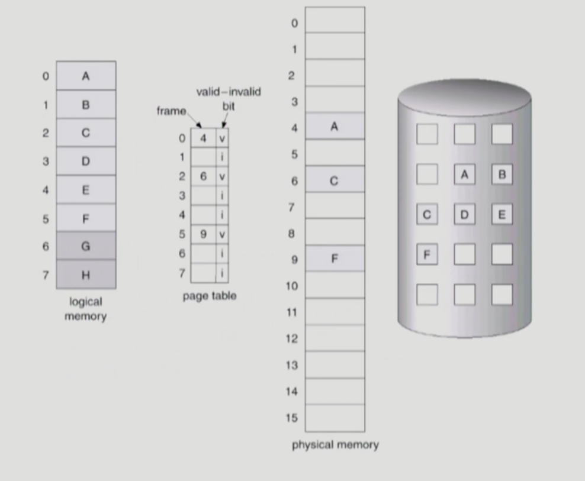

- Page Fault
  - invalid Page를 접근하면 MMU가 trap을 발생시킴 (page fault trap)
  - Kernal mode로 들어가서 page fault handler가 invoke됨
  - 다음과 같은 순서로 Page fault를 처리한다.
    1. Invalid reference? (eg. bad address, protection violation) => abort process.
    2. Get an empty page frame(없으면 뺏어온다:replace)
    3. 해당 페이지를 disk에서 memory로 읽어온다.
       1. disk I/O가 끝나기 까지 이 프로세스는 CPU를 preempt당함(block)
       2. Disk read가 끝나면 page tables entry 기록, valid/invalid bit = "valid"
       3. ready queue에 Process를 insert -> dispatcher later
    4. 이 프로세스가 CPU를 잡고 다시 Running
    5. 아까 중단되었던 instruction을 재개

- Steps in Handling a Page fault
  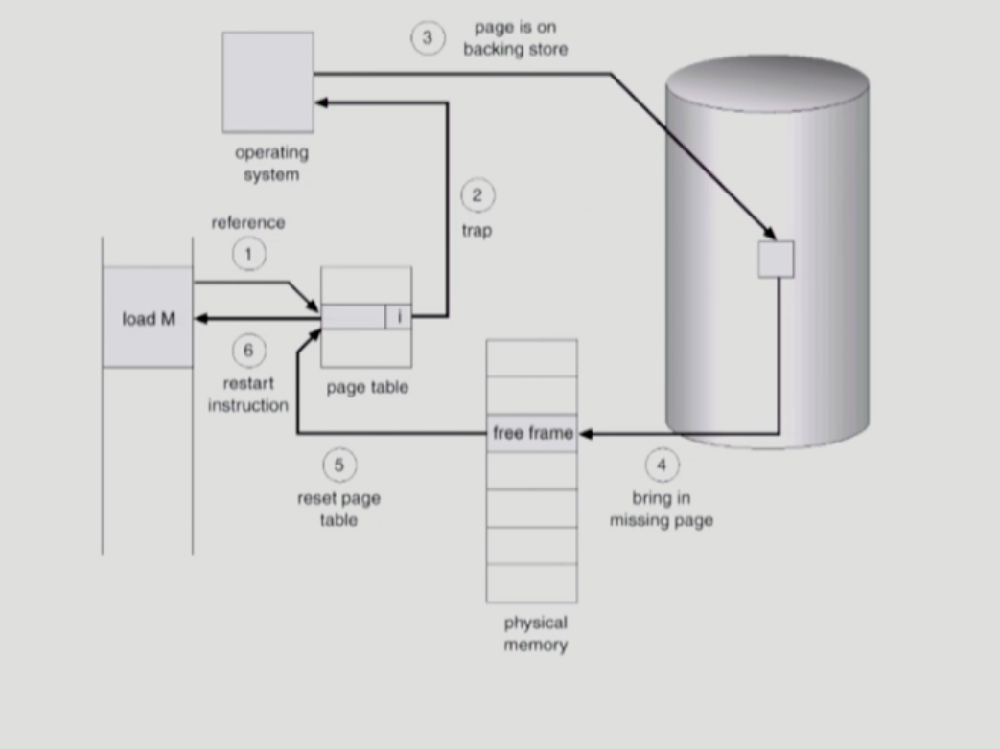

- performance of Demand Paging
  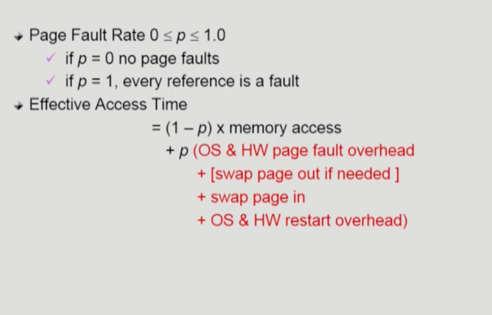

- Free Frame이 없는 경우
  - Page replacement
    - 어떤 frame을 뺴앗아올지 결정해야함
    - 곧바로 사용되지 않을 page를 쫓아내는 것이 좋음
    - 동일한 페이지가 여러번 메모리에서 쫓겨났다가 다시 들어올 수 있음
  - Replace Algorithm
    - page-fault rate을 최소화하는 것이 목표
    - 알고리즘의 평가
      - 주어진 page reference string에 대해 page fault를 얼마나 내는지 조사
    - reference string의 예
      - 1,2,3,4,1,2,5,1,2,3,4,5.

- Page Replacement
  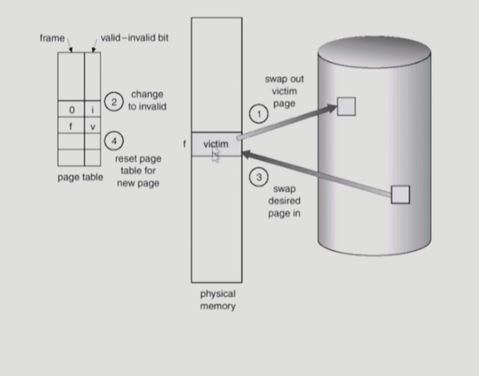

- Optimal Algorithm(미래를 알지 못하기 때문에 실제로는 사용하기가 힘듬)
  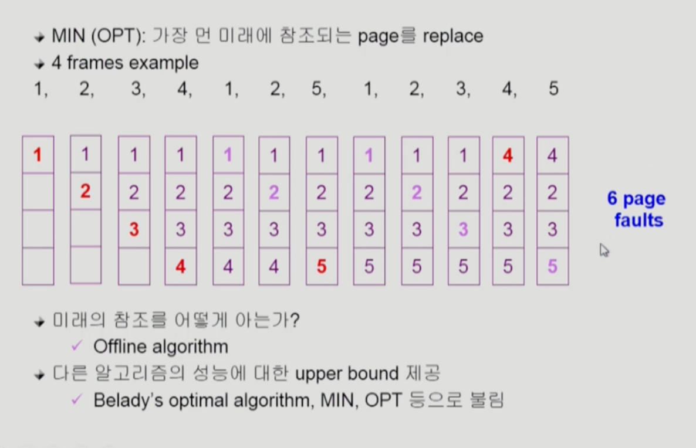

- FIFO(First In First Out) Algorithm
  - FIFO: 먼저 들어온 것을 먼저 내쫒음
  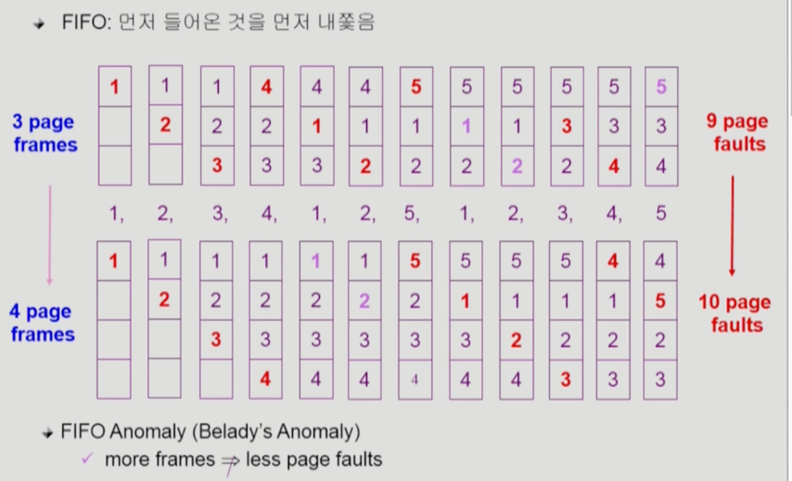

- LRU(Least Recently Used) Algorithm
  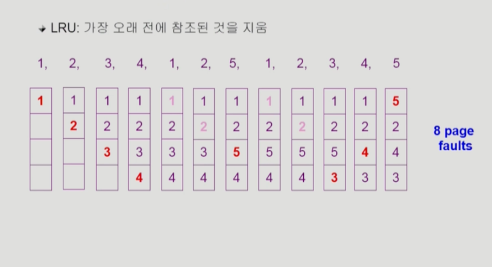

- LFU(Least Frequently Used) Algorithm
  - LFU: 참조 횟수(reference count)가 가장 적은 페이지를 지움
    - 최저 참조 횟수인 page가 여럿 있는 경우
      - LFU알고리즘 자체에서는 여러 page중 임의로 선정한다
      - 성능 향상을 위해 가장 오래 전에 참조된 page를 지우게 구현할 수도 있다.
    - 장단점
      - LRU처럼 직전 참조 시점만 보는 것이 아니라 장기적인 시간 규모를 보기때문에 page의 인기도를 좀 더 정확히 반영할 수 있음
      - 참조 시점의 최근성을 반영하지 못함
      - LRU보다 구현이 복잡함
  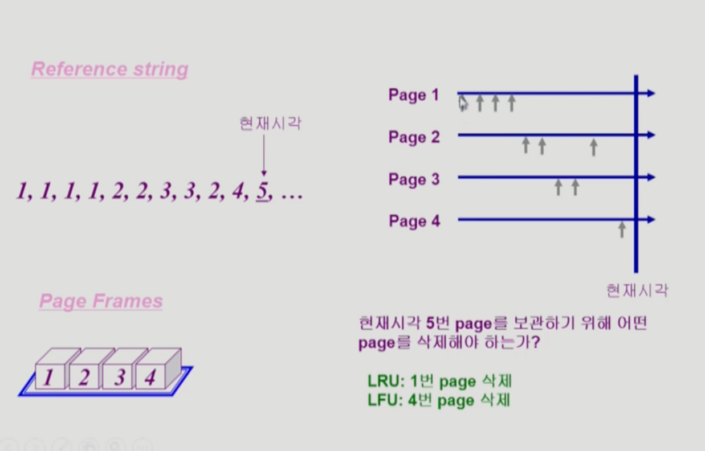

- LRU와 LFU알고리즘의 구현
  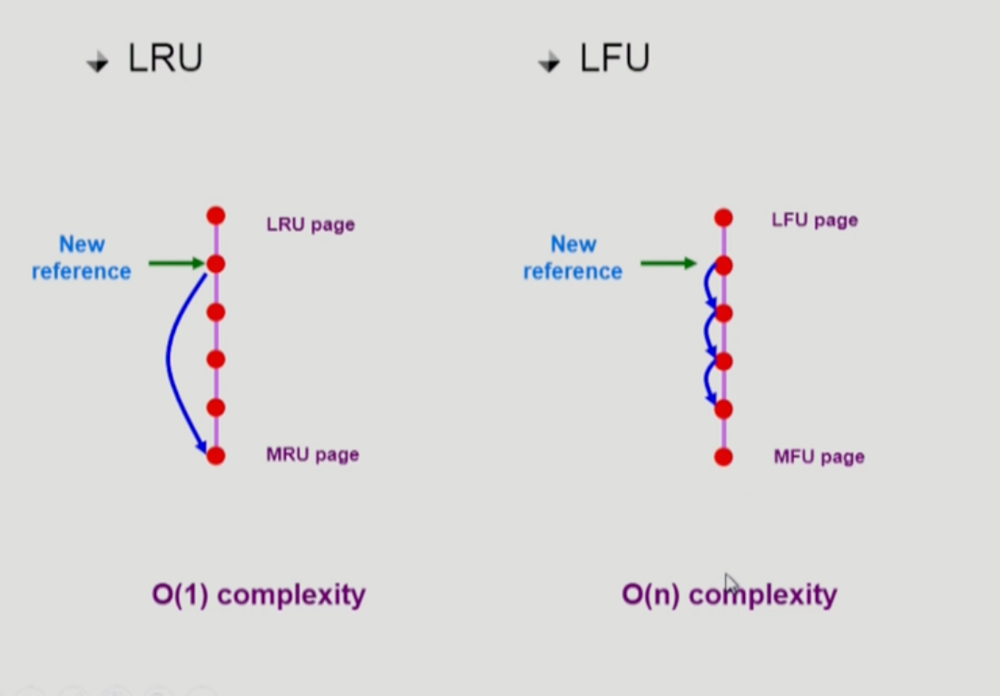

- 다양한 캐슁 환경
  - 캐슁 기법
    - 한정된 빠른 공간(=캐쉬)에 요청된 데이터를 저장해 두었다가 후속 요청시 캐쉬로부터 직접 서비스하는 방식
    - paging system외에도 cache memory, buffer caching, Web caching등 다양한 분야에서 사용
  - 캐쉬 운영의 시간 제약
    - 교체 알고리즘에서 삭제할 항목을 결정하는 일에 지나치게 많은 시간이 걸리는 경우 실제 시스템에서 사용할 수 없음
    - Buffer caching이나 Web caching인 경우
      - O(1)에서 O(log n)정도까지 허용
    - Paging system인 경우
      - page fault인 경우에만 OS가 관여함
      - 페이지가 이미 메모리에 존재하는 경우 참조시각 등의 정보를 OS가 알 수 없음
      - O(1)인 LRU의 list조작조차 불가능

- Paging System에서 LRU,LFU 가능한가
  - LRU나 LFU같은 경우는 운영체제에서 관리를 해줘야 하지만 해당 알고리즘의 경우에는 CPU를 사용해야 되기때문에 활용이 불가능하지만 buffer caching이나 web caching에서 사용함

- Clock 알고리즘
  - LRU의 근사(approximation)알고리즘
  - 여러 명칭으로 불림
    - Second chance algorithm
    - NUR(Not Used Recently) 또는 NRU(Not Recently Used)
  - Reference bit을 사용해서 교체 대상 페이지 선정(circular list)
  - reference bit가 0인 것을 찾을 때까지 포인터를 하나씩 앞으로 이동
  - 포인터 이동하는 중에 reference bit 1은 모드 0으로 바꿈
  - Reference bit이 0인 것을 찾으면 그 페이지를 교체
  - 한 바퀴 되돌아와서도(=second chance)0이면 그때에는 replace당함
  - 자주 사용되는 페이지라면 second chance가 올 때1
  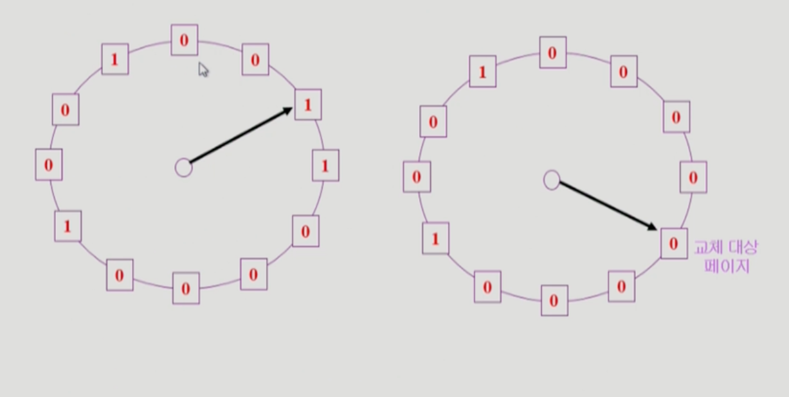
- Clock algorithm개선 
  - reference bit과 modified bit(dirty bit)을 함께 사용
  - reference bit = 1 : 최근에 참조된 페이지
  - modified bit =1 : 최근에 변경된 페이지(I/O를 동반하는 페이지)

- Page Frame의 Allocation 
  - Allocation problem : 각 Process에 얼마만큼의 page frame을 할당할 것인가?
  - 필요성
    - 메모리 참조 명령어 수행시 명령어, 데이터 등 여러 페이지 동시 참조
      - 명령어 수행을 위해 최소한 할당 되어야 하는 frame의 수가 있음
    - Loop를 구성하는 page들은 한꺼번에 allocate되는 것이 유리함
      - 최소한의 Allocation이 없으면 매 loop마다 page fault
  - Allocation Scheme
    - Equal allocation : 모든 프로세스에 똑같은 갯수 할당
    - Proportional allocation: 프로세스 크기에 비례하여 할당
    - Priority allocation: 프로세스의 priority에 따라 다르게 할당

- Golbal replacement
  - Replace시 다른 process에 할당된 frame을 빼앗아 올수 있다.
  - Process별 할당량을 조절하는 또 다른 방법임
  - FIFO,LRU,LFU등의 알고리즘을 global replacement로 사용시 해당
  - Working set, PFF알고리즘 사용
- Local replacement
  - 자신에게 할당된 frame내에서만 Replacement
  - FIFO,LRU,LFU등의 알고리즘을 process별로 운영시

- Thrashing
  - 프로세스의 원활한 수행에 필요한 최소한의 page frame 수를 할당 받지 못한 경우 발생
  - Page fault rate이 매우 높아짐
  - CPU utilization 낮아짐
  - OS는 MPD(multiprogramming degree)를 높어야 한다고 판단
  - 또다른 프로세스가 시스템에 추가됨(higher MPD-Multi Programming Degree)
  - 프로세스 당 할당된 frame의 수가 더욱 감소
  - 프로세스는 page의 swap in/swap out으로 매우 바쁨
  - 대부분의 시간에 CPU는 한가함
  - low throughput
  - Thrashing Diagram 
    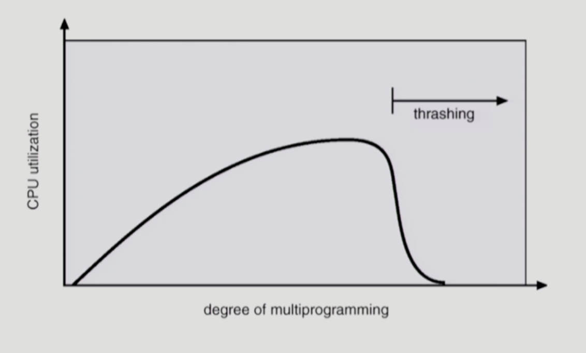

- Working-Set Model
  - Locality of reference
    - 프로세스는 특정 시간 동안 일정 장소만을 집중적으로 참조한다
    - 집중적으로 참조되는 해당 page들의 집합을 locality set이라 함
  - Working-set Model
    - Locality에 기반하여 프로세스가 일정 시간 동안 원활하게 수행되기 위해 한꺼번에 메모리에 올라와 있어야 하는 page들의 집합을 Working Set이라 정의함
    - Working Set모델에서는 process의 working set 전체가 메모리에 올라와 있어야 수행되고 그렇지 않은 경우 모든 frame을 반납한 후 swap out(suspend)
    - Thrashing을 방지함
    - Multiprogramming degree를 결정함
  - Working-Set Algorithm
    - Working set의 결정
      - Working set window를 통해 알아냄
      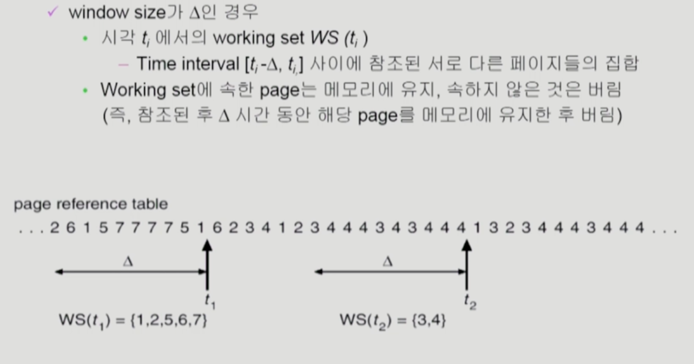
      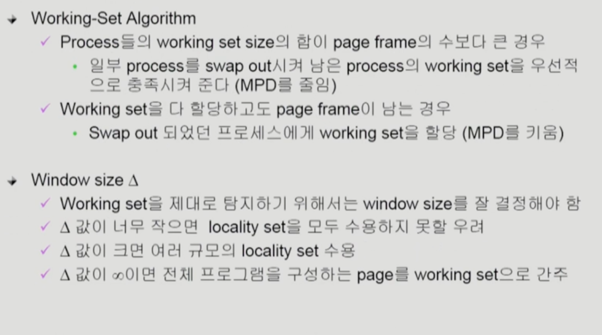

- PFF(Page-Fault Frequency) Scheme
  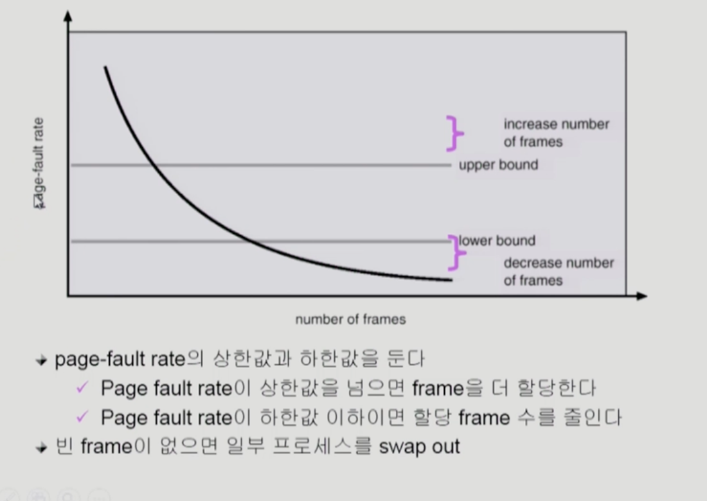

- Page size를 감소시키면
  - 페이지 수 증가
  - 페이지 테이블 크기 증가
  - Internal framentation 감소
  - Disk transfer의 효율성 감소
    - Seek/rotation vs transfer
  - 필요한 정보만 메모리에 올라와 메모리 이용이 효율적
    - Locality의 활용 측면에서는 좋지 않음
  - Trend
    - Larger page size      
