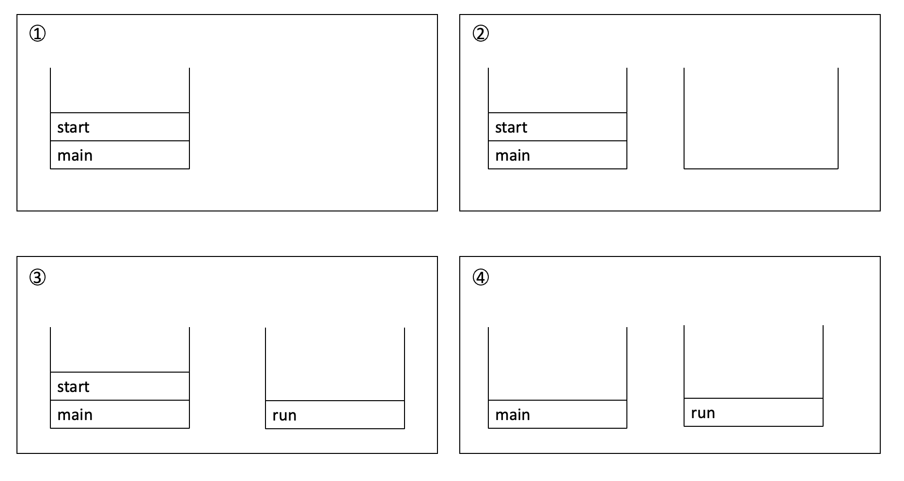

- 프로세스와 쓰레드
  - 프로세스(process)
    - 프로세스란 간단히 말해서 실행 중인 프포그램(program)이다.
    - 프로그램을 실행하면 OS로부터 실행에 필요한 자원(메모리)을 할당받아 프로세스가 된다.
    - 프로그램을 수행하는 데 필요한 데이터와 메모리 등의 자원 그리고 쓰레드로 구성되어있다.
  - 쓰레드
    - 프로세스의 자원을 이용해서 실제로 작업을 수행한느 것이 바로 쓰레드이다.
  - 모든 프로세스에는 최소한 하나의 쓰레드가 존재하며 둘 이상의 쓰레드를 가진 프로세스를 멀티 쓰레드(multi-threaded process)라고 한다.
  - 하나의 프로세스가 가질 수 있는 쓰레드의 갯수는 제한되어 있지 않으나 쓰레드가 작업을 수행하는데 개별적인 메모리 공간(호출스택)을 필요로 하기 때문에 프로세스의 메모리 한계에 따라 생성할 수 있는 쓰레드의 수가 결정된다.
- 멀티태스킹과 멀티쓰레딩
  - 우리가 사용하고있는 대부분의 OS는 멀티태스킹(multi-tasking,다중작업)을 지원하기 때문에 여러 개의 프로세스가 동시에 실행될 수 있다.
  - 멀티쓰레딩은 하나의 프로세스 내에서 여러 쓰레드가 동시에 작업을 수행하는 것이다. CPU의 코어(core)가 한 번에 단 하나의 작업만 수행할 수 있으므로, 실제로 동시에 처리되는 작업의 갯수는 코어의 갯수와 일치한다.
  - 그러나 쓰레드의 수는 언제나 코어의 개수보다 훨씬 많기 때문에 각 코어가 아주 짧은 시간동안 여러 작업을 번갈아 가며 수행함으로써 여러 작업들이 모두 동시에 수행되는 것처럼 보이게 한다.
- 멀티쓰레드의 장단점
  - 장점
    - CPU의 사용률을 향상시킨다.
    - 자원을 보다 효율적으로 사용할 수 있다.
    - 사용자에 대한 응답성이 향상된다.
    - 작업이 분리되어 코드가 간결해진다.ㄴ
  - 단점
    - 멀티쓰레드 프로세스는 여러 쓰레드가 같은 프로세스 내에서 자원을 공유하면서 작업을 하기 때문에 발생할 수 있는 동기화(synchronization),교착상태(deadlock)와 같은 문제들을 고려해서 신중히 프로그래밍 해야한다. 
- 쓰레드의 구현과 실행
  - 쓰레드를 구현하는 방법은 Thread클래스를 상속 받는 방법과 Runnable인터페이스를 구현하는 방법, 모두 두가지가 있다.
  - 위의 두가지중 어느 쪽을 선택해도 별 차이는 없지만 Thread클래스를 상속 받으면 다른 클래스를 상속 받을수 없기 때문에, Runnable인터페이스를 구현하는 방법이 일반적이다.
  - Runnable인터페이스를 구현하는 방법은 재사용성(reusablity)이 높고 코드의 일관성(consistency)을 유지할 수 있기 때문에 보다 객체지향적인 방법이라 할 수 있겠다.
  1.Thread를 상속
  ```java
    class MyThread extends Thread{
        public void run(){/*작업내용*/} //Thread클래스의 run을 오버라이딩
    }
  ```
  2.Runnable인터페이스를 구현
  ```java
    class MyThread implements Runnable{
        public void run(){/*작업내용*/}
    }
  ```
    - Runnable인터페이스는 오로지 run()만 정의되어 있는 간단한 인터페이스이다. Runnable인터페이스를 구현하기 위해서 해야 할 일은 추상메서드인 run()의 몸통{}을 만들어 주는 것 뿐이다.
    - 쓰레드를 구현 한다는 것은 위의 두 방법 중 어떤 것을 선택하든지, 그저 쓰레드를 통해 작업하고자 하는 내용으로 run()의 몸통{}을 채우는 것일 뿐이다.
  - 인스턴스 생성 방법
    ```java
        ThraedEx1_1 t1 = new ThreadEx1_1(); //Thread의 자손 클래스의 인스턴스를 생성
        Runnable r = new ThreadEx1_2(); //Runnable을 구현한 클래스의 인스턴스를 생성
        Thread t2 = new Thread(r); //생성자 Thread(Runnable target)
        Thread t2 = new Thread(new ThreadEx1_2()); //위의 두줄을 한줄로 간단히
    ```
    - Runnable인터페이스를 구현한 경우, Runnable인터페이스를 구현한 클래스의 인스턴스를 Thread클래스의 생성자의 매개변수로 제공해야 한다.
    - Thraed클래스를 상속 받으면,자손 클래스에서 조상인 Thread클래스의 메서드를 직접 호출할 수 있지만,Runnable을 구현하면 Thread클래스의 static메서드인 current Thread()를 호출하여 쓰레드에 대한 참조를 얻어와야지만 호출이 가능하다.
    ```java
        class ThreadEx1_1 extends Thread{
            public void run(){
                for(int i = 0 ; i < 5;i++){
                    //조상인 Thread의 getName()을 호출
                    System.out.println(getName());
                }
            }
        }

        class ThreadEx1_2 implements Runnable{
            public void run(){
                for(int i = 0 ;i<5;i++){
                    //Thread.currentThread() 현재 실행중인 Thread를 반환한다.
                    System.out.println(Thread.currentThread().getName());
                }
            }
        }
    ```
  - 쓰레드의 실행 - start()
    - 쓰레드를 생성했다고 해서 자동으로 실행 되는 것은 아니다. start()를 호출해야만 쓰레드가 실행된다.
    ```java
        t1.start(); 쓰레드 t1을 실행시킨다.
        t2.start(); 쓰레드 t2을 실행시킨다.
    ```
    - start()가 호출되었다고 해서 바로 실행되는 것이 아니라, 일단 실행대기 상태에 있다가 자신의 차례가 되어야 실행된다.
    - 물론 실행대기중인 쓰레드가 하나도 없으면 곧바로 실행상태가 된다.
    - 한번 종료된 쓰레드는 다시 실행 할수가 없다. 하나의 쓰레드에 대해서 start()가 한 번만 호출될 수 있다는 뜻이다.
    - 만일 쓰레드의 작업을 한번 더 수행해야 한다면 아래의 오른쪽 코드와 같이 새로운 쓰레드를 생성한 다음에 start를 호출해야 한다.
  - start()와 run()
    - main메서드에서 run()을 호출하는 것은 생성된 쓰레드를 실행시키는 것이 아니라 단순히 클래스에 선언된 메서드를 호출하는 것일 뿐이다.
    - start()는 새로운 쓰레드가 작업을 실행하는데 필요한 호출스택(call stack)을 생성한 다음에 run()을 호출해서, 생성된 호출스택에 run()이 첫 번째로 올라가게 한다.
    - 모든 쓰레든느 독립적인 작업을 수행하기 위해 자신만의 호출스택을 필요로 하기 때문에 새로운 쓰레들르 생성하고 실행시킬 때마다 새로운 호출스택이 생성되고 쓰레드가 종료되면 작업에 사용된 호출스택은 소멸된다.
  - 쓰레드를 생성하고 start()를 호출한후 호출 스택의 변화
    1.main메서드에서 쓰레드의 start를 호출한다.
    2.start()는 새로운 쓰레드를 생성하고 쓰레드가 작업하는데 사용될 호출스택을 생성한다.
    3.새로 생성된 호출스택에 run이 호출되어 쓰레드가 독립된 공간에서 작업을 수행한다.
    4.이제는 호출스택이 2개이므로 스케줄러가 정한 순서에 의해서 번갈아 가면서 실행된다.
    
  - main 쓰레드
    - main쓰레드에서 작업을 수행하는 것도 쓰레드이며,이를 main쓰레드라고 한다.
    - 지금까지는 main메서드가 수행을 마치면 다른 프로그램이 종료 되었으나, 위의 그림에서와 같이 main메서드가 수행을 마쳤다하더라도 다른 쓰레드가 아직 작업을 마치지 않은 상태라면 프로그램이 종료되지않는다.
    - 실행중인 쓰레드가 하나도 없을 때 프로그램은 종료된다.
    - 쓰레드는 사용자쓰레드(user thread)와 데몬쓰레드(daemon thread) 두 종류가 있는데 자세한 것은 곧 설명할 것이다.
- 싱글쓰레드와 멀티 쓰레드
  - 두개의 작업을 쓰레드(th1)로 처리하는 경우와 두개의 쓰레드(th1,th2)로 처리하는 경우를 가정해보았을때, 하나의 쓰레드로 두 작업을 처리하는 경우는 한 작업을 마친 후에 다른 작업을 시작하지만, 두개의 쓰레드로 작업하는 경우에는 짧은 시간동안 2개의 쓰레드(th1,th2)가 번갈아 가면서 작업을 수행해서 동시에 두 작업이 처리되는 것과 같이 느끼게 한다.
    