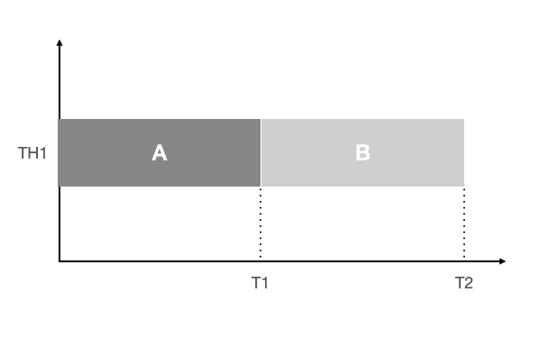
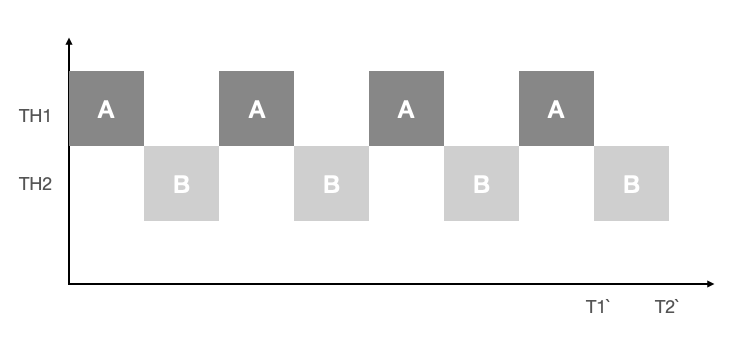
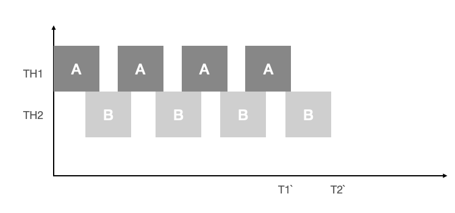

- 프로세스와 쓰레드
  - 프로세스(process)
    - 프로세스란 간단히 말해서 실행 중인 프포그램(program)이다.
    - 프로그램을 실행하면 OS로부터 실행에 필요한 자원(메모리)을 할당받아 프로세스가 된다.
    - 프로그램을 수행하는 데 필요한 데이터와 메모리 등의 자원 그리고 쓰레드로 구성되어있다.
  - 쓰레드
    - 프로세스의 자원을 이용해서 실제로 작업을 수행한느 것이 바로 쓰레드이다.
  - 모든 프로세스에는 최소한 하나의 쓰레드가 존재하며 둘 이상의 쓰레드를 가진 프로세스를 멀티 쓰레드(multi-threaded process)라고 한다.
  - 하나의 프로세스가 가질 수 있는 쓰레드의 갯수는 제한되어 있지 않으나 쓰레드가 작업을 수행하는데 개별적인 메모리 공간(호출스택)을 필요로 하기 때문에 프로세스의 메모리 한계에 따라 생성할 수 있는 쓰레드의 수가 결정된다.
- 멀티태스킹과 멀티쓰레딩
  - 우리가 사용하고있는 대부분의 OS는 멀티태스킹(multi-tasking,다중작업)을 지원하기 때문에 여러 개의 프로세스가 동시에 실행될 수 있다.
  - 멀티쓰레딩은 하나의 프로세스 내에서 여러 쓰레드가 동시에 작업을 수행하는 것이다. CPU의 코어(core)가 한 번에 단 하나의 작업만 수행할 수 있으므로, 실제로 동시에 처리되는 작업의 갯수는 코어의 갯수와 일치한다.
  - 그러나 쓰레드의 수는 언제나 코어의 개수보다 훨씬 많기 때문에 각 코어가 아주 짧은 시간동안 여러 작업을 번갈아 가며 수행함으로써 여러 작업들이 모두 동시에 수행되는 것처럼 보이게 한다.
- 멀티쓰레드의 장단점
  - 장점
    - CPU의 사용률을 향상시킨다.
    - 자원을 보다 효율적으로 사용할 수 있다.
    - 사용자에 대한 응답성이 향상된다.
    - 작업이 분리되어 코드가 간결해진다.ㄴ
  - 단점
    - 멀티쓰레드 프로세스는 여러 쓰레드가 같은 프로세스 내에서 자원을 공유하면서 작업을 하기 때문에 발생할 수 있는 동기화(synchronization),교착상태(deadlock)와 같은 문제들을 고려해서 신중히 프로그래밍 해야한다. 
- 쓰레드의 구현과 실행
  - 쓰레드를 구현하는 방법은 Thread클래스를 상속 받는 방법과 Runnable인터페이스를 구현하는 방법, 모두 두가지가 있다.
  - 위의 두가지중 어느 쪽을 선택해도 별 차이는 없지만 Thread클래스를 상속 받으면 다른 클래스를 상속 받을수 없기 때문에, Runnable인터페이스를 구현하는 방법이 일반적이다.
  - Runnable인터페이스를 구현하는 방법은 재사용성(reusablity)이 높고 코드의 일관성(consistency)을 유지할 수 있기 때문에 보다 객체지향적인 방법이라 할 수 있겠다.
  1.Thread를 상속
  ```java
    class MyThread extends Thread{
        public void run(){/*작업내용*/} //Thread클래스의 run을 오버라이딩
    }
  ```
  2.Runnable인터페이스를 구현
  ```java
    class MyThread implements Runnable{
        public void run(){/*작업내용*/}
    }
  ```
    - Runnable인터페이스는 오로지 run()만 정의되어 있는 간단한 인터페이스이다. Runnable인터페이스를 구현하기 위해서 해야 할 일은 추상메서드인 run()의 몸통{}을 만들어 주는 것 뿐이다.
    - 쓰레드를 구현 한다는 것은 위의 두 방법 중 어떤 것을 선택하든지, 그저 쓰레드를 통해 작업하고자 하는 내용으로 run()의 몸통{}을 채우는 것일 뿐이다.
  - 인스턴스 생성 방법
    ```java
        ThraedEx1_1 t1 = new ThreadEx1_1(); //Thread의 자손 클래스의 인스턴스를 생성
        Runnable r = new ThreadEx1_2(); //Runnable을 구현한 클래스의 인스턴스를 생성
        Thread t2 = new Thread(r); //생성자 Thread(Runnable target)
        Thread t2 = new Thread(new ThreadEx1_2()); //위의 두줄을 한줄로 간단히
    ```
    - Runnable인터페이스를 구현한 경우, Runnable인터페이스를 구현한 클래스의 인스턴스를 Thread클래스의 생성자의 매개변수로 제공해야 한다.
    - Thraed클래스를 상속 받으면,자손 클래스에서 조상인 Thread클래스의 메서드를 직접 호출할 수 있지만,Runnable을 구현하면 Thread클래스의 static메서드인 current Thread()를 호출하여 쓰레드에 대한 참조를 얻어와야지만 호출이 가능하다.
    ```java
        class ThreadEx1_1 extends Thread{
            public void run(){
                for(int i = 0 ; i < 5;i++){
                    //조상인 Thread의 getName()을 호출
                    System.out.println(getName());
                }
            }
        }

        class ThreadEx1_2 implements Runnable{
            public void run(){
                for(int i = 0 ;i<5;i++){
                    //Thread.currentThread() 현재 실행중인 Thread를 반환한다.
                    System.out.println(Thread.currentThread().getName());
                }
            }
        }
    ```
  - 쓰레드의 실행 - start()
    - 쓰레드를 생성했다고 해서 자동으로 실행 되는 것은 아니다. start()를 호출해야만 쓰레드가 실행된다.
    ```java
        t1.start(); 쓰레드 t1을 실행시킨다.
        t2.start(); 쓰레드 t2을 실행시킨다.
    ```
    - start()가 호출되었다고 해서 바로 실행되는 것이 아니라, 일단 실행대기 상태에 있다가 자신의 차례가 되어야 실행된다.
    - 물론 실행대기중인 쓰레드가 하나도 없으면 곧바로 실행상태가 된다.
    - 한번 종료된 쓰레드는 다시 실행 할수가 없다. 하나의 쓰레드에 대해서 start()가 한 번만 호출될 수 있다는 뜻이다.
    - 만일 쓰레드의 작업을 한번 더 수행해야 한다면 아래의 오른쪽 코드와 같이 새로운 쓰레드를 생성한 다음에 start를 호출해야 한다.
  - start()와 run()
    - main메서드에서 run()을 호출하는 것은 생성된 쓰레드를 실행시키는 것이 아니라 단순히 클래스에 선언된 메서드를 호출하는 것일 뿐이다.
    - start()는 새로운 쓰레드가 작업을 실행하는데 필요한 호출스택(call stack)을 생성한 다음에 run()을 호출해서, 생성된 호출스택에 run()이 첫 번째로 올라가게 한다.
    - 모든 쓰레든느 독립적인 작업을 수행하기 위해 자신만의 호출스택을 필요로 하기 때문에 새로운 쓰레들르 생성하고 실행시킬 때마다 새로운 호출스택이 생성되고 쓰레드가 종료되면 작업에 사용된 호출스택은 소멸된다.
  - 쓰레드를 생성하고 start()를 호출한후 호출 스택의 변화
    1.main메서드에서 쓰레드의 start를 호출한다.
    2.start()는 새로운 쓰레드를 생성하고 쓰레드가 작업하는데 사용될 호출스택을 생성한다.
    3.새로 생성된 호출스택에 run이 호출되어 쓰레드가 독립된 공간에서 작업을 수행한다.
    4.이제는 호출스택이 2개이므로 스케줄러가 정한 순서에 의해서 번갈아 가면서 실행된다.
    
  - main 쓰레드
    - main쓰레드에서 작업을 수행하는 것도 쓰레드이며,이를 main쓰레드라고 한다.
    - 지금까지는 main메서드가 수행을 마치면 다른 프로그램이 종료 되었으나, 위의 그림에서와 같이 main메서드가 수행을 마쳤다하더라도 다른 쓰레드가 아직 작업을 마치지 않은 상태라면 프로그램이 종료되지않는다.
    - 실행중인 쓰레드가 하나도 없을 때 프로그램은 종료된다.
    - 쓰레드는 사용자쓰레드(user thread)와 데몬쓰레드(daemon thread) 두 종류가 있는데 자세한 것은 곧 설명할 것이다.
- 싱글쓰레드와 멀티 쓰레드
  - 두개의 작업을 쓰레드(th1)로 처리하는 경우와 두개의 쓰레드(th1,th2)로 처리하는 경우를 가정해보았을때, 하나의 쓰레드로 두 작업을 처리하는 경우는 한 작업을 마친 후에 다른 작업을 시작하지만, 두개의 쓰레드로 작업하는 경우에는 짧은 시간동안 2개의 쓰레드(th1,th2)가 번갈아 가면서 작업을 수행해서 동시에 두 작업이 처리되는 것과 같이 느끼게 한다.

  - 하나의 쓰레드로 두 개의 작업을 수행하는 경우(싱글코어)

  

  - 두개의 쓰레드로 두 개의 작업을 수행하는 경우(싱글코어)

  

  - 위의 그래프에서 알 수 있듯이 하나의 쓰레드로 두 개의 작업을 수행한 시간과 두개의 쓰레드로 작업한 두개의 작업시간은 거의 같다(T2 = T2`)
  - 쓰레드간의 작업 전환(context switching)에 시간이 걸리기 때문에 두 개의 쓰레드로 작업한 시간이 싱글 쓰레드로 작업한 시간보다 더 걸리게 된다.
  - 작업 전환을 할 때는 현재 진행중인 작업의 상태(다음에 실행해야할 위치(PC,프로그램 카운터))등의 정보를 저장하고 읽어오는 시간이 소요된다. 

  - 멀티코어로 두개의 쓰레드를 실행하는 경우

  

  - 실행결과를 싱글코어 일때와 멀티 코어일때를 비교해 놓았을때에는 싱글코어인 경우에는 멀티쓰레드라도 하나의 코어가 번갈아가면서 작업을 수행하는 것이므로 두 작업이 절대 겹치지 않는다. 그러나 멀티 코어에서는 멀티쓰레드로 두 작업을 수행하면 동시에 두 쓰레드가 수행될 수 있으므로 A와 B가 겹치는 부분이 발생하게 되는데 이는 화면(console)이라는 자원을 놓고 두 쓰레드가 경쟁하게 되는 것이다.

  - 위의 결과는 실행할 때마다 다른 결과를 얻을 수 있는데 그 이유는 실행중인 프로세스가 OS의 프로세스 스케줄러의 영향을 받기 때문이다.
  - JVM의 쓰레드 스케줄러에 의해서 어떤 쓰레드가 얼마동안 실행될 것인지 결정되는 것과 같이 프로세스도 프로세스 스케줄러에 의해서 실행순서와 실행시간이 결정되기 때문에 매 순간 솽항에 따라 프로세스에게 할당되는 실행시간이 일정하지 않고 쓰레드에게 할당되는 시간 역시 일정하지 않게 된다.
  - 자바가 OS독립적 이라고는 하지만 OS종속적인 부분이 몇 가지있는데 쓰레드도 그 중의 하나이다.
- 쓰레드의 우선순위
  - 쓰레드는 우선순위(priority)라는 속성(멤버변수)를 가지고 있는데 이 우선순위에 따라 쓰레드가 얻는 실행시간이 달라진다. 쓰레드가 수행하는 작업의 중요도에 따라 쓰레드의 우선순위를 서로 다르게 지정하여 특정 쓰레드가 더 많은 작업시간을 갖도록 할 수 있다.
  - 예를 들어 파일전송기능이 있는 메신저의 경우, 파일 다운로드를 처리하는 쓰레드보다 채팅 내용을 전송하는 쓰레드의 우선순위가 더 높아야 사용자가 채팅하는데 불편함이 없을 것이다. 대신에 파일 다운로드 작업에 걸리는 시간은 더 길어질것이다.

  - 쓰레드의 우선순위 지정하기
  ```java
    void setPriority(int newPriority) 쓰레드의 우선순위를 지정한 값으로 변경한다.
    int getPriority()
  ```
    - 쓰레드가 가질 수 있는 우선순위의 범위는 1~10이며 숫자가 높을수록 우선순위가 높다.
    - 쓰레드의 운선순위는 쓰레드를 생성한 쓰레드로부터 상속받는다는 것이다. main메서드를 수행하는 쓰레드는 우선순위가 5이므로 main메서드내에서 생성하는 쓰레드의 우선순위는 자동적으로 5가 된다.
- 쓰레드 그룹(thread group)
  - 쓰레드 그룹은 서로 관련된 쓰레드를 그룹으로 다루기 위한 것으로, 폴더를 생성해서 관련된 파일들을 함께 넣어서 관리하는 것처럼 쓰레드그룹을 생성해서 쓰레드를 그룹으로 묶어서 관리할 수 있다.
  - 폴더 안에 폴더를 생성할 수 있듯이 쓰레드 그룹에 다른 쓰레드 그룹을 포함 시킬 수 있다.
  - 쓰레드 그룹은 보안상의 이유로 도입된 개념으로, 자신이 속한 쓰레드 그룹이나 하위 쓰레드 그룹은 변경할 수 있지만 다른 쓰레드 그룹의 쓰레드를 변경할 수는 없다. 쓰레드 그룹의 쓰레드를 변경할 수는 없다. ThreadGroup을 사용해서 생성할 수 있으며, 주요 생성자와 메서드는 다음과 같다.

  - 메서드

  |생성자/메서드|설명|
  |----------|---|
  |ThreadGroup(String name)|지정된 이름의 새로운 쓰레드 그룹을 생성|
  |ThreadGroup(ThreadGroup parent,String name)|지정된 쓰레드 그룹에 포함되는 새로운 쓰레드 그룹을 생성|
  |int activeCount()|쓰레드 그룹에 포함된 활성상태에 있는 쓰레드의 수를 반환|
  |int activeGroupCount()|쓰레드 그룹에 포함된 활성상태에 있는 쓰레드 그룹의 수를 반환|
  |void checkAccess()|현재 실행중인 쓰레드가 쓰레드 그룹을 변경할 권한이 있는지 체크, 만일 권한이 없다면 SecurityException을 발생시킨다.|
  |void destoroy()|쓰레드 그룹과 하위 쓰레드 그룹까지 모두 삭제한다. 단 쓰레드 그룹이나 하위 쓰레드 그룹이 비어있어야한다.|
  |int enumerate(Thread[] list),|int enumerate(Thread[] list, boolean recurse),int enumerate(ThreadGroup[] list),int	enumerate(ThreadGroup[] list, boolean recurse)|쓰레드 그룹에 속한 쓰레드 또는 하위 쓰레드 그룹의 목록을 지정된 배여렝 담고 그 갯수를 반환 ,두 번째 매개변수인 recurese의 값을 true로 하면 쓰레드 그룹에 속한 하위 쓰레드 그룹에 쓰레드 또는 쓰레드 그룹까지 배열에 담는다.|
  |int getMaxpriority()|쓰레드 그룹의 최대 우선순위 반환|
  |String getName()|쓰레드 그룹의 이름을 반환|
  |ThreadGroup getParnet()|쓰레드 그룹의 상위 쓰레드 그룹을 반환|
  |void interrupt()|쓰레드 그룹에 속한 모든 쓰레드를 interrupt|
  |boolean isDeamon()|쓰레드 그룹이 데몬 쓰레드 그룹인지 확인|
  |boolean isDestoryed|쓰레드 그룹이 삭제 되었는지 확인|
  |void list()|쓰레드 그룹에 속한 쓰레드와 하위 쓰레드그룹에 대한 정보를 출력|
  |boolean parentOf(ThreadGroup g)|지정된 쓰레드 그룹의 상위 쓰레드그룹인지 확인|
  |void setDaemon(boolean daemon|쓰레드 그룹을 데몬 쓰레드그룹으로 설정/해제|
  |setMaxPriority(int pri)|쓰레드 그룹의 최대 우선순위를 설정|

  - 생성자

  ```java
    Thread(ThreadGroup group,String name)
    Thread(ThreadGroup group,Runnable target)
    Thread(ThreadGroup group,Runnable target, String name)
    Thread(ThreadGroup group,Runnable target, String name, long stackSize)
  ```

    - 모든 쓰레드는 반드시 쓰레드 그룹에 포함되어 있어야 하기 떄문에 위와 같이 쓰레드 그룹을 지정하는 생성자를 사용하지 않은 쓰레드는 기본적으로 자신을 생성한 쓰레드와 같은 쓰레드 그룹에 속하게 된다.
    - 자바 어플리케이션이 실행되면 JVM은 main과 system이라는 쓰레드 그룹을 만들고 JVM운영에 필요한 쓰레드들을 생성해서 이 쓰레드 그룹에 포함시킨다. 예를 들어 main메서드를 수행하는 main이라는 이름의 쓰레드는 main쓰레드 그룹에 속하고, 가비지 컬렉션을 수행하는 Finalizer쓰레드는 system쓰레드 그룹에 속한다.

    - 그 외에도 쓰레드 그룹 관련 메서드 
    ```java
      ThreadGroup getThreadGroup() 쓰레드 자신이 속한 쓰레드 그룹을 반환한다.
      void uncaughtException(Thread t, Throwable e) 쓰레드 그룹의 쓰레드가 처리되지 않은 예외에 의해 실행이 종료되었을때, JVM에 의해 이 메서드가 자동으로 호출된다.
    ```

    - 쓰레드 그룹을 지정하지 않은 쓰레드는 자동적으로 main쓰레드 그룹에 속하게 된다.

- 데몬 쓰레드(daemon thread)
  - 데몬 쓰레드는 다른 일반 쓰레드(데몬쓰레드가 아닌 쓰레드)의 작업을 돕는 보조적인 역활을 수행하는 쓰레드이다.
  - 일반 쓰레드가 모두 종료되면 데몬 쓰레드는 강제적으로 자동 종료되는데 그 이유는 데몬 쓰레드는 일반 쓰레드의 보조역활을 수행하므로 일반 쓰레드가 모두 종료되고 나면 데몬 쓰레드의 존재의 의미가 없기 때문이다. 이점을 제외하고는 데몬쓰레드와 일반 쓰레드의 차이가 없다.
  - 데몬 쓰레드의 예로는 가비지 컬렉터, 워드프로세스의 자동저장, 화면자동갱신등이 있다.
  - 데몬 쓰레드는 무한루프와 조건문을 이용해서 실행 후 대기하고 있다가 특정 조건이 만족되면 작업을 수행하고 다시 대기하도록 작성한다.
  - 데몬 쓰레드는 일반 쓰레드의 작성방법과 실행 방법이 같으며, 다만 쓰레드를 생성한 다음 실행하기 전에 setDaemon(true)를 호출하기만 하면 된다. 그리고 데몬 쓰레드가 생성한 쓰레드는 자동적으로 데몬 쓰레드가 된다

  ```java
    boolean isDaemon 쓰레드가 데몬 쓰레드인지 확인한다, 데몬 쓰레드이면 true를 반환한다.
    void setDaemon(boolean on) 쓰레드를 데몬 쓰레드로 또는 사용자 쓰레드로 변경한다. 매개변수 on의 값을 true로 지정하면 데몬 쓰레드가 된다.
  ```
  - setDaemon메서드는 반드시 start()를 호출하기 전에 생성되어야 한다. 그렇지 않으면 IllegalThreadStateException이 발생한다.
  - getAllStackTrace()를 이용하면 실행 중 또는 대기상태, 즉 작업이 완료되지 않은 모든 쓰레드의 호출스택을 출력할 수 있다. 

- 쓰레드의 실행 제어
  - 쓰레드 프로그래밍이 어려운 이유는 동기화(synchronization)과 스케줄링(scheduling)때문이다.
  - 효율적인 멀티쓰레드 프로그램을 만들기 위해서는 보다 정교한 스케줄링을 통해 프로세스에게 주어진 자원과 시간을 여러 쓰레드가 낭비없이 잘 사용하도록 프로그래밍 해야된다.
  - 쓰레드의 스케줄링을 잘하기 위해서는 쓰레드의 상태와 관련 메서드를 잘 알아야 한다.

  - 쓰레드의 스케줄링과 관련된 메서드

  |메서드|설명|
  |----|---|
  |static void sleep(long mills),static void sleep(long mills,int nanos)|지정된 시간(천분의 일초 단위)동안 쓰레드를 일시정지시킨다. 지정한 시간이 지나고 나면,자동적으로 다시 실행대기상태가 된다.|
  |void join(),void join(long mills),void join(long mills,int nanos)|지정된 시간동안 쓰레드가 실행되도록 한다. 지정된 시간이 지나거나 작업이 종료되면 join을 호출한 쓰레드로 다시 돌아와 실행을 계속한다.|
  |void interrupt()|sleep()이나 join()에 의해 일시정지상태인 쓰레드를 깨워서 실행대기상태로 만든다. 해당 쓰레드에서는 interruptedException이 발생함으로써 일시정지상태를 벗어나게 된다.|
  |void stop()|쓰레드를 즉시 종료시킨다.|
  |void suspend()|쓰레드를 일시정지시킨다. resume()을 호출하면 다시 실행대기상태가 된다.|
  |void resume()|suspend()에 의해 일시정지상태에 있는 쓰레드를 실행대기 상태로 만든다.|
  |static void yield()|실행 중에 자신에게 주어진 실행시간을 다른 쓰레드에게 양보(yeild)하고 자신은 실행대기상태가 된다.|

  - 쓰레드의 상태
  
  |상태|설명|
  |---|---|
  |NEW|쓰레드가 생성되고 아직 start()가 호출되지 않은 상태|
  |RUNNABLE|실행 중 또는 실행 가능한 상태|
  |BLOCKED|동기화블럭에 의해서 일시정지된 상태(lock이 풀릴 때까지 기다리는 상태)|
  |WAITING,TIMED_WATINING|쓰레드의 작업이 종료되지는 않았지만 실행가능하지않은(unrunnable) 일시정지상태,TIMED_WAITING은 일시정지시간이 지정된 경우를 의미한다.|
  |TERMINATED|쓰레드의 작업이 종료된 상태|

- 쓰레드의 동기화
  - 싱글쓰레드 프로세스의 경우 프로세스 내에서 단 하나의 쓰레드만 작업하기 때문에 프로세서의 자원을 가지고 작업하는데 별문제가 없지만, 멀티쓰레드 프로세스의 경우 여러 쓰레드가 같은 프로세스 내의 자원을 공유해서 작업하기 때문에 서로의 작업에 영향을 주게 된다.
  - 만일 쓰레드 A가 작업하던 도중에 다른 쓰레드B에게 제어권이 넘어갔을 때, 쓰레드 A가 작업하던 공유 데이터를 쓰레드가 암의로 변경하였다면, 다른 쓰레드A가 제어권을 받아서 나머지 작업을 마쳤을 때 원래 의도했던 것과는 다른 결과를 얻을 수 있다.
  - 이러한 일이 발생하는 것을 방지하기 위해서 한 쓰레드가 특정 작업을 끝마치기 전까지 다른 쓰레들에 의해 방해받지 않도록 하는 것이 필요하다. 그래서 도입된 개념이 바로 '임계 영역(critical section)'과 '잠금(락,lock)'이다.
  - 공유 데이터를 사용하는 코드 영역을 임계 영역으로 지정해놓고, 공유 데이터(객체)가 가지고 있는 lock을 획득한 단 하나의 쓰레드만 이 영역 내의 코드를 수행할 수 있게 한다. 그리고 해당 쓰레드가 임계 영역 내의 모든 코드를 수행하고 벗어나서 lock을 반납해야만 다른 쓰레드가 반납한 lock을 획득하여 임계영역의 코드를 수행할 수 있게 된다.
  - 한 쓰레드가 진행중인 작업을 다른 쓰레드가 간섭하지 못하도록 막는 것을 '쓰레드의 동기화(synchronization)'라고 한다.

  1. synchronized를 이용한 동기화
    - 이 키워드는 임계 영역을 설정하는데 사용된다. 아래와 같이 두가지 방식이 있다.
    ```java
      1.메서드 전체를 임계 영역으로 지정
        public synchronized void calcSum(){ // 임계영역(critical section)
          ...         // 임계영역(critical section)
        } // 임계영역(critical section)
      2.특정한 영역을 임계 영역으로 지정
        synchronized(객체의 참조변수){ // 임계영역(critical section)
          ...   // 임계영역(critical section)
        } // 임계영역(critical section)
    ```
- wait()과 notify()
  - synchronized로 동기화 해서 공유데이터를 보호하는 것 까지는 좋은데, 특정 쓰레드가 객체의 락을 가진 상태로 오랜 시가을 보내지 않도록 하는 것도 중요하다. 만일 계좌에 출금할 돈이 부족해서 한 쓰레드가 락을 보유한 채로 돈이 입금될 떄까지 오랜 시간을 보낸다면, 다른 쓰레드들은 모두 해당 객체의 락을 기다리느라 다른 작업들로 원활히 진행되지 않을것이다.
  - 동기화된 임계영역의 코드를 수행하다가 작업을 더 이상 진행할 상황이 아니면, 일단 wait()을 호출하여 쓰레드가 락을 반납하고 기다리게 한다. 그러면 다른 쓰레드가 락을 얻어 해당 객체에 대한 작업을 수행할 수 있게 된다. 나중에 작업을 진행할 수 있는 상황이 되면 notify()를 호출해서, 작업을 중단했던 쓰레드가 다시 락을 얻어 진행할 수 있게 한다.
  - wait()에 의해 lock을 반납했다가, 다시 lock을 얻어서 임계영역에 들어오는 것을 재진입(reentrance)이라고 한다.
  ```java
    wait(),notify(),notifyAll()
    - Object에 정의되어 있다.
    - 동기화 블록(synchronized블록)내에서만 사용할 수 있다.
    - 모단 호율적인 동기화를 가능하게 한다.
  ```
  - 기아 상태와 경쟁상태
  - 지독히 운이 나쁘면 어떤 쓰레드는 계속 통지를 받지 못하고 오랫동나 기다리게 되는데, 이것을 기아(starvation) 현상이라고 한다.

- Lock과 Condition을 이용한 동기화
  - 동기화 할수 있는 방법은 synchronized블럭 외에도 java.util.concurrent.locks 패키지가 제공하는 lock클래스들을 이용하는 방법이 있다.
  - synchronized블럭으로 동기화를 하면 자동적으로 lock이 잠기고 풀리기 때문에 편리하다. 심지어 synchronized블럭 내에서 예외가 발생해도 lock은 자동적으로 풀린다. 그러나 떄로는 같은 메서드 내에서만 lock을 걸 수 있다는 제약이 불편하기도 하다. 그럴 때이 lock클래스를 사용한다. lock클래스의 종류는 다음과 같이 3가지가 있다.
  ```java
    ReentrantLock 재진입이 가능한 lock, 가장 일반적인 배타 lock
    ReetrantReadWriteLock 읽기에는 공유적이고 쓰기에는 배타적인 lock
    StampedLock ReentrantReadWriteLock에 낙관적인 lock의 기능을 추가
  ```
  

