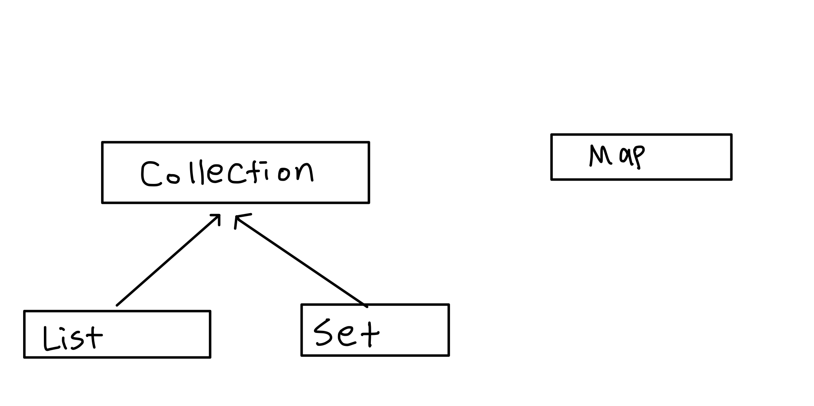
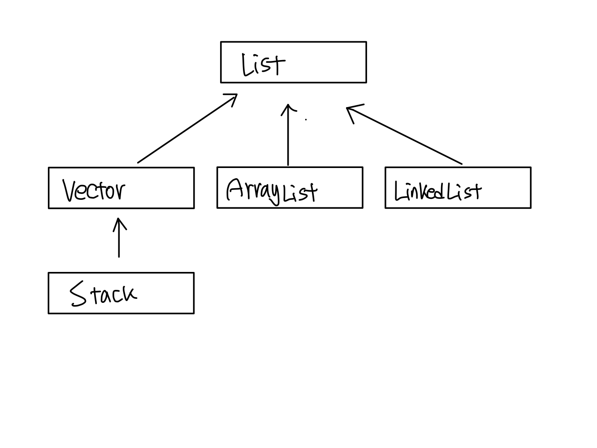
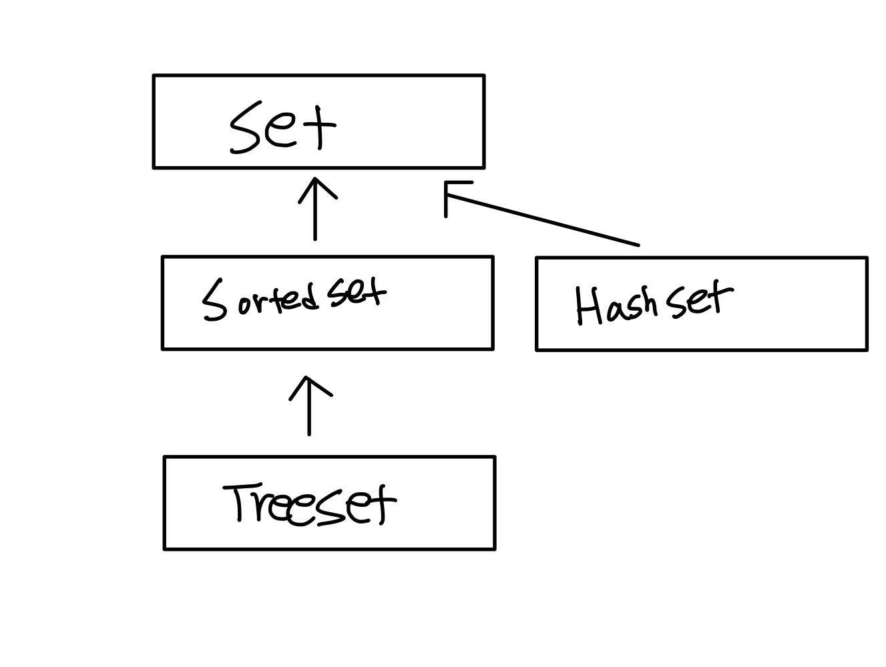
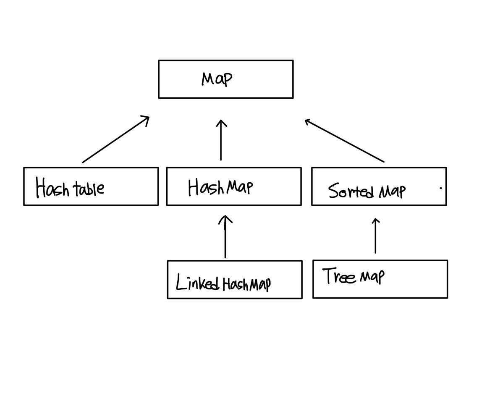
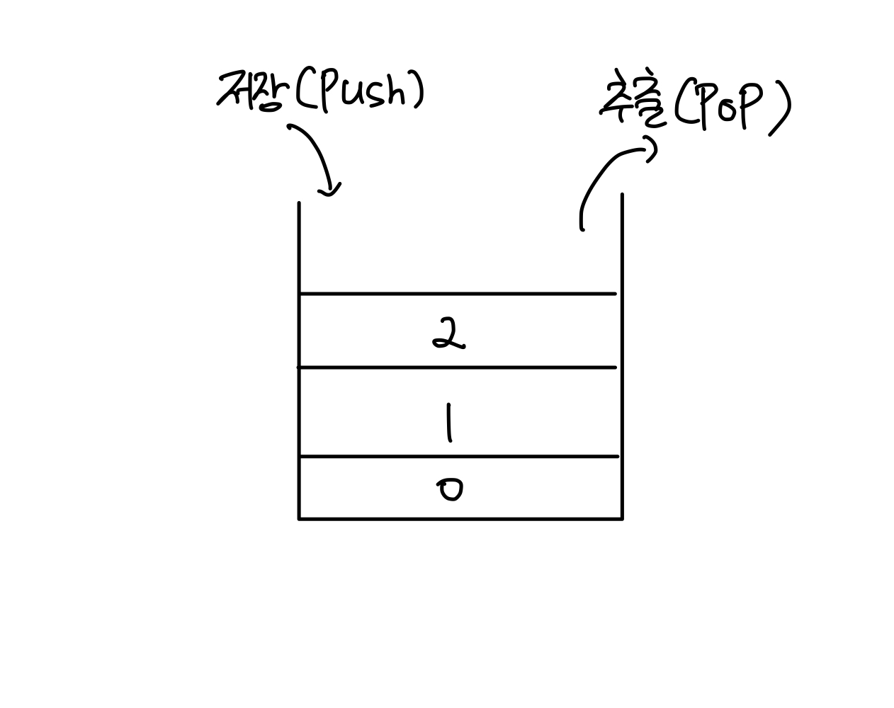
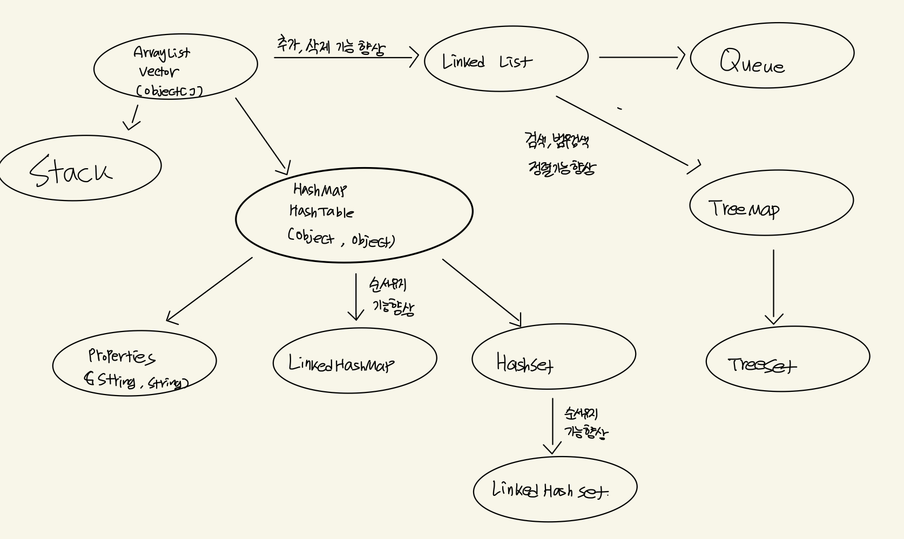

# 컬렉션 프레임 웍

- 컬렉션 프레임웍(Collections Framework)
    - 데이터 군을 저장하는 표준화한 설계를 뜻한다.
    - 컬렉션(Collection): 데이터 그룹을 프레임웍은 표준화된 프로그래밍 방식을 의미한다.

- 핵심 인터페이스
  - 컬렉션 프레임웍에서는 컬렉션 데이터 그룹을 크게 3가지 타입이 존재한다고 인식하고 각 컬렉션을 다루는데 필요한 기능을 가진 3개의 인터페이스를 정의하였다. 그리고 인터페이스 List와 Set의 공통된 부분을 다시 뽑아서 새로운 인터페이스인 Collection을 추가로 정의하였다.
  - 컬렉션 프레임웍의 핵심 인터페이스와 특징
    
    <br/>
    
  - 특징  
    <ol style="list-style-type:decimal">
      <li>List와 Set을 구현한 컬렉션 클래스들은 서로 많은 공통 부분이 존재하여 Collection인터페이스를 정의하였다.</li>
      <li>Map인터페이스는 이들과는 전혀 다른 형태로 컬렉션을 다루기  때문에 상속 계층도에는 포함되지 못했다.</li>
    </ol>
     
    | 인터페이스 | 특징 |
    | ------  | -----------------------------------|
    | List    | 순서가 있는 데이터의 집합,데이터의 중복을 허용한다.(예 대기자 명단)           <br/>         구현 클래스 : ArrayList,LinkedList,Stack,Vector등  |
    | Set     | 순서를 유지하지 않는 데이터의 집합, 데이터의 중복을 허용하지 않는다.(예 양의 정수집합,소수의 집합) <br/> 구현 클래스 : HashSet,TreeSet등|
    |Map      | 키(key)와 값(value)의 쌍(pair)으로 이루어진 데이터의 집합 <br/> 순서는 유지되지 않으며 키는 중복으로 허용하지 않고 값은 중복을 허용한다.(예 우편번호, 지역번호) <br/>   구현 클래스 : HashMap,TreeMap,HashTable,Properties등 |

    - 모든 컬렉션 클래스들은 List,Set,Map중의 하나를 구현하고 있으나 Vector,Stack,Hashtable,Properties와 같은 클래스 들은 컬렉션 프레임 웍이 만들어지기 이전부터 존재하던 것이기 때문에 컬렉션 프레임웍의 명명법을 따르지 않았고, Vector와 Hashtable과 같은 기존의 컬렉션 클래스들의 호환을 위해 설게를 변경하여 남겨두었지만 그대신 새로 추가된 ArrayList와 HashMap을 사용하는 것이 바람직하다.

- <a href = "https://docs.oracle.com/javase/8/docs/api/java/util/Collection.html" >Collection인터페이스</a>
  - Collection인터페이스는 컬렉션 클래스에 저장된 데이터를 읽고, 추가하고 삭제하는 등 컬렉션을 다루는데 가장 기본적인 메서드들을 정의하고 있다.
- <a href = "https://docs.oracle.com/javase/8/docs/api/java/util/List.html">List 인터페이스</a>
  - List인터페이스는 중복을 허용하면서 저장순서가 유지되는 컬렉션을 구현하는데 사용된다.
  
- <a href = "https://docs.oracle.com/javase/8/docs/api/java/util/Set.html">Set 인터페이스</a>
  - Set인터페이스는 중복을 허용하지 않고 저장순서가 유지되지 않는 컬렉션 클래스를 구현하는데 사용된다. Set인터페이스를 구현한 클래스로는 HashSet,TreeSet  등이 있다.
  
    
- <a href = "https://docs.oracle.com/javase/8/docs/api/java/util/Map.html">Map인터페이스</a>
  - Map인터페이스는 키(key)와 값(value)을 하나의 쌍으로 묶어서 저장하는 컬렉션 클래스로 구현하는데 사용된다. 키는 중복될 수 없지만 값은 중복을 허용한다.
  - 기존에 저장된 데이터와 중복된 키 값을 저장하면 기존의 값은 없어지고 마지막에 저장된 값이 남게 된다.
  
- <a href = "https://docs.oracle.com/javase/8/docs/api/java/util/ArrayList.html">ArrayList</a>
  - ArrayList는 List인터페이스를 구현하기 때문에 데이터의 저장순서가 유지디고 중복을 허용하는 특징을 가진다.
  - ArrayList는 Object배열을 이용해서 데이터를 순차적으로 저장한다. 첫 번째로 저장한 객체는 Object배열의 0번째 위치에 저장되고 그 다음에 저장하는 객체는 1번째 위치에 저장하는 형식으로 계속 배열에 순서대로 저장되며, 배열에 공간이 없으면 더 큰 새로운 배열을 생성해서 기존의 배열에 저장된 내용을 새로운 배열에 복사후 저장한다.
  - ArrayList를 생성할 때, 저장할 요소의 개수를 고려해서 실제 저장할 개수보다 약간 여유있는 크기로 하는 것이 좋다. 생성할 때 지정한 크기보다 더 많은 객체를 저장하면 자동적으로 크기가 늘어나기는 하지만 이 과정에서 처리시간이 많이 소요되기 때문이다.
- <a href = "https://docs.oracle.com/javase/8/docs/api/java/util/LinkedList.html">LinkedList </a>
  - 배열은 가장 기본적인 형태의 자료구조로 구조가 간단하며 사용하기 쉽고 데이터를 읽어오는데 걸리는 시간이 가장 빠르다는 장점을 가지고 있다.
  - 위와같은 장점을 가지고있지만 다음과 같은 단점을 가지고 있다.
  <br/>
    1.크기를 변경할 수 없다. 이로인해 새로운 배열을 생성하여 데이터를 복사해야한다.
  <br/>
    2.비 순차적인 데이터의 추가 또는 삭제에 시간이 많이 걸린다. 차례대로 데이터를 추가하고 마지막에서부터 데이터를 삭제하는 것은 빠르지만 배열의 중간에 데이터를 추가하려면 빈자리를 만들기 위해 다른 데이터들을 복사해서 이동해야한다.
  <br/>
  - 링크드 리스트의 요소(node)들은 자신과 연결된 다음 요소에 대한 참조(주소값)와 데이터로 구성되어있다.
  ```JAVA
    Class Node{
      Node next;
      Object obj;
    }
  ```
  - 링크드 리스트에서의 데이터 삭제는 간단하다. 삭제하고자 하는 요소의 이전요소가 삭제하고자 하는 요소의 다음 요소를 참조하도록 변경하기만 하면 된다.
  - 새로운 데이터를 추가할 때는 새로운 요소를 생성한 다음 추가하고자 하는 위치의 이전 요소의 참조를 새로운 요소에 대한 참조로 변경해주고, 새로운 요소가 그 다음 요소를 참조하도록 변경하기만 하면 되므로 처리속도가 매우 빠르다.
  - 링크드 리스트는 이동방향이 단방향이기 때문에 다음 요소에 대한 접근은 쉽지만 이전 요소에 대한 접근은 어렵다. 이점을 보완한 것이 더블 링크드 리스트(doubly linked list)이다.
- ArrayList와 LinkedList비교
  |컬렉션|읽기(접근시간)|추가/삭제|비고|
  |----|-----------|-------|--|
  |ArrayList|빠르다|느리다|순차적인 추가삭제는 더 빠름<br/>비효율적인 메모리 사용|
  |LinkedList|느리다|빠르다|데이터가 많을 수록 접근성이 떨어짐|
- <a href = "https://docs.oracle.com/javase/8/docs/api/java/util/Stack.html">Stack</a>
  - 스택은 마지막에 저장한 데이터를 가장 먼저 꺼내게 되는 LIFO(Last In First Out)구조로 되어 있다.
  - 순차적으로 데이터를 추가하고 삭제하는 스택에는 ArrayList와 같은 배열 기반의 컬렉션 클래스가 적합하다.
  
- <a href = "https://docs.oracle.com/javase/8/docs/api/java/util/Queue.html">Queue</a>
  - 큐는 처음에 저장한 데이터를 가장 먼저 꺼내게 되는 FIFO(First In First Out)구조로 되어 있다.
  - 큐는 데이터를 꺼낼 때 항상 첫 번째 저장된 데이터를 삭제하므로,ArrayList와 같은 배열기반의 컬렉션클래스를 사용한다면 데이터를 꺼낼 때마다 빈 공간을 채우기 위해 데이터의 복사가 발생하므로 비효율적이다. 따라서 큐는 ArrayList보다 데이터의 추가/삭제가 쉬운 LinkedList로 구현하는 것이 더 적합하다.
- PriorityQueue
  - Queue인터페이스의 구현제 중의 하나로 저장한 순서에 관계없이 우선순위(priority)가 높은 것부터 꺼내게 된다는 특징이 있다. 그리고 NULL은 저장할 수 없다. null을 저장하면 NullPointerException이 발생한다.
  - 저장공간을 배열로 사용하며, 각 요소를 힙(heap)이라는 자료구조의 형태로 저장한다.
- Deque(Double - Ended Queue)
  - Queue의 변형으로 한 쪽 끝으로만 추가/삭제할 수 있는 Queue와 달리, Deque는 양쪽 끝에 추가/삭제가 가능하다.
- Itertor
  - 컬렉션 프레임웍에서는 컬렉션에 저장된 요소들을 읽어오는 방법을 표준화하였다. 컬렉션에 저장된 각 요소에 접근하는 기능을 가진 Iterator인터페이스를 정의하고, Collection인터페이스에는 Iterator(Iterator)를 구현한 클래스의 인스턴스를 반환하는 iterator()를 정의하고 있다.
  - ArrayList에 저장된 요소들을 출력하기 위한 코드는 아래와 같이 작성할 수 있다.
  ```java
  Collection c = new ArrayList();
  Iterator it = c.iterator();

  while(it.hasNext){
    System.out.println(it.next());
  }
  ```
- ListIterator와 Enumeration
  - Enumeration은 컬렉션 프레임웍이 만들어지기 이전에 사용하던 것으로 Iterator의 구버전이라고 생각하면 된다.
  - ListIterator는 Iterator를 상속받아서 기능을 추가한 것으로,컬렉션의 요소에 접근할 때 Iterator는 단방향으로만 이동할 수 있는데 반해 ListIterator는 양방향으로의 이동이 가능하다.
- Arrays
  - Arrays클래스에는 배열을 다루는데 유용한 케서드가 정의되어 있다.
  - 배열의 복사 - copyof, copyOfRange()
  ```java
    int[] arr = {0,1,2,3,4};
    int[] arr2 = Arrays.copyOf(arr,arr.length); // arr2 = [0,1,2,3,4]
    int[] arr5 = Arrays.copyOfRange(arr,2,4); //arr5 = [2,3] <-4는 불포함 범위의 끝은 포함하지 않음
  ```
  - 배열 채우기 - fill(),setAll()
  ```java
    int[] arr = new int[5];
    Arrays.fill(arr,9);
    Arrays.setAll(arr,()->(int)(Math.random()*5)+1); //arr = [1,5,2,1,1] 함수형 인터페이스를 사용 하여야함
  ```
  - 배열의 정렬과 검색 - sort(), binarySearch()
    - sort는 배열을 정렬할 때, 그리고 저장된 요소를 검색할 때는 binarySearch()를 사용한다. binarySearch()는 배열에서 지정된 값이 저장된 위치(index)를 찾아서 반환하는데 반드시 배열이 정렬된 상태여야지만 올바른 결과를 얻는다.
  - 배열의 비교와 출력 - equals(), toString()
    - toString()은 배열의 모든 요소를 문자열로 편하게 출력할 수 있다.
    - toString은 일차원 배열에만 사용할수 있으므로 만약 다차원 배열에 사용할 경우 deepToString()을 사용해야 한다.
    - equals는 두 배열에 저장된 모든 요소를 비교해서 같으면 true,다르면 false를 반환한다.
    - equals()도 이차월 배열에만 사용이 가능하므로 다차원 배열의 비교에는 deepEquals()를 사용해야 한다.
  - 배열을 List로 변환 - asList(Object... a)
    - asList()는 배열을 List에 담아서 반환한다. 매개변수의 타입이 가변인수라서 배열 생성없이 저장할 요소들만 나열하는 것도 가능하다
  - parallelXX(),Spliterator,stream()
    - parrllel로 시작하는 이름의 메서드들이 있는데,이 메서드들은 보다 빠른 결과를 얻기 위해 여러 쓰레드가 작업을 나누어 처리하도록한다.
    - spliterator()는 여러 쓰레드가 처리할 수 있게 하나의 작업을 여러 작업으로 나누는 Spliterator를 반환한다.
    - stream()은 컬렉션을 스트림으로 변환한다.
- Comparator와 Comparable
  - Comparator와 Comparable은 모두 인터페이스로 컬렉션을 정렬하는데 필요한 메서드를 정의하고 있으며, Comparable을 구현하고 있는 클래스들은 같은 타입의 인스턴스끼리 서로 비교할 수 있는 클래스들, 주로 Integer와 같은 wrapper클래스와 String,Date,File과 같은 것들이며 기본적으로 오름차순,즉 작은 값에서부터 큰 값의 순으로 정렬되도록 구현되어 있다.
  - Comparable을 구현한 클래스들이 기본적으로는 오름차순으로 정렬되어 있지만, 내림차순으로 정렬한다던가 아니면 다른 기준에 의해서 정렬되도록 하고 싶을 때 Comparator를 구현해서 정렬 기준을 제공할 수 있다.
- <a href = "https://docs.oracle.com/javase/8/docs/api/java/util/HashSet.html">HashSet</a>
  - HashSet은 Set인터페이스를 구현한 가장 대표적인 컬렉션 이며, Set인터페이스의 특징대로 HashSet은 중복된 요소를 저장하지 않는다.
  - HashSet은 저장순서를 유지하지 않으므로 저장순서를 유지하고자 한다면 LinkedHashSet을 사용해야 한다.
- TreeSet
  - 이진 검색 트리(binary search tree)라는 자료구조의 현태로 데이터를 저장하는 컬렉션 클래스이다.
  - Set인터페이스를 구현했으므로 중복된 데이터의 저장을 허용하지 않으며 정렬된 위치에 저장하므로 저장순서를 유지하지도 않는다.
- <a href ="https://docs.oracle.com/javase/8/docs/api/java/util/HashMap.html">HashMap</a>과 <a href ="https://docs.oracle.com/javase/8/docs/api/java/util/HashTable.html">HashTable</a>
  - HashTable보다 새로운 버전인 HashMap을 사용할 것을 권장한다.
  - HashMap은 Map을 구현했으므로 앞서 살펴본 키(key)와 값(value)을 묶어서 하나의 데이터(entry)로 저장한다는 특징을 갖는다. 그리고 해싱(hashing)을 사용하기 때문에 많은 양의 데이터를 검색하는데 있어서 뛰어난 성능을 보인다.
  - 키는 컬렉션 내의 키(key)중에서 유일해야한다.
  - 키(key)와 달리 데이터의 중복을 허용한다.
- TreeMap
  - TreeMap은 이름에서 알 수 있듯이 이진검색트리의 형태로 키와 값의 쌍으로 이루어진 데이터를 저장한다. 그래서 검색과 정렬에 적합한 컬렉션 클래스이다.
  - 검색에 관한 대부분의 경우에서 HashMap이 TreeMap보다 더 뛰어나므로 HashMap을 사용하는 것이 좋다. 다만 범위 검색이나 정렬이 필요한 경우 TreeMap을 사용하는 것이 좋다.
- Properties
  - Properties는 HashMap의 구버전인 HashTable을 상속받아 구현한 것으로 Hashtable은 키와 값(Object,Object)의 형태로 저장하는데 비해 Properties는 (String,String)의 형태로 저장하는 보다 단순화된 컬렉션클래스이다.
  - 주로 애플리케이션의 환경설정과 관련된 속성을 저장하는데 사용되며 데이터를 파일로부터 읽고 쓰는 편리한 기능을 제공한다.
- Collections
  - Arrays가 배열과 관련된 메서드를 제공하는 것처럼, Collections는 컬렉션과 관련된 메서드를 모두 제공한다. fill(),copy,sort(),binarySearch()등의 메서드는 두 클래스에 모두 포함되어 있으며 같은 기능을 한다.
  - 멀티 쓰레드 프로그래밍에서는 하나의 객체를 여러 쓰레드가 동시에 접근할 수 있기 때문에 데이터 일관성(consistency)을 유지하기 위해서는 공유되는 객체에 동기화(synchronization)가 필요하다.
  
- 컬렉션 클래스 정리 & 요약
  
  
