- 데이터 접근
  
- Race Condition
  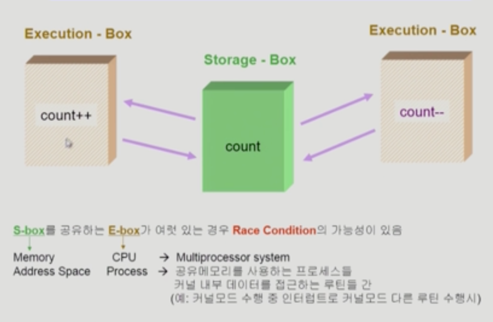

    - 여러 프로세스들이 동시에 공유 데이터를 접근 하는 상황
    - 데이터의 최종 연산 결과는 마지막에 그 데이터를 다룬 프로세스에 따라 달라짐

- os에서 race condition은 언제 발생하는가?
  - kernel 수행 중 인터럽트 발생 시
  - Process가 시스템 call을 하여 Kernel mode로 수행 중인데 context switch가 일어나는 경우
  - Multiprocessor에서 shared memory 내의 kernal data

- os에서의 race condition
  1. interrupt handler vs kernel
    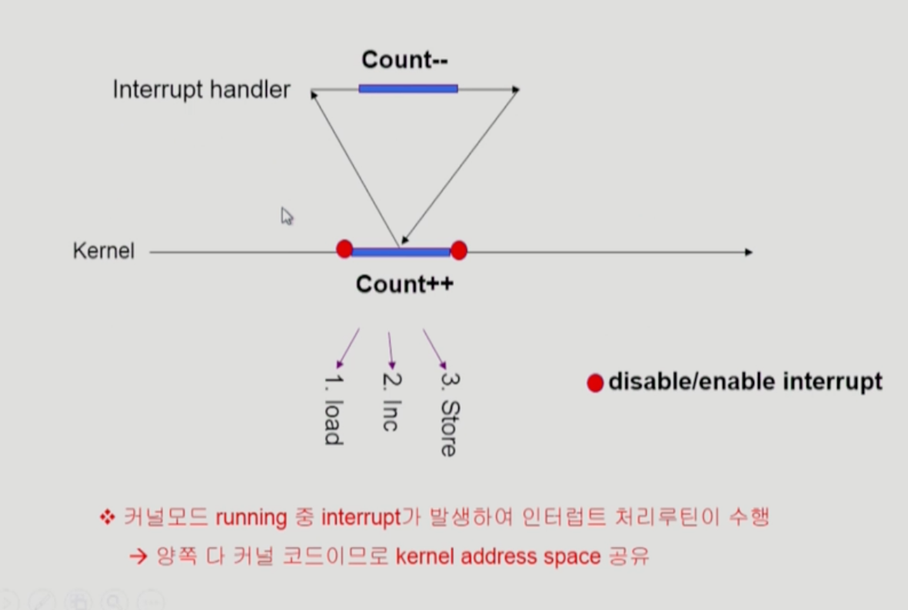
  2. preempt a process running in kernel
    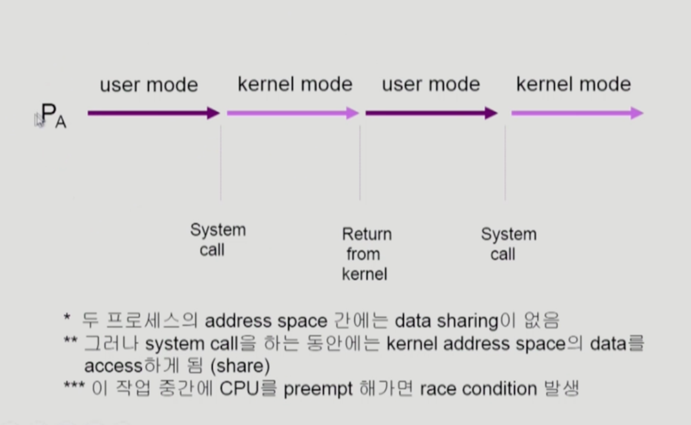
    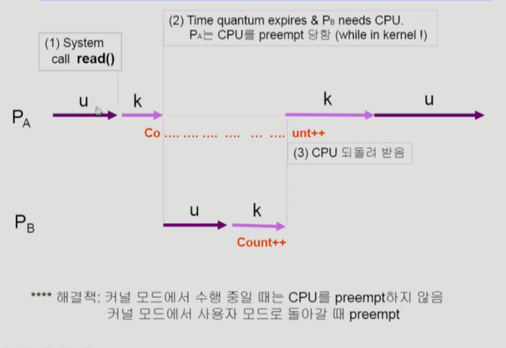
  3. multiprocessor
    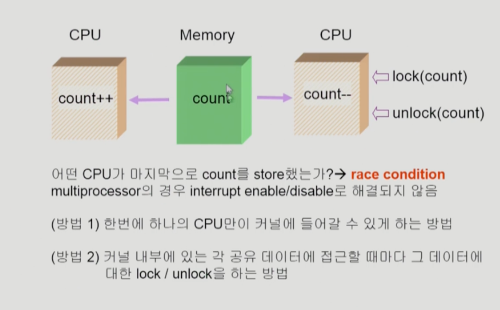

- Process Synchronization 문제
  - 공유 데이터(shared data)의 동시 접근(concurrent access)은 데이터의 불일치 문제(inconsistency)를 발생 시킬 수 있다.
  - 일관성(consistency)유지를 위해서는 협력 프로세스(cooperating process)간의 실행 순서(orderly execution)를 정해주는 케머니즘 필요

- The Critical-Section(공유데이터에 접근하는 코드) Problem(임계 구역)
  - n개의 프로세스가 공유 데이터를 동시에 사용하기를 원하는 경우
  - 각 프로세스의 code segment에는 공유 데이터를 접근하는 critical section이 존재
  - Problem
    - 하나의 프로세스가 ciritcal section에 있을 때 다른 모든 프로세스는 criticla section에 들어갈 수 없어야 한다.

- Initial Attempts to Solve Problem
  - 두 개의 프로세스가 있다고 가정 P0,P1
  - 프로세스 들의 일반적인 구조
  ```c
    do {
      entry section
      critical section
      exit section
      remainder section
    }while(1);
  ```
  - 프로세스들은 수행의 동기화(synchronize)를 위해 몇몇 변수를 공유할 수 있다. -> synchronization variable

- 프로그래적 해결법의 충족 조건
  - Mutual Exclusion(상호 배제)
    - 프로세스 Pi가 critical section 부분을 수행 중이면 다른 모든 프로세스들은 그들의 critical section에 들어가면 안된다.
  - Progress(진행)
    - 아무도 critical section에 있지 않은 상태에서 critical section에 들어가고자 하는 프로세스가 있으면 critical section에 들어가게 해주어야 한다.
  - Bounded Waiting(유한 대기)
    - 프로세스가 critical section에 들어가려고 요청한 후부터 그 요청이 허용될 때까지 다른 프로세스들이 critical section에 들어가는 횟수에 한계가 있어야 한다.
  - 가정
    - 모든 프로세스의 수행 속도는 0보다 크다
    - 프로세스들 간의 상대적인 수행 속도는 가정하지 않는다.

- algorithm1
  
  - Satisfies mutual exclusion, but not progress
  - Progress를 충족하지 않았기 때문에 critical section문제를 풀지 못한 것이다.
- algorithm2
  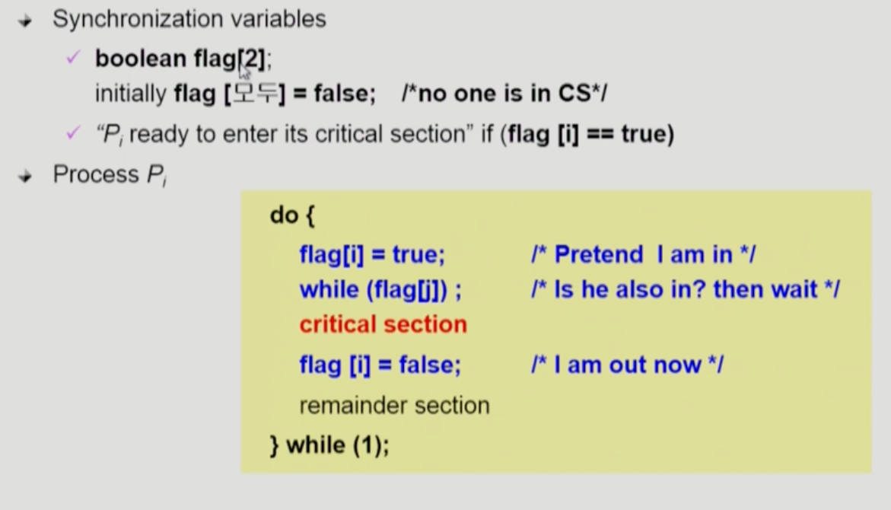
  - critical section에 들어가고 싶을 때 Pi프로세스가 flag에 알리고 상대방 flag를 체크한고 만약 상대 프로세스가 flag를 셋팅 해두었다면 기다리고 셋팅 해두지 않았으면 critical section에 진입한다.
  - 둘 다 2행까지 수행 후 끊임 없이 양보하는 상황 발생 가능
  - Satisfies mutual exclusion, but not progress requirement
- algorithm3(Peterson's Algorithm)
  
  - Meets all three requirements; solves the critical section problem for tho processes.
  - Busy Waiting(spin lock,계속 CPU와 memery를 쓰면서 wait) 문제가 발생함

- Synchronization Hardware
  - 하드웨어 적으로 Test & modify를 atomic하게 수행할 수 있도록 지원하는 경우 앞의 문제는 간단히 해결
  
  
  - Mutual Exclusion With Test & Set

  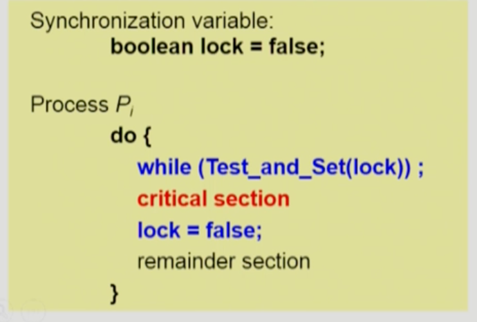

- Semaphores
  - 앞의 방식들을 추상화 시킴(추상 자료형)
  - Semaphore S
    - integer variable
    - 아래의 두 가지 atomic 연산에 의해서만 접근 가능 
    - P연산은 세마포어를 획득하는 과정 V연산은 반납하는 과정

    

- Critical Section of n Processes
  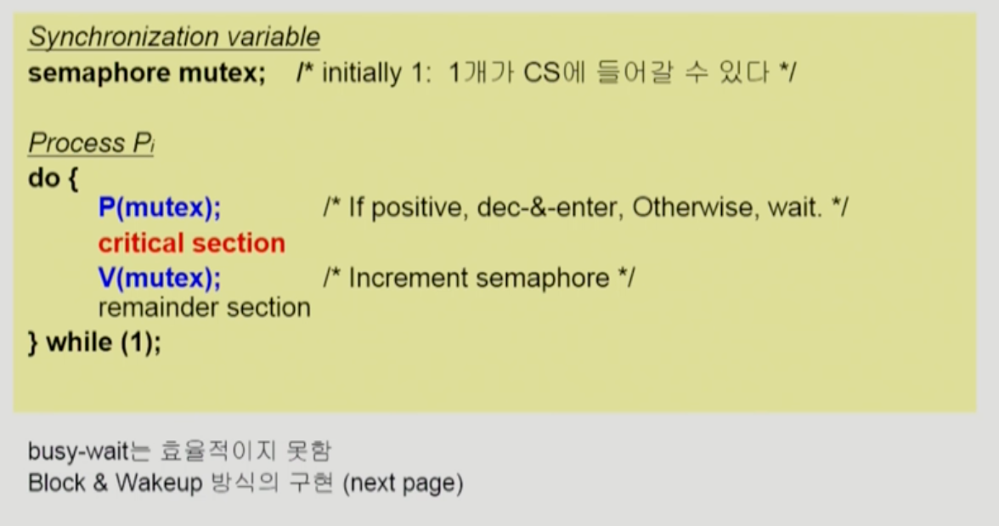

  - Block & WakeUp 방식의 구현(=sleep lock)


- Block/Wakeup Implementation
  - semaphore를 다음과 같이 정의
  ```C
    typedef struct
    {
      int value // semaphore
      struct process *L; //process wait queue
    }semaphore;
  ```
  - block과 wakeup을 다음과 같이 가정
    - block 커널은 block을 호출한 프로세스를 suspend시킴, 이 프로세스의 PCB를 semaphore에 대한 wait queue에 넣음
    - wakeup(P) block된 프로세스 P를 wakeUp 시킴 이프로세스의 PCB를 ready queue로 옮김
    

  - block/wakeup version of P() & V()
  
  
- Busy-wait vs Block/wakeup
  - Block/wakeup overhead v.s. Critical Section길이
    - Criticla section의 길이가 긴 경우 Block/Wakeup이 적당
    - Critical section의 길이가 매우 짧은 경우 Block/Wakeup 오버헤드가 busy-wait 오버헤드보다 더 커질 수 있음
    - 일반적으로 Block/wakeup방식이 더 좋음
- Two types of Semaphores
  - counting semaphores
    - 도메인이 0이상인 임의의 정수값
    - 주로 resource countin에 사용
  - Binary semaphore(=mutex)
    - 0 또는 1값만 가질 수 있는 semaphore
    - 주로 Mutual exclusion(lock/unlock)에 사용

- Deadlock and Starvation
  - Deadlock
    - 둘 이상의 프로세스가 서로 상대방에 의해 충족될 수 있는 event를 무한히 기다리는 현상
    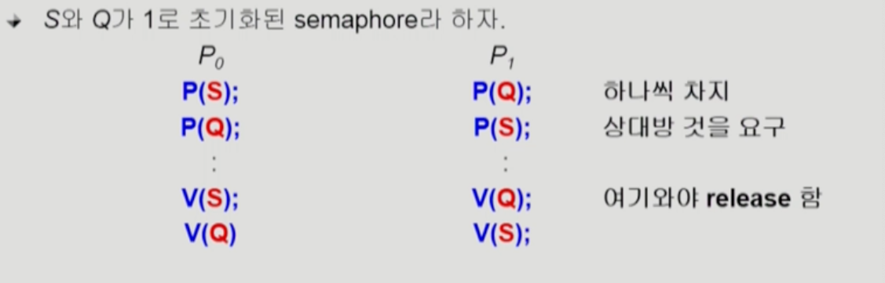
  - starvation
    - indefinite blocking. 프로세스가 suspend된 이유에 해당하는 세마포어 큐에서 빠져나갈 수 없는 현상

- Classical Problems of Synchronization
  - Bounded-Buffer-Problem(Producer-Consumer Problem)
    

    - shared data : buffer자체 및 buffer 조작 변수(empty/full buffer의 시작위치)
    - Synchronization variables
      - mutual exclusion -> Need binary semaphore(Shared data의 Mutual exclusion을 위해)
      - resource count -> Need integer semaphore(남은 full/empty buffer의 수 표시)
    

  - Readers and Writers Problem
    - 한 프로세스가 DB에 write중일 때 다른 process가 접근하면 안됨
    - read는 동시에 여럿이 해도 됨
    - solution
      - writer가 Db에 접근 허가를 아직 얻지 못한 상태에서는 모든 대기중인 Reader들을 다 DB에 접근하게 해준다.
      - Writer는 대기 중인 Reader가 하나도 없을 때 DB접근이 허용된다.
      - 일단 Writer가 DB에 접근 중이면 Reader들은 접근이 금지된다.
      - Writer가 DB에서 빠져나갸아만 Reader의 접근이 허용된다.
    - Shared data
      - DB자체
      - readcount; // 현재 DB에 접근중인 Reader의 수
    - Synchronization variables
      - mutex // 공유변수 readcount를 접근하는 코드의 mutual exclusion보장을 위해 사용
      - db // Reader와 writer 공유 DB 자체를 올바르게 접근하게 하는 역활

    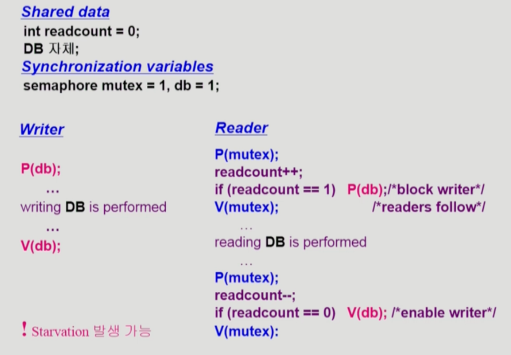

  - Dining-Philosophers Problem(식사하는 철학자)
    
    

    - 앞의 solution의 문제점
      - Deadlock 가능성이 있다.
      - 모든 철학자가 동시에 배가 고파져 왼쪽 젓가락을 집어버린 경우
    - 해결방안
      - 4명의 철학자만 테이블에 동시에 앉을수 있도록한다.
      - 젓사락을 두개 모두 집을 수 있을 떄에만 젓가락을 집을수 있게 한다.
      - 비대칭
        - 짝수(홀수) 철학자는 왼쪽(오른쪽)젓가락부터 집도록

- Monitor
  - Semaphore의 문제점
    - 코딩하기 힘들다
    - 정확성(correctness)의 입증이 어렵다
    - 자발적 협력(voluntary cooperation)이 필요하다
    - 한번의 실수가 모든 시스템에 치명적 영향
    
  - 모니터는 동시 수행중인 프로세스 사이에서 abstract data type의 안전한 공유를 보장하기 위한 high-level synchronization construct
    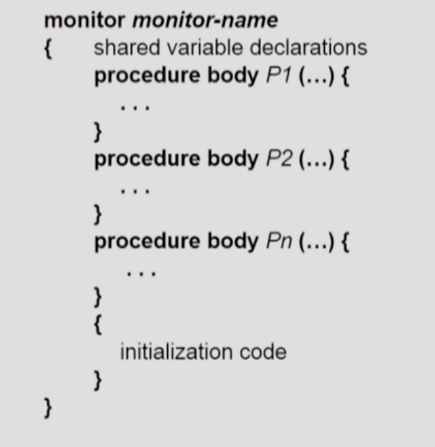
  - 모니터 내애서는 한번에 하나의 프로세스 만이 활동가능
  - 프로그래머가 동기화 제약 조건을 명시적으로 코딩할 필요없음
  - 프로세스가 모니터안에서 기다릴 수 있도록 하기위해 condition variable 사용 , condition x,y;
  - Condition variable은 wait와 signal 연산에 의해서만 접근 가능 x.wait();, x.wait()을 invoke한 프로세스는 다른 프로세스가 x.signal()을 invoke하기 전 까지 suspend된다. x.signal(); x.signal은 정확하게 하나의 suspend된 프로세스를 resume한다. suspend된 프로세스가 없으면 아무일도 일어나지 않는다.

  - 모니터 코드로 작성한 생산자 - 소비자 문제
    
  
  - 모니터 코드로 작성한 식사하는 철학자 문제
    
  

  


  

