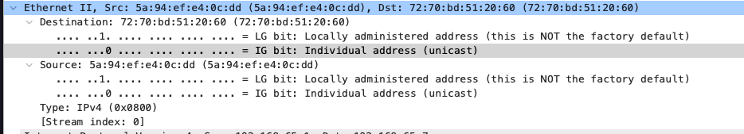
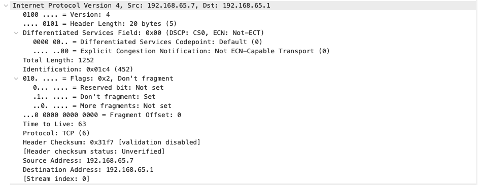

# 1주차
## 네트워크 7계층 

### L2 계층
- 물리적으로 연결된 같은 네트워크 안의 기기들끼리, MAC 주소를 이용해 데이터를 정확하고 안전하게 전달하는 계층
- L2 계층의 경우 단위가 프레임이며, MAC 주소라는 물리적 주소를 통한 통신이 목적임, 보통은 스위치에서 해당 역할을 담당함
- 상위 레이어로 올라갈 때, 프레임 내의 DATA 내에 상위 레이어의 정보가 저장되어있고, 캡슐화와 역캡슐화를 통해서 데이터를 패키징함
- 아래와 같이 wireshark를 통해서 실제 패킷 캡처한 내용을 볼 수 있음
    

### L3 계층
- L3 계층의 경우 단위가 패킷이며, IP 주소를 통한 통신이 목적임
- 우리가 보통 말하는 IP를 다루는 계층이 L3 계층임, IP의 경우 논리적 주소임
- IP의 경우 패킷이 데이터 단위이며, 보통은 라우터에서 해당 역할을 담당함
    
